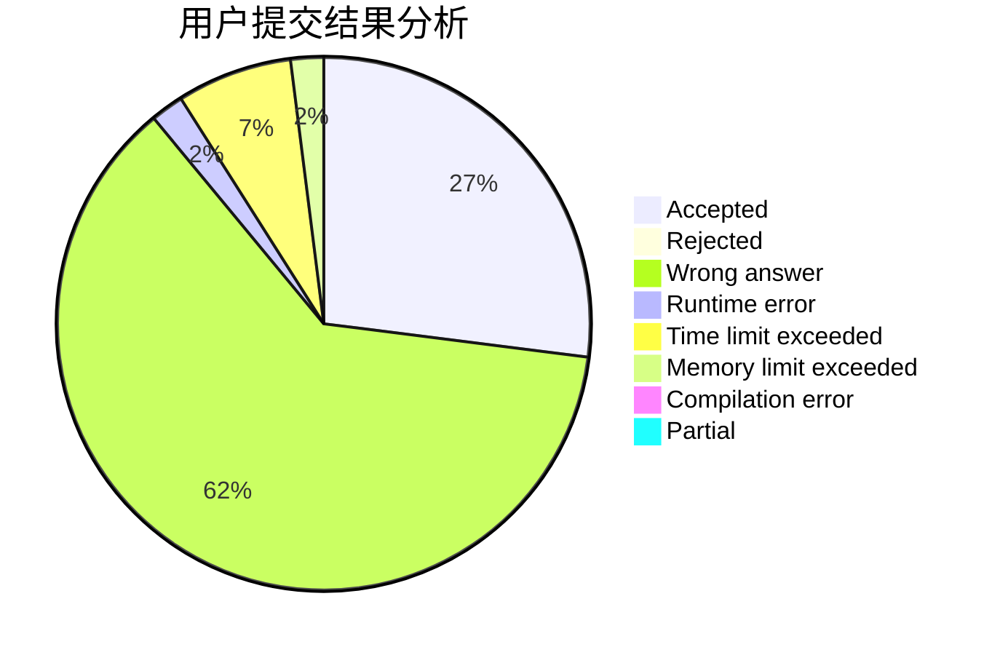
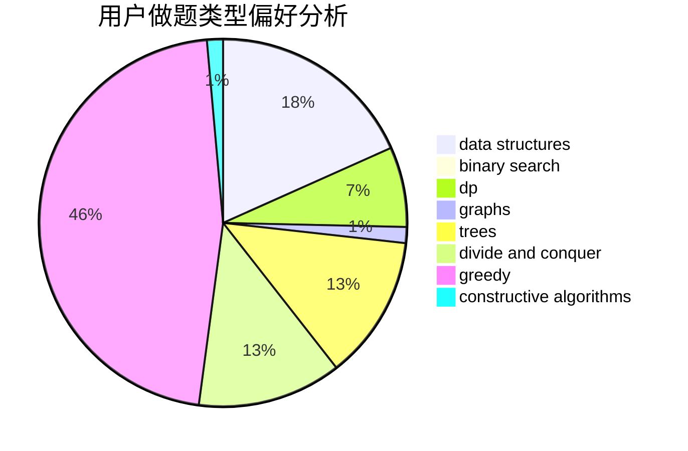
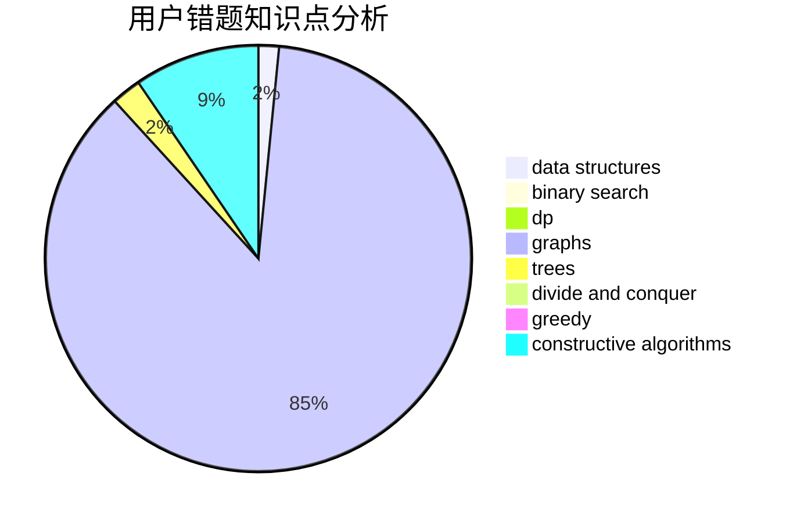

# HuaShanLunJian

<!-- tabs:start -->

#### **用户提交结果分析**

#### **用户做题类型偏好分析**

#### **用户错题知识点分析**

<!-- tabs:end -->
# 推荐题目
[1283A](https://codeforces.com/contest/1283/problem/A)		math		  
[199D](https://codeforces.com/contest/199/problem/D)		dsu,graphs,sortings,trees		  
[405C](https://codeforces.com/contest/405/problem/C)		implementation,
                        math		  
[766B](https://codeforces.com/contest/766/problem/B)		constructive algorithms,
                        geometry,
                        greedy,
                        math,
                        number theory,
                        sortings		  
[103B](https://codeforces.com/contest/103/problem/B)		dfs and similar,
                        dsu,
                        graphs		  
[814B](https://codeforces.com/contest/814/problem/B)		constructive algorithms		  
[48A](https://codeforces.com/contest/48/problem/A)		implementation,
                        schedules		  
[117C](https://codeforces.com/contest/117/problem/C)		dfs and similar,
                        graphs		  
[586F](https://codeforces.com/contest/586/problem/F)		dsu,graphs,sortings,trees		  
[1482E](https://codeforces.com/contest/1482/problem/E)		data structures,
                        divide and conquer,
                        dp		  
