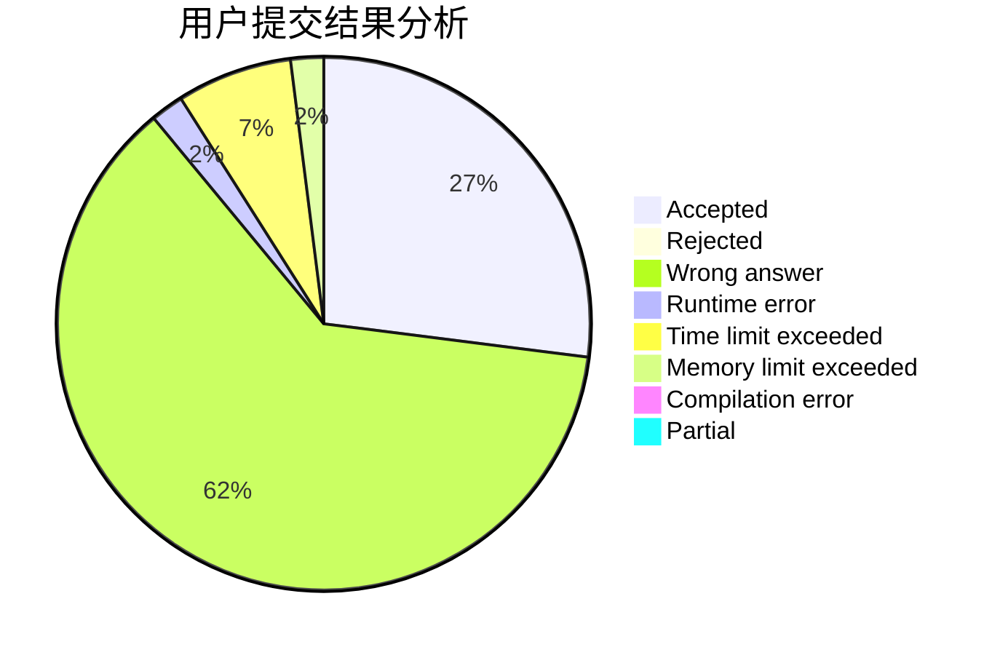
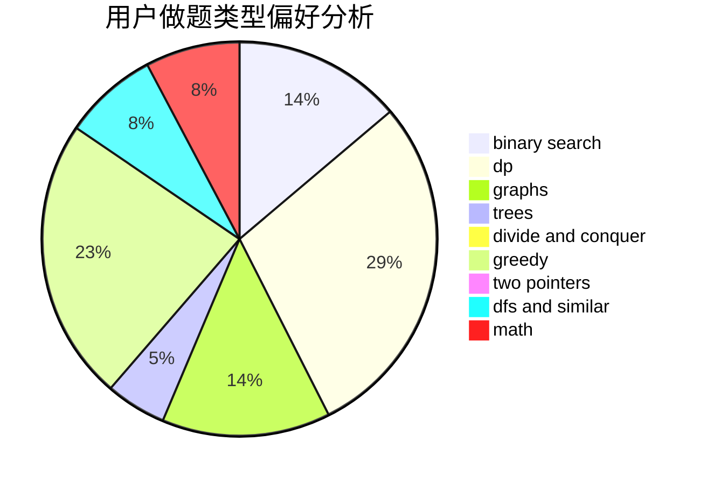

# HuaShanLunJian

<!-- tabs:start -->

#### **用户提交结果分析**

#### **用户做题类型偏好分析**

<!-- tabs:end -->
# 推荐题目
[1290A](https://codeforces.com/contest/1290/problem/A)
[220C](https://codeforces.com/contest/220/problem/C)
[434C](https://codeforces.com/contest/434/problem/C)
[785D](https://codeforces.com/contest/785/problem/D)
[103E](https://codeforces.com/contest/103/problem/E)
[832D](https://codeforces.com/contest/832/problem/D)
[50E](https://codeforces.com/contest/50/problem/E)
[1182E](https://codeforces.com/contest/1182/problem/E)
[607A](https://codeforces.com/contest/607/problem/A)
[1490C](https://codeforces.com/contest/1490/problem/C)
