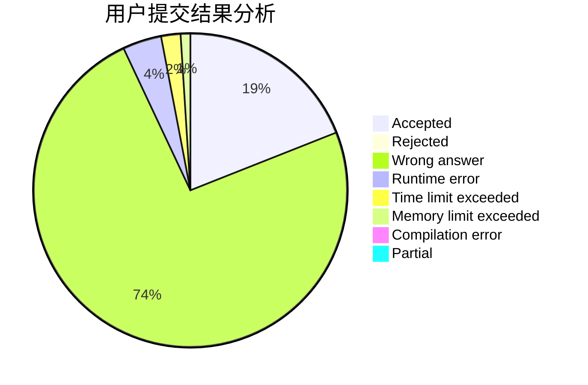
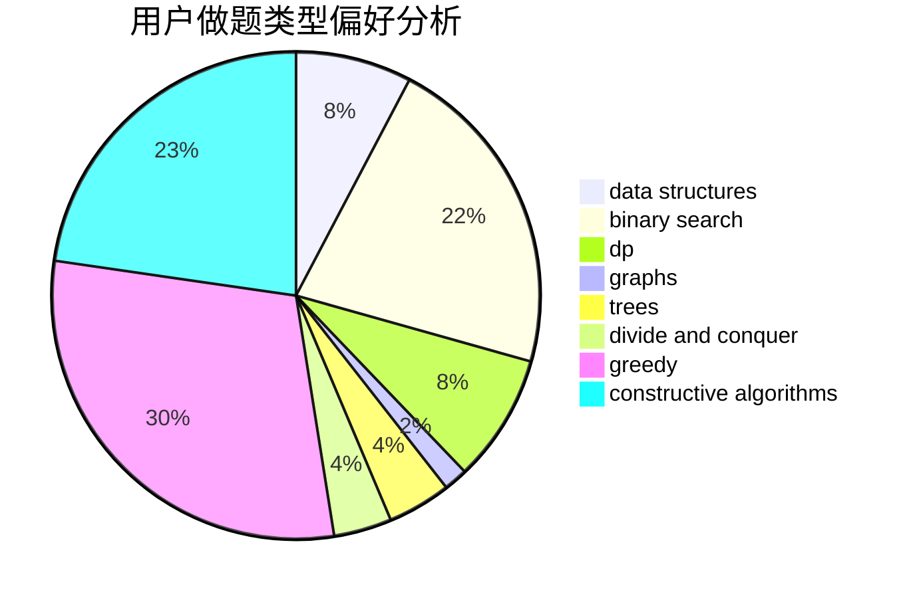

# 275307894a

<!-- tabs:start -->

#### **用户提交结果分析**

#### **用户做题类型偏好分析**

#### **用户错题知识点分析**

<!-- tabs:end -->
# 推荐题目
[1332C](https://codeforces.com/contest/1332/problem/C)		dfs and similar,
                        dsu,
                        greedy,
                        implementation,
                        strings		  
[13351](https://codeforces.com/contest/1335/problem/1)		dsu,graphs,sortings,trees		  
[1332D](https://codeforces.com/contest/1332/problem/D)		bitmasks,
                        constructive algorithms,
                        math		  
[13352](https://codeforces.com/contest/1335/problem/2)		dsu,graphs,sortings,trees		  
[1331E](https://codeforces.com/contest/1331/problem/E)		dfs and similar,
                        geometry,
                        implementation		  
[1013A](https://codeforces.com/contest/1013/problem/A)		math		  
[1141B](https://codeforces.com/contest/1141/problem/B)		implementation		  
[120H](https://codeforces.com/contest/120/problem/H)		graph matchings		  
[1241B](https://codeforces.com/contest/1241/problem/B)		dsu,graphs,sortings,trees		  
[1334G](https://codeforces.com/contest/1334/problem/G)		bitmasks,
                        brute force,
                        fft		  
