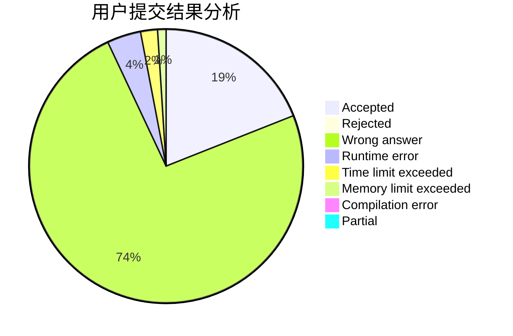
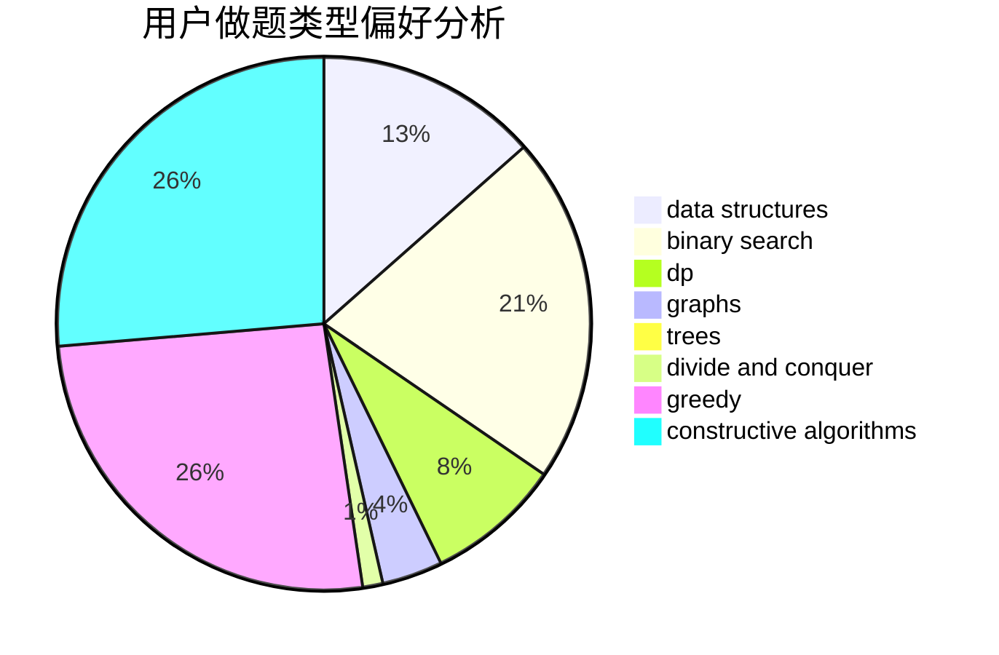
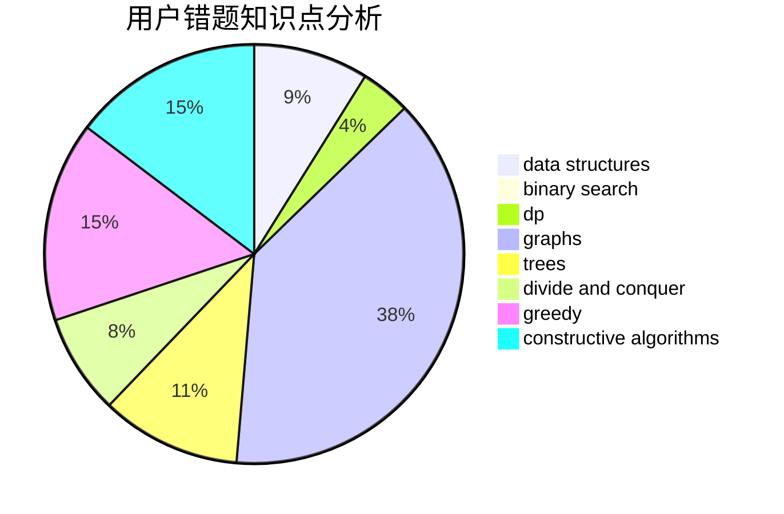

# 275307894a
<!-- tabs:start -->
#### **用户提交结果分析**

#### **用户做题类型偏好分析**

#### **用户错题知识点分析**

<!-- tabs:end -->
# 推荐题目
[Bad Ugly Numbers](http://codeforces.com/problemset/problem/1326/A)		constructive algorithms,
                        number theory		  
[Parity](http://codeforces.com/problemset/problem/1110/A)		math		  
[Make k Equal](http://codeforces.com/problemset/problem/1328/F)		greedy		  
[Carousel](http://codeforces.com/problemset/problem/1328/D)		constructive algorithms,
                        dp,
                        graphs,
                        greedy,
                        math		  
[Border](https://codeforces.com/contest/1011/problem/E)		number theory		  
[Covered Points Count](http://codeforces.com/problemset/problem/1000/C)		data structures,
                        implementation,
                        sortings		  
[EhAb AnD gCd](http://codeforces.com/problemset/problem/1325/A)		constructive algorithms,
                        greedy,
                        number theory		  
[Expected Value Again](http://codeforces.com/problemset/problem/1205/E)		combinatorics,
                        strings		  
[Alice and the Unfair Game](http://codeforces.com/problemset/problem/1236/E)		binary search,
                        data structures,
                        dp,
                        dsu		  
[Petr#](http://codeforces.com/problemset/problem/113/B)		brute force,
                        data structures,
                        hashing,
                        strings		  
<!-- tabs:start -->
#### **data structures**
[Bad Ugly Numbers](http://codeforces.com/problemset/problem/1000/C)		data structures,
                        implementation,
                        sortings		  
[Parity](http://codeforces.com/problemset/problem/1236/E)		binary search,
                        data structures,
                        dp,
                        dsu		  
[Make k Equal](http://codeforces.com/problemset/problem/113/B)		brute force,
                        data structures,
                        hashing,
                        strings		  
[Carousel](http://codeforces.com/problemset/problem/1327/F)		bitmasks,
                        combinatorics,
                        data structures,
                        dp,
                        two pointers		  
[Border](http://codeforces.com/problemset/problem/1006/C)		binary search,
                        data structures,
                        two pointers		  
[Covered Points Count](http://codeforces.com/problemset/problem/1326/E)		data structures,
                        two pointers		  
[EhAb AnD gCd](http://codeforces.com/problemset/problem/1492/C)		binary search,
                        data structures,
                        dp,
                        greedy,
                        two pointers		  
[Expected Value Again](http://codeforces.com/problemset/problem/1490/G)		binary search,
                        data structures,
                        math		  
[Alice and the Unfair Game](http://codeforces.com/problemset/problem/1479/D)		binary search,
                        bitmasks,
                        brute force,
                        data structures,
                        probabilities,
                        trees		  
[Petr#](http://codeforces.com/problemset/problem/1497/A)		brute force,
                        data structures,
                        greedy,
                        sortings		  
#### **binary search**
[Bad Ugly Numbers](http://codeforces.com/problemset/problem/1236/E)		binary search,
                        data structures,
                        dp,
                        dsu		  
[Parity](http://codeforces.com/problemset/problem/1006/C)		binary search,
                        data structures,
                        two pointers		  
[Make k Equal](http://codeforces.com/problemset/problem/1328/B)		binary search,
                        brute force,
                        combinatorics,
                        implementation,
                        math		  
[Carousel](http://codeforces.com/problemset/problem/1326/D2)		binary search,
                        greedy,
                        hashing,
                        string suffix structures,
                        strings		  
[Border](http://codeforces.com/problemset/problem/1492/C)		binary search,
                        data structures,
                        dp,
                        greedy,
                        two pointers		  
[Covered Points Count](http://codeforces.com/problemset/problem/1463/D)		binary search,
                        constructive algorithms,
                        greedy,
                        two pointers		  
[EhAb AnD gCd](http://codeforces.com/problemset/problem/1490/G)		binary search,
                        data structures,
                        math		  
[Expected Value Again](http://codeforces.com/problemset/problem/1479/D)		binary search,
                        bitmasks,
                        brute force,
                        data structures,
                        probabilities,
                        trees		  
[Alice and the Unfair Game](http://codeforces.com/problemset/problem/1436/E)		binary search,
                        data structures,
                        two pointers		  
[Petr#](http://codeforces.com/problemset/problem/1461/D)		binary search,
                        brute force,
                        data structures,
                        divide and conquer,
                        implementation,
                        sortings		  
#### **dp**
[Bad Ugly Numbers](http://codeforces.com/problemset/problem/1328/D)		constructive algorithms,
                        dp,
                        graphs,
                        greedy,
                        math		  
[Parity](http://codeforces.com/problemset/problem/1236/E)		binary search,
                        data structures,
                        dp,
                        dsu		  
[Make k Equal](http://codeforces.com/problemset/problem/1012/C)		dp		  
[Carousel](http://codeforces.com/problemset/problem/1327/F)		bitmasks,
                        combinatorics,
                        data structures,
                        dp,
                        two pointers		  
[Border](http://codeforces.com/problemset/problem/1326/F1)		bitmasks,
                        brute force,
                        dp,
                        meet-in-the-middle		  
[Covered Points Count](http://codeforces.com/problemset/problem/1324/F)		dfs and similar,
                        dp,
                        graphs,
                        trees		  
[EhAb AnD gCd](http://codeforces.com/problemset/problem/1324/E)		dp,
                        implementation		  
[Expected Value Again](http://codeforces.com/problemset/problem/1327/E)		combinatorics,
                        dp,
                        math		  
[Alice and the Unfair Game](http://codeforces.com/problemset/problem/1326/F2)		bitmasks,
                        dp,
                        math		  
[Petr#](http://codeforces.com/problemset/problem/1492/C)		binary search,
                        data structures,
                        dp,
                        greedy,
                        two pointers		  
#### **graph**
[Bad Ugly Numbers](http://codeforces.com/problemset/problem/1328/D)		constructive algorithms,
                        dp,
                        graphs,
                        greedy,
                        math		  
[Parity](http://codeforces.com/problemset/problem/1328/E)		dfs and similar,
                        graphs,
                        trees		  
[Make k Equal](http://codeforces.com/problemset/problem/1325/F)		constructive algorithms,
                        dfs and similar,
                        graphs,
                        greedy		  
[Carousel](http://codeforces.com/problemset/problem/1327/D)		brute force,
                        dfs and similar,
                        graphs,
                        math,
                        number theory		  
[Border](http://codeforces.com/problemset/problem/1324/F)		dfs and similar,
                        dp,
                        graphs,
                        trees		  
[Covered Points Count](http://codeforces.com/problemset/problem/1327/B)		brute force,
                        graphs,
                        greedy		  
[EhAb AnD gCd](http://codeforces.com/problemset/problem/1325/E)		brute force,
                        dfs and similar,
                        graphs,
                        number theory,
                        shortest paths		  
[Expected Value Again](http://codeforces.com/problemset/problem/1487/C)		brute force,
                        constructive algorithms,
                        dfs and similar,
                        graphs,
                        greedy,
                        implementation,
                        math		  
[Alice and the Unfair Game](http://codeforces.com/problemset/problem/1437/C)		dp,
                        flows,
                        graph matchings,
                        greedy,
                        math,
                        sortings		  
[Petr#](http://codeforces.com/problemset/problem/1470/D)		constructive algorithms,
                        dfs and similar,
                        graph matchings,
                        graphs,
                        greedy		  
#### **trees**
[Bad Ugly Numbers](http://codeforces.com/problemset/problem/1328/E)		dfs and similar,
                        graphs,
                        trees		  
[Parity](http://codeforces.com/problemset/problem/1324/F)		dfs and similar,
                        dp,
                        graphs,
                        trees		  
[Make k Equal](http://codeforces.com/problemset/problem/1325/C)		constructive algorithms,
                        dfs and similar,
                        greedy,
                        trees		  
[Carousel](http://codeforces.com/problemset/problem/1479/D)		binary search,
                        bitmasks,
                        brute force,
                        data structures,
                        probabilities,
                        trees		  
[Border](http://codeforces.com/problemset/problem/1511/C)		brute force,
                        data structures,
                        implementation,
                        trees		  
[Covered Points Count](http://codeforces.com/problemset/problem/1499/F)		combinatorics,
                        dfs and similar,
                        dp,
                        trees		  
[EhAb AnD gCd](http://codeforces.com/problemset/problem/1491/E)		brute force,
                        dfs and similar,
                        divide and conquer,
                        number theory,
                        trees		  
[Expected Value Again](http://codeforces.com/problemset/problem/1466/D)		data structures,
                        greedy,
                        sortings,
                        trees		  
[Alice and the Unfair Game](http://codeforces.com/problemset/problem/1495/D)		combinatorics,
                        dfs and similar,
                        graphs,
                        math,
                        shortest paths,
                        trees		  
[Petr#](http://codeforces.com/problemset/problem/1303/G)		data structures,
                        divide and conquer,
                        geometry,
                        trees		  
#### **divide and conquer**
[Bad Ugly Numbers](http://codeforces.com/problemset/problem/1461/D)		binary search,
                        brute force,
                        data structures,
                        divide and conquer,
                        implementation,
                        sortings		  
[Parity](http://codeforces.com/problemset/problem/1466/G)		combinatorics,
                        divide and conquer,
                        hashing,
                        math,
                        string suffix structures,
                        strings		  
[Make k Equal](http://codeforces.com/problemset/problem/1490/D)		dfs and similar,
                        divide and conquer,
                        implementation		  
[Carousel](https://codeforces.com/contest/1483/problem/C)		data structures,
                        divide and conquer,
                        dp		  
[Border](http://codeforces.com/problemset/problem/1491/E)		brute force,
                        dfs and similar,
                        divide and conquer,
                        number theory,
                        trees		  
[Covered Points Count](http://codeforces.com/problemset/problem/1303/G)		data structures,
                        divide and conquer,
                        geometry,
                        trees		  
[EhAb AnD gCd](http://codeforces.com/problemset/problem/1494/D)		constructive algorithms,
                        data structures,
                        dfs and similar,
                        divide and conquer,
                        dsu,
                        greedy,
                        sortings,
                        trees		  
[Expected Value Again](http://codeforces.com/problemset/problem/1482/E)		data structures,
                        divide and conquer,
                        dp		  
[Alice and the Unfair Game](http://codeforces.com/problemset/problem/566/C)		dfs and similar,
                        divide and conquer,
                        trees		  
[Petr#](http://codeforces.com/problemset/problem/1428/F)		binary search,
                        data structures,
                        divide and conquer,
                        dp,
                        two pointers		  
#### **greedy**
[Bad Ugly Numbers](http://codeforces.com/problemset/problem/1328/F)		greedy		  
[Parity](http://codeforces.com/problemset/problem/1328/D)		constructive algorithms,
                        dp,
                        graphs,
                        greedy,
                        math		  
[Make k Equal](http://codeforces.com/problemset/problem/1325/A)		constructive algorithms,
                        greedy,
                        number theory		  
[Carousel](http://codeforces.com/problemset/problem/1325/F)		constructive algorithms,
                        dfs and similar,
                        graphs,
                        greedy		  
[Border](http://codeforces.com/problemset/problem/1267/J)		greedy,
                        implementation,
                        math		  
[Covered Points Count](http://codeforces.com/problemset/problem/1325/D)		bitmasks,
                        constructive algorithms,
                        greedy,
                        number theory		  
[EhAb AnD gCd](http://codeforces.com/problemset/problem/1325/B)		greedy,
                        implementation		  
[Expected Value Again](http://codeforces.com/problemset/problem/1327/B)		brute force,
                        graphs,
                        greedy		  
[Alice and the Unfair Game](http://codeforces.com/problemset/problem/1325/C)		constructive algorithms,
                        dfs and similar,
                        greedy,
                        trees		  
[Petr#](http://codeforces.com/problemset/problem/1328/C)		greedy,
                        implementation		  
#### **constructive algorithms**
[Bad Ugly Numbers](http://codeforces.com/problemset/problem/1326/A)		constructive algorithms,
                        number theory		  
[Parity](http://codeforces.com/problemset/problem/1328/D)		constructive algorithms,
                        dp,
                        graphs,
                        greedy,
                        math		  
[Make k Equal](http://codeforces.com/problemset/problem/1325/A)		constructive algorithms,
                        greedy,
                        number theory		  
[Carousel](http://codeforces.com/problemset/problem/1325/F)		constructive algorithms,
                        dfs and similar,
                        graphs,
                        greedy		  
[Border](http://codeforces.com/problemset/problem/1325/D)		bitmasks,
                        constructive algorithms,
                        greedy,
                        number theory		  
[Covered Points Count](http://codeforces.com/problemset/problem/1327/C)		constructive algorithms,
                        implementation		  
[EhAb AnD gCd](http://codeforces.com/problemset/problem/1325/C)		constructive algorithms,
                        dfs and similar,
                        greedy,
                        trees		  
[Expected Value Again](http://codeforces.com/problemset/problem/1493/A)		constructive algorithms,
                        greedy		  
[Alice and the Unfair Game](http://codeforces.com/problemset/problem/1463/D)		binary search,
                        constructive algorithms,
                        greedy,
                        two pointers		  
[Petr#](https://codeforces.com/contest/1456/problem/B)		bitmasks,
                        brute force,
                        constructive algorithms		  
#### **sortings**
[Bad Ugly Numbers](http://codeforces.com/problemset/problem/1000/C)		data structures,
                        implementation,
                        sortings		  
[Parity](https://codeforces.com/contest/1496/problem/C)		geometry,
                        greedy,
                        math,
                        sortings		  
[Make k Equal](http://codeforces.com/problemset/problem/1495/A)		geometry,
                        greedy,
                        math,
                        sortings		  
[Carousel](http://codeforces.com/problemset/problem/1497/A)		brute force,
                        data structures,
                        greedy,
                        sortings		  
[Border](http://codeforces.com/problemset/problem/1427/A)		math,
                        sortings		  
[Covered Points Count](http://codeforces.com/problemset/problem/1461/D)		binary search,
                        brute force,
                        data structures,
                        divide and conquer,
                        implementation,
                        sortings		  
[EhAb AnD gCd](http://codeforces.com/problemset/problem/1437/C)		dp,
                        flows,
                        graph matchings,
                        greedy,
                        math,
                        sortings		  
[Expected Value Again](http://codeforces.com/problemset/problem/1473/A)		greedy,
                        implementation,
                        math,
                        sortings		  
[Alice and the Unfair Game](http://codeforces.com/problemset/problem/1486/B)		binary search,
                        geometry,
                        shortest paths,
                        sortings		  
[Petr#](http://codeforces.com/problemset/problem/1480/B)		greedy,
                        implementation,
                        sortings		  
<!-- tabs:end -->
