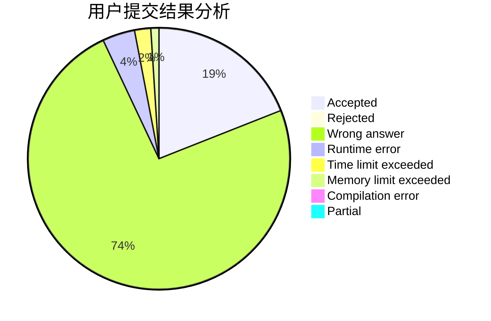
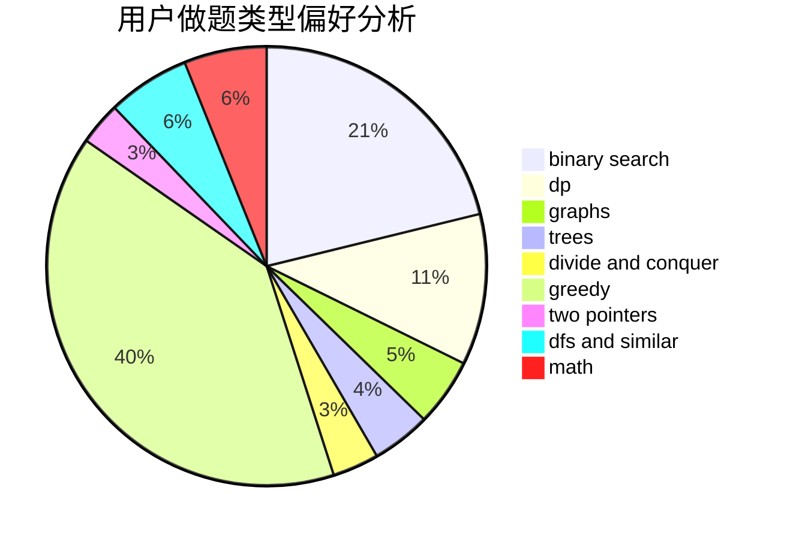

# 275307894a

<!-- tabs:start -->

#### **用户提交结果分析**

#### **用户做题类型偏好分析**

<!-- tabs:end -->
# 推荐题目
[1332C](https://codeforces.com/contest/1332/problem/C)
[13351](https://codeforces.com/contest/1335/problem/1)
[1332D](https://codeforces.com/contest/1332/problem/D)
[13352](https://codeforces.com/contest/1335/problem/2)
[1331E](https://codeforces.com/contest/1331/problem/E)
[1013A](https://codeforces.com/contest/1013/problem/A)
[1141B](https://codeforces.com/contest/1141/problem/B)
[120H](https://codeforces.com/contest/120/problem/H)
[1241B](https://codeforces.com/contest/1241/problem/B)
[1334G](https://codeforces.com/contest/1334/problem/G)
