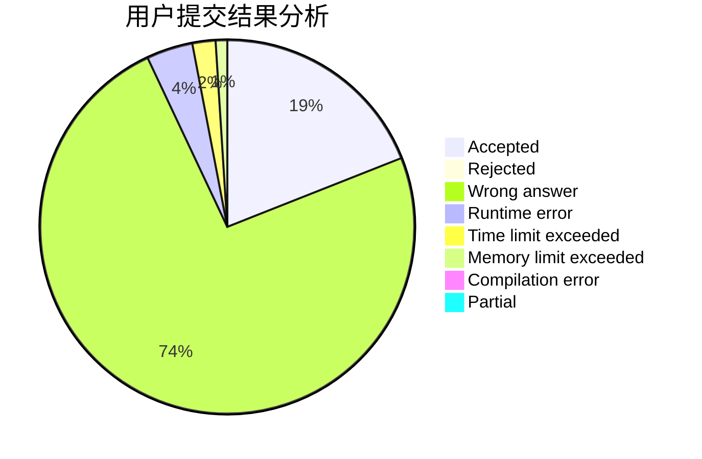
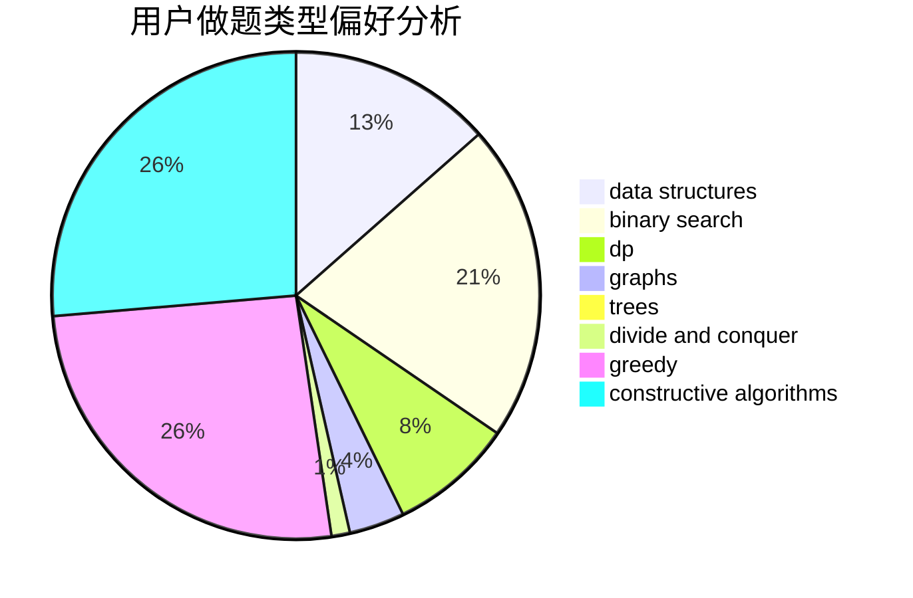
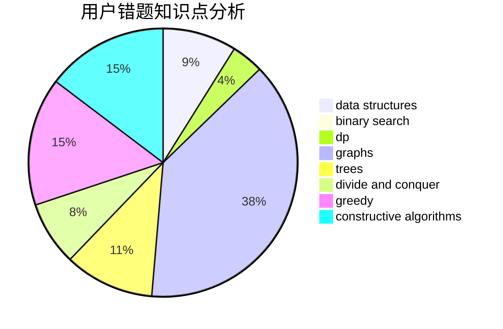

# 275307894a

<!-- tabs:start -->

#### **用户提交结果分析**

#### **用户做题类型偏好分析**

#### **用户错题知识点分析**

<!-- tabs:end -->
# 推荐题目
[1326A](https://codeforces.com/contest/1326/problem/A)		constructive algorithms,
                        number theory		  
[1328E](https://codeforces.com/contest/1328/problem/E)		dfs and similar,
                        graphs,
                        trees		  
[1326B](https://codeforces.com/contest/1326/problem/B)		implementation,
                        math		  
[1328F](https://codeforces.com/contest/1328/problem/F)		greedy		  
[1325A](https://codeforces.com/contest/1325/problem/A)		constructive algorithms,
                        greedy,
                        number theory		  
[1012C](https://codeforces.com/contest/1012/problem/C)		dp		  
[113B](https://codeforces.com/contest/113/problem/B)		brute force,
                        data structures,
                        hashing,
                        strings		  
[1205E](https://codeforces.com/contest/1205/problem/E)		combinatorics,
                        strings		  
[1236E](https://codeforces.com/contest/1236/problem/E)		binary search,
                        data structures,
                        dp,
                        dsu		  
[1328D](https://codeforces.com/contest/1328/problem/D)		constructive algorithms,
                        dp,
                        graphs,
                        greedy,
                        math		  
