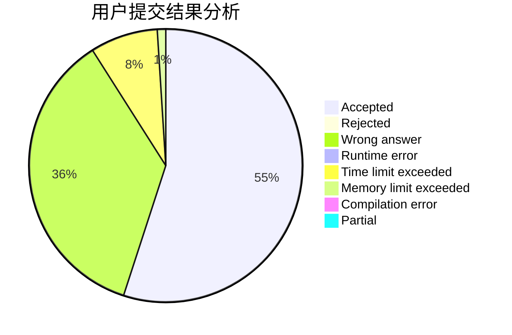
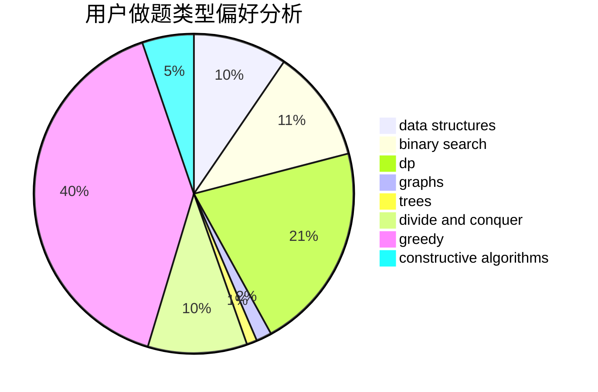

# Huangyb

<!-- tabs:start -->

#### **用户提交结果分析**

#### **用户做题类型偏好分析**

#### **用户错题知识点分析**

<!-- tabs:end -->
# 推荐题目
[767B](https://codeforces.com/contest/767/problem/B)		brute force,
                        greedy		  
[425E](https://codeforces.com/contest/425/problem/E)		dp		  
[575A](https://codeforces.com/contest/575/problem/A)		data structures,
                        math,
                        matrices		  
[501C](https://codeforces.com/contest/501/problem/C)		constructive algorithms,
                        data structures,
                        greedy,
                        sortings,
                        trees		  
[852E](https://codeforces.com/contest/852/problem/E)		dp		  
[1511D](https://codeforces.com/contest/1511/problem/D)		brute force,
                        constructive algorithms,
                        graphs,
                        greedy,
                        strings		  
[1149C](https://codeforces.com/contest/1149/problem/C)		data structures,
                        implementation,
                        trees		  
[311A](https://codeforces.com/contest/311/problem/A)		constructive algorithms,
                        implementation		  
[566E](https://codeforces.com/contest/566/problem/E)		bitmasks,
                        constructive algorithms,
                        trees		  
[1203B](https://codeforces.com/contest/1203/problem/B)		greedy,
                        math		  
