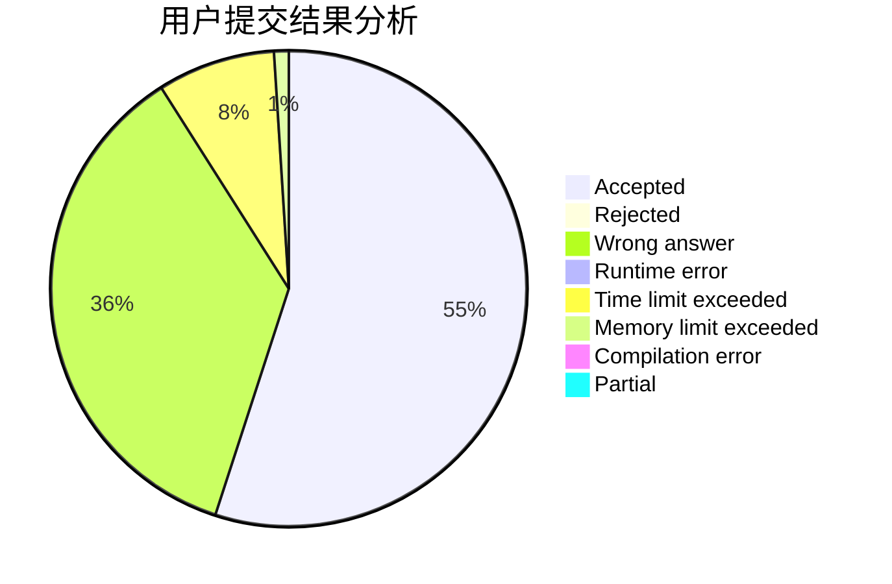
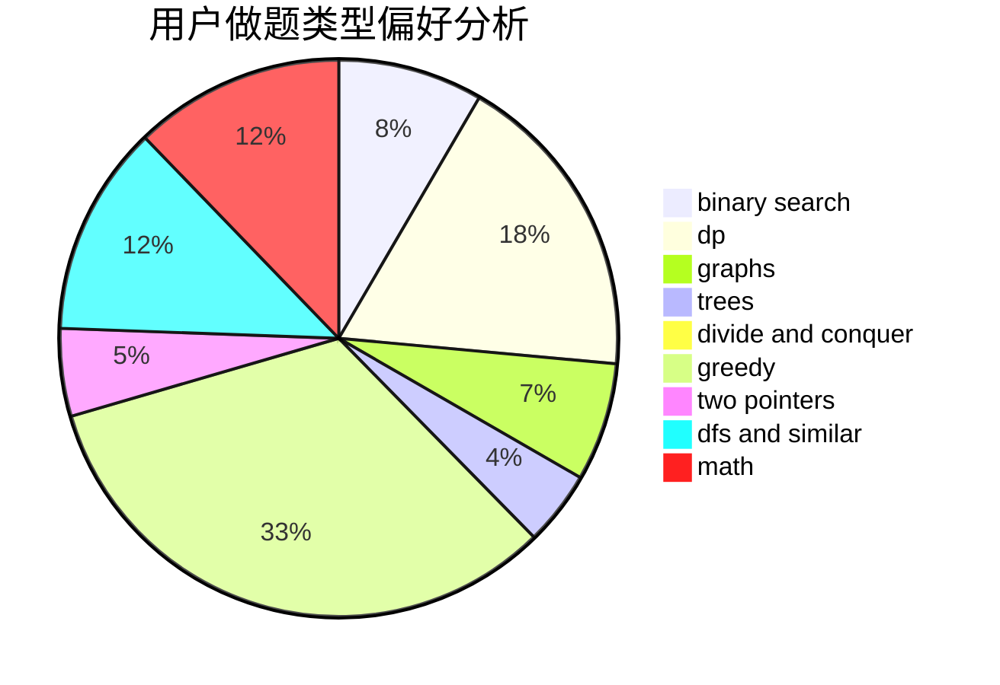

# Huangyb

<!-- tabs:start -->

#### **用户提交结果分析**

#### **用户做题类型偏好分析**

<!-- tabs:end -->
# 推荐题目
[786D](https://codeforces.com/contest/786/problem/D)
[449C](https://codeforces.com/contest/449/problem/C)
[596A](https://codeforces.com/contest/596/problem/A)
[523A](https://codeforces.com/contest/523/problem/A)
[870E](https://codeforces.com/contest/870/problem/E)
[16A](https://codeforces.com/contest/16/problem/A)
[1151A](https://codeforces.com/contest/1151/problem/A)
[334A](https://codeforces.com/contest/334/problem/A)
[585D](https://codeforces.com/contest/585/problem/D)
[1207F](https://codeforces.com/contest/1207/problem/F)
