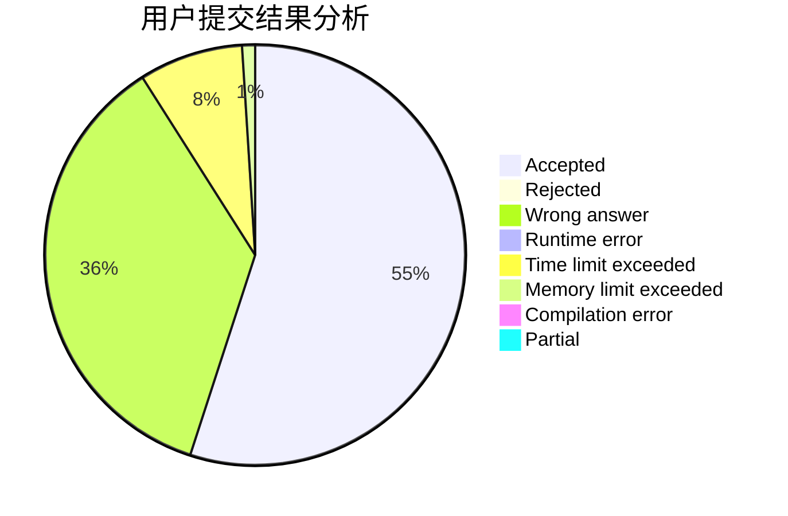
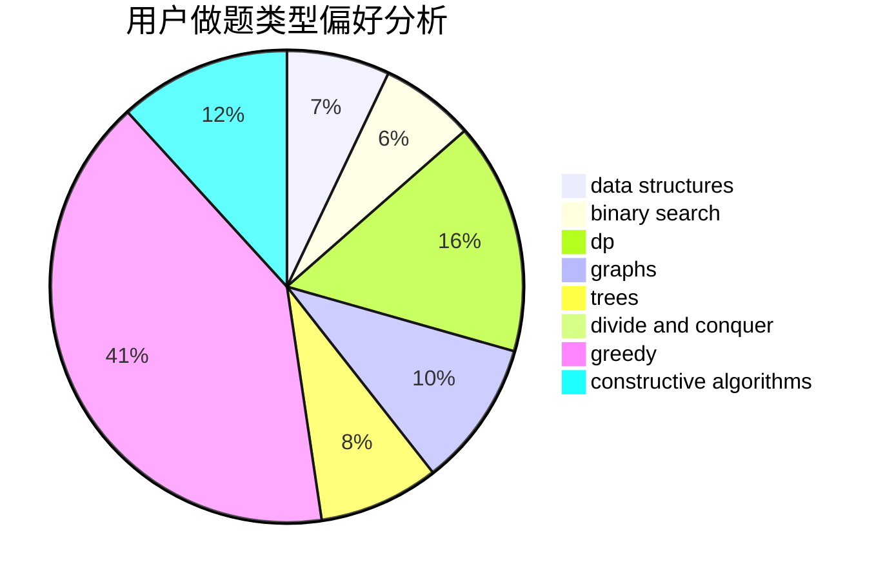
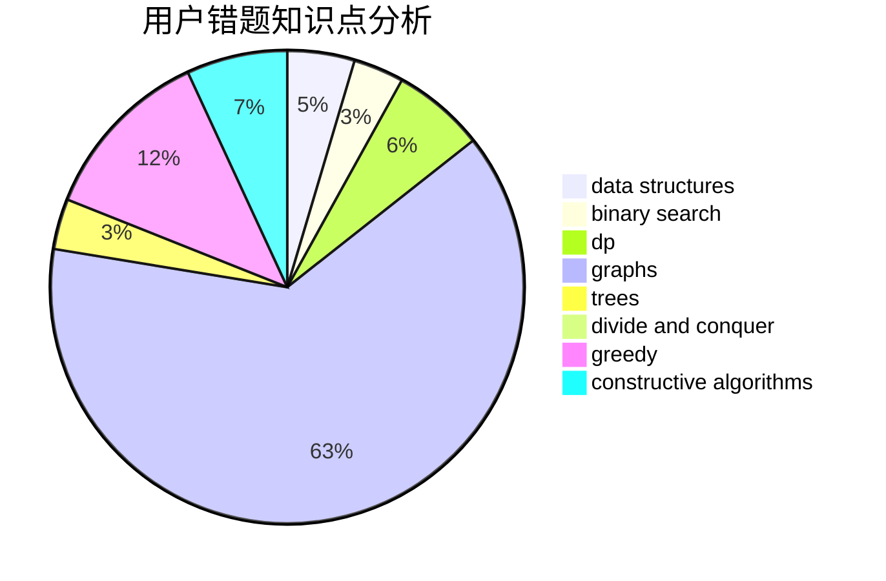

# Huangyb

<!-- tabs:start -->

#### **用户提交结果分析**

#### **用户做题类型偏好分析**

#### **用户错题知识点分析**

<!-- tabs:end -->
# 推荐题目
[786D](https://codeforces.com/contest/786/problem/D)		data structures,
                        dfs and similar,
                        hashing,
                        strings,
                        trees		  
[449C](https://codeforces.com/contest/449/problem/C)		constructive algorithms,
                        number theory		  
[596A](https://codeforces.com/contest/596/problem/A)		geometry,
                        implementation		  
[523A](https://codeforces.com/contest/523/problem/A)		*special problem,
                        implementation		  
[870E](https://codeforces.com/contest/870/problem/E)		dfs and similar,
                        dsu,
                        graphs,
                        trees		  
[16A](https://codeforces.com/contest/16/problem/A)		implementation		  
[1151A](https://codeforces.com/contest/1151/problem/A)		brute force,
                        strings		  
[334A](https://codeforces.com/contest/334/problem/A)		implementation		  
[585D](https://codeforces.com/contest/585/problem/D)		meet-in-the-middle		  
[1207F](https://codeforces.com/contest/1207/problem/F)		brute force,
                        data structures,
                        implementation		  
