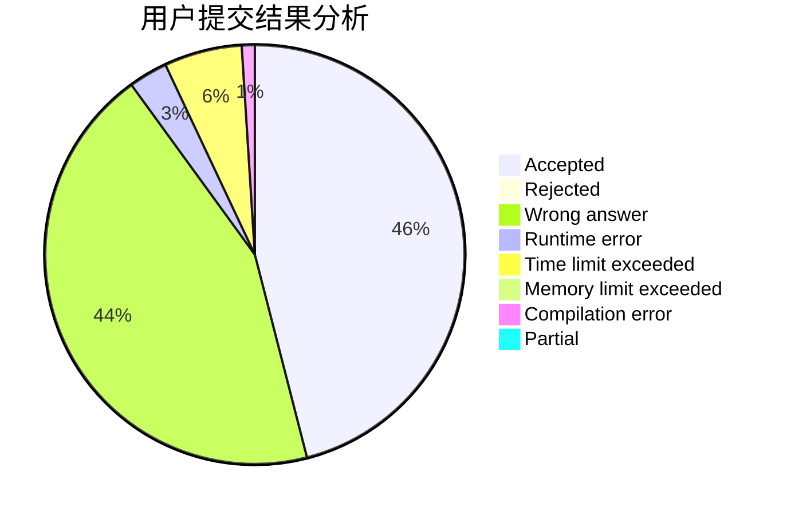
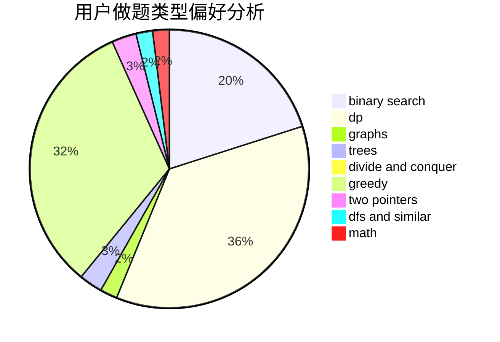

# HungTeen

<!-- tabs:start -->

#### **用户提交结果分析**

#### **用户做题类型偏好分析**

<!-- tabs:end -->
# 推荐题目
[371C](https://codeforces.com/contest/371/problem/C)
[777A](https://codeforces.com/contest/777/problem/A)
[932B](https://codeforces.com/contest/932/problem/B)
[1220A](https://codeforces.com/contest/1220/problem/A)
[1043A](https://codeforces.com/contest/1043/problem/A)
[11301](https://codeforces.com/contest/1130/problem/1)
[1176E](https://codeforces.com/contest/1176/problem/E)
[1225D](https://codeforces.com/contest/1225/problem/D)
[137D](https://codeforces.com/contest/137/problem/D)
[699D](https://codeforces.com/contest/699/problem/D)
