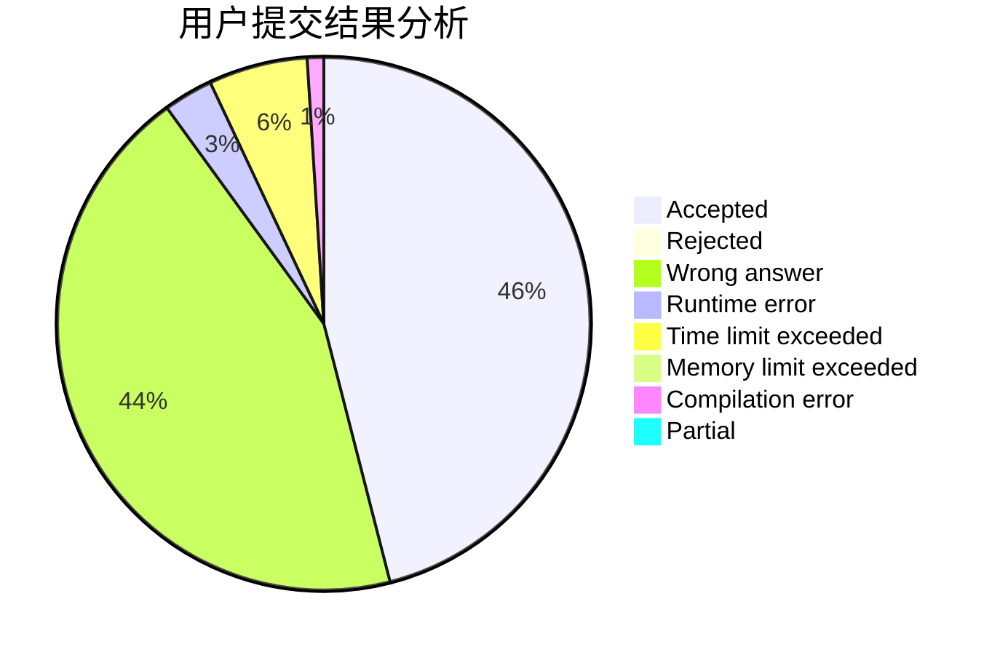
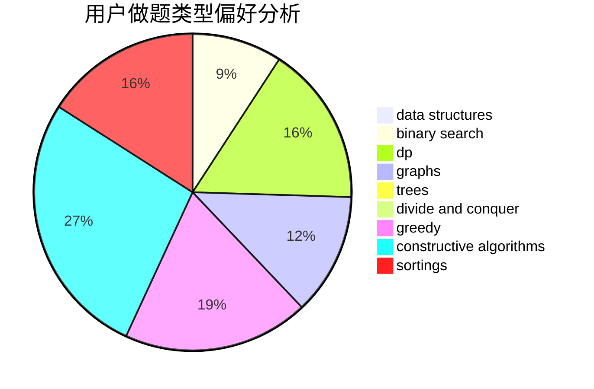
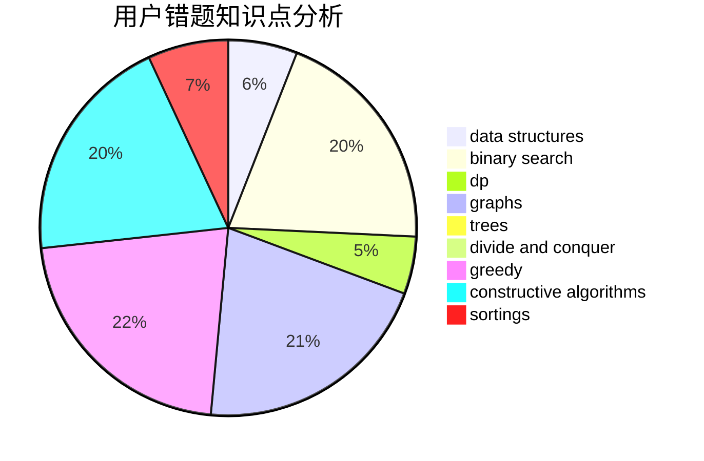

# HungTeen
<!-- tabs:start -->
#### **用户提交结果分析**

#### **用户做题类型偏好分析**

#### **用户错题知识点分析**

<!-- tabs:end -->
# 推荐题目
[345A](http://codeforces.com/problemset/problem/345/A)		*special problem,
                        probabilities		  
[1214E](http://codeforces.com/problemset/problem/1214/E)		constructive algorithms,
                        graphs,
                        math,
                        sortings,
                        trees		  
[1247A](https://codeforces.com/contest/1247/problem/A)		math		  
[1143C](http://codeforces.com/problemset/problem/1143/C)		dfs and similar,
                        trees		  
[402E](http://codeforces.com/problemset/problem/402/E)		graphs,
                        math		  
[682B](http://codeforces.com/problemset/problem/682/B)		sortings		  
[1054D](http://codeforces.com/problemset/problem/1054/D)		greedy,
                        implementation		  
[677B](http://codeforces.com/problemset/problem/677/B)		implementation,
                        math		  
[1446E](http://codeforces.com/problemset/problem/1446/E)		constructive algorithms,
                        dfs and similar		  
[906E](http://codeforces.com/problemset/problem/906/E)		dp,
                        string suffix structures,
                        strings		  
<!-- tabs:start -->
#### **data structures**
[1042D](http://codeforces.com/problemset/problem/1042/D)		data structures,
                        divide and conquer,
                        two pointers		  
[1217F](http://codeforces.com/problemset/problem/1217/F)		data structures,
                        divide and conquer,
                        dsu,
                        graphs,
                        trees		  
[757G](http://codeforces.com/problemset/problem/757/G)		data structures,
                        divide and conquer,
                        graphs,
                        trees		  
[444C](http://codeforces.com/problemset/problem/444/C)		data structures		  
[674G](https://codeforces.com/contest/674/problem/G)		data structures		  
[913D](http://codeforces.com/problemset/problem/913/D)		binary search,
                        brute force,
                        data structures,
                        greedy,
                        sortings		  
[1320D](http://codeforces.com/problemset/problem/1320/D)		data structures,
                        hashing,
                        strings		  
[1400E](http://codeforces.com/problemset/problem/1400/E)		data structures,
                        divide and conquer,
                        dp,
                        greedy		  
[1503F](http://codeforces.com/problemset/problem/1503/F)		constructive algorithms,
                        data structures,
                        divide and conquer,
                        geometry,
                        graphs,
                        implementation		  
[1492C](http://codeforces.com/problemset/problem/1492/C)		binary search,
                        data structures,
                        dp,
                        greedy,
                        two pointers		  
#### **binary search**
[913D](http://codeforces.com/problemset/problem/913/D)		binary search,
                        brute force,
                        data structures,
                        greedy,
                        sortings		  
[1419D2](http://codeforces.com/problemset/problem/1419/D2)		binary search,
                        brute force,
                        constructive algorithms,
                        greedy,
                        sortings,
                        two pointers		  
[1492C](http://codeforces.com/problemset/problem/1492/C)		binary search,
                        data structures,
                        dp,
                        greedy,
                        two pointers		  
[1463D](http://codeforces.com/problemset/problem/1463/D)		binary search,
                        constructive algorithms,
                        greedy,
                        two pointers		  
[1490G](http://codeforces.com/problemset/problem/1490/G)		binary search,
                        data structures,
                        math		  
[1479D](http://codeforces.com/problemset/problem/1479/D)		binary search,
                        bitmasks,
                        brute force,
                        data structures,
                        probabilities,
                        trees		  
[1436E](http://codeforces.com/problemset/problem/1436/E)		binary search,
                        data structures,
                        two pointers		  
[1461D](http://codeforces.com/problemset/problem/1461/D)		binary search,
                        brute force,
                        data structures,
                        divide and conquer,
                        implementation,
                        sortings		  
[1493C](http://codeforces.com/problemset/problem/1493/C)		binary search,
                        brute force,
                        constructive algorithms,
                        greedy,
                        strings		  
[1487D](http://codeforces.com/problemset/problem/1487/D)		binary search,
                        brute force,
                        math,
                        number theory		  
#### **dp**
[906E](http://codeforces.com/problemset/problem/906/E)		dp,
                        string suffix structures,
                        strings		  
[1120D](http://codeforces.com/problemset/problem/1120/D)		dfs and similar,
                        dp,
                        dsu,
                        graphs,
                        greedy,
                        trees		  
[1408I](http://codeforces.com/problemset/problem/1408/I)		dp,
                        math		  
[1400E](http://codeforces.com/problemset/problem/1400/E)		data structures,
                        divide and conquer,
                        dp,
                        greedy		  
[161D](http://codeforces.com/problemset/problem/161/D)		dfs and similar,
                        dp,
                        trees		  
[729F](http://codeforces.com/problemset/problem/729/F)		dp		  
[1492C](http://codeforces.com/problemset/problem/1492/C)		binary search,
                        data structures,
                        dp,
                        greedy,
                        two pointers		  
[1457C](https://codeforces.com/contest/1457/problem/C)		brute force,
                        dp,
                        implementation		  
[1491C](http://codeforces.com/problemset/problem/1491/C)		brute force,
                        data structures,
                        dp,
                        greedy,
                        implementation		  
[1437C](http://codeforces.com/problemset/problem/1437/C)		dp,
                        flows,
                        graph matchings,
                        greedy,
                        math,
                        sortings		  
#### **graph**
[1214E](http://codeforces.com/problemset/problem/1214/E)		constructive algorithms,
                        graphs,
                        math,
                        sortings,
                        trees		  
[402E](http://codeforces.com/problemset/problem/402/E)		graphs,
                        math		  
[1217F](http://codeforces.com/problemset/problem/1217/F)		data structures,
                        divide and conquer,
                        dsu,
                        graphs,
                        trees		  
[757G](http://codeforces.com/problemset/problem/757/G)		data structures,
                        divide and conquer,
                        graphs,
                        trees		  
[1120D](http://codeforces.com/problemset/problem/1120/D)		dfs and similar,
                        dp,
                        dsu,
                        graphs,
                        greedy,
                        trees		  
[1503F](http://codeforces.com/problemset/problem/1503/F)		constructive algorithms,
                        data structures,
                        divide and conquer,
                        geometry,
                        graphs,
                        implementation		  
[1487C](http://codeforces.com/problemset/problem/1487/C)		brute force,
                        constructive algorithms,
                        dfs and similar,
                        graphs,
                        greedy,
                        implementation,
                        math		  
[1437C](http://codeforces.com/problemset/problem/1437/C)		dp,
                        flows,
                        graph matchings,
                        greedy,
                        math,
                        sortings		  
[1470D](http://codeforces.com/problemset/problem/1470/D)		constructive algorithms,
                        dfs and similar,
                        graph matchings,
                        graphs,
                        greedy		  
[1476C](http://codeforces.com/problemset/problem/1476/C)		dp,
                        graphs,
                        greedy		  
#### **trees**
[1214E](http://codeforces.com/problemset/problem/1214/E)		constructive algorithms,
                        graphs,
                        math,
                        sortings,
                        trees		  
[1143C](http://codeforces.com/problemset/problem/1143/C)		dfs and similar,
                        trees		  
[1217F](http://codeforces.com/problemset/problem/1217/F)		data structures,
                        divide and conquer,
                        dsu,
                        graphs,
                        trees		  
[757G](http://codeforces.com/problemset/problem/757/G)		data structures,
                        divide and conquer,
                        graphs,
                        trees		  
[1120D](http://codeforces.com/problemset/problem/1120/D)		dfs and similar,
                        dp,
                        dsu,
                        graphs,
                        greedy,
                        trees		  
[1205D](http://codeforces.com/problemset/problem/1205/D)		constructive algorithms,
                        trees		  
[161D](http://codeforces.com/problemset/problem/161/D)		dfs and similar,
                        dp,
                        trees		  
[1479D](http://codeforces.com/problemset/problem/1479/D)		binary search,
                        bitmasks,
                        brute force,
                        data structures,
                        probabilities,
                        trees		  
[1511C](http://codeforces.com/problemset/problem/1511/C)		brute force,
                        data structures,
                        implementation,
                        trees		  
[1499F](http://codeforces.com/problemset/problem/1499/F)		combinatorics,
                        dfs and similar,
                        dp,
                        trees		  
#### **divide and conquer**
[1042D](http://codeforces.com/problemset/problem/1042/D)		data structures,
                        divide and conquer,
                        two pointers		  
[1217F](http://codeforces.com/problemset/problem/1217/F)		data structures,
                        divide and conquer,
                        dsu,
                        graphs,
                        trees		  
[757G](http://codeforces.com/problemset/problem/757/G)		data structures,
                        divide and conquer,
                        graphs,
                        trees		  
[1400E](http://codeforces.com/problemset/problem/1400/E)		data structures,
                        divide and conquer,
                        dp,
                        greedy		  
[1503F](http://codeforces.com/problemset/problem/1503/F)		constructive algorithms,
                        data structures,
                        divide and conquer,
                        geometry,
                        graphs,
                        implementation		  
[1461D](http://codeforces.com/problemset/problem/1461/D)		binary search,
                        brute force,
                        data structures,
                        divide and conquer,
                        implementation,
                        sortings		  
[1466G](http://codeforces.com/problemset/problem/1466/G)		combinatorics,
                        divide and conquer,
                        hashing,
                        math,
                        string suffix structures,
                        strings		  
[1490D](http://codeforces.com/problemset/problem/1490/D)		dfs and similar,
                        divide and conquer,
                        implementation		  
[1483C](https://codeforces.com/contest/1483/problem/C)		data structures,
                        divide and conquer,
                        dp		  
[1491E](http://codeforces.com/problemset/problem/1491/E)		brute force,
                        dfs and similar,
                        divide and conquer,
                        number theory,
                        trees		  
#### **greedy**
[1054D](http://codeforces.com/problemset/problem/1054/D)		greedy,
                        implementation		  
[701A](http://codeforces.com/problemset/problem/701/A)		greedy,
                        implementation		  
[337A](http://codeforces.com/problemset/problem/337/A)		greedy		  
[913D](http://codeforces.com/problemset/problem/913/D)		binary search,
                        brute force,
                        data structures,
                        greedy,
                        sortings		  
[1120D](http://codeforces.com/problemset/problem/1120/D)		dfs and similar,
                        dp,
                        dsu,
                        graphs,
                        greedy,
                        trees		  
[1419D2](http://codeforces.com/problemset/problem/1419/D2)		binary search,
                        brute force,
                        constructive algorithms,
                        greedy,
                        sortings,
                        two pointers		  
[1400E](http://codeforces.com/problemset/problem/1400/E)		data structures,
                        divide and conquer,
                        dp,
                        greedy		  
[1492C](http://codeforces.com/problemset/problem/1492/C)		binary search,
                        data structures,
                        dp,
                        greedy,
                        two pointers		  
[1496C](https://codeforces.com/contest/1496/problem/C)		geometry,
                        greedy,
                        math,
                        sortings		  
[1493A](http://codeforces.com/problemset/problem/1493/A)		constructive algorithms,
                        greedy		  
#### **constructive algorithms**
[1214E](http://codeforces.com/problemset/problem/1214/E)		constructive algorithms,
                        graphs,
                        math,
                        sortings,
                        trees		  
[1446E](http://codeforces.com/problemset/problem/1446/E)		constructive algorithms,
                        dfs and similar		  
[1174C](http://codeforces.com/problemset/problem/1174/C)		constructive algorithms,
                        number theory		  
[1205D](http://codeforces.com/problemset/problem/1205/D)		constructive algorithms,
                        trees		  
[1419D2](http://codeforces.com/problemset/problem/1419/D2)		binary search,
                        brute force,
                        constructive algorithms,
                        greedy,
                        sortings,
                        two pointers		  
[1503F](http://codeforces.com/problemset/problem/1503/F)		constructive algorithms,
                        data structures,
                        divide and conquer,
                        geometry,
                        graphs,
                        implementation		  
[1395B](http://codeforces.com/problemset/problem/1395/B)		constructive algorithms		  
[1493A](http://codeforces.com/problemset/problem/1493/A)		constructive algorithms,
                        greedy		  
[1463D](http://codeforces.com/problemset/problem/1463/D)		binary search,
                        constructive algorithms,
                        greedy,
                        two pointers		  
[1456B](https://codeforces.com/contest/1456/problem/B)		bitmasks,
                        brute force,
                        constructive algorithms		  
#### **sortings**
[1214E](http://codeforces.com/problemset/problem/1214/E)		constructive algorithms,
                        graphs,
                        math,
                        sortings,
                        trees		  
[682B](http://codeforces.com/problemset/problem/682/B)		sortings		  
[1345C](https://codeforces.com/contest/1345/problem/C)		math,
                        number theory,
                        sortings		  
[913D](http://codeforces.com/problemset/problem/913/D)		binary search,
                        brute force,
                        data structures,
                        greedy,
                        sortings		  
[1419D2](http://codeforces.com/problemset/problem/1419/D2)		binary search,
                        brute force,
                        constructive algorithms,
                        greedy,
                        sortings,
                        two pointers		  
[1496C](https://codeforces.com/contest/1496/problem/C)		geometry,
                        greedy,
                        math,
                        sortings		  
[1495A](http://codeforces.com/problemset/problem/1495/A)		geometry,
                        greedy,
                        math,
                        sortings		  
[1497A](http://codeforces.com/problemset/problem/1497/A)		brute force,
                        data structures,
                        greedy,
                        sortings		  
[1427A](http://codeforces.com/problemset/problem/1427/A)		math,
                        sortings		  
[1461D](http://codeforces.com/problemset/problem/1461/D)		binary search,
                        brute force,
                        data structures,
                        divide and conquer,
                        implementation,
                        sortings		  
<!-- tabs:end -->
