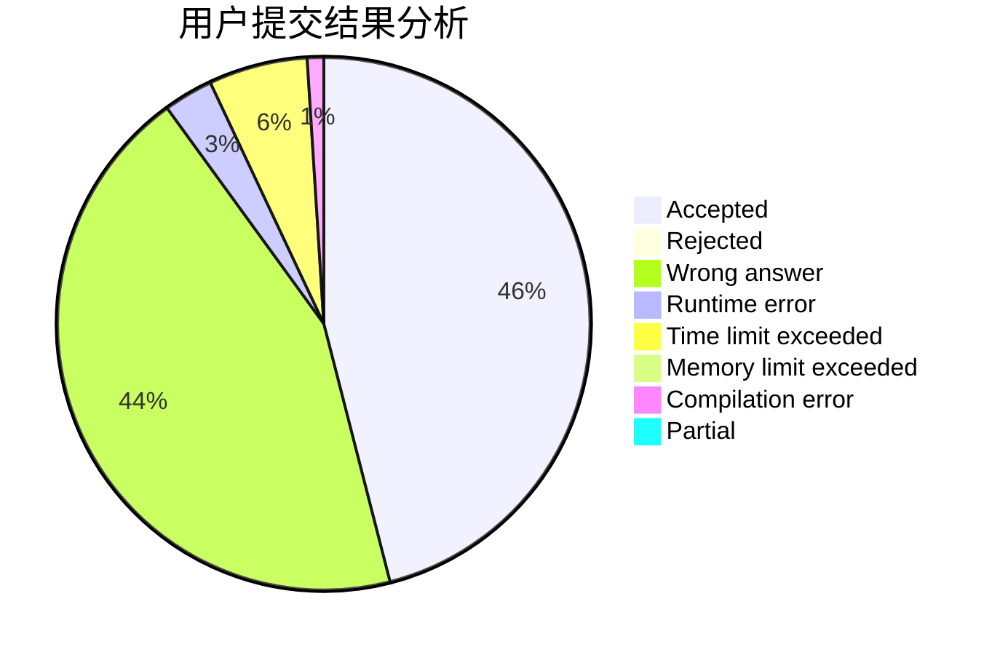
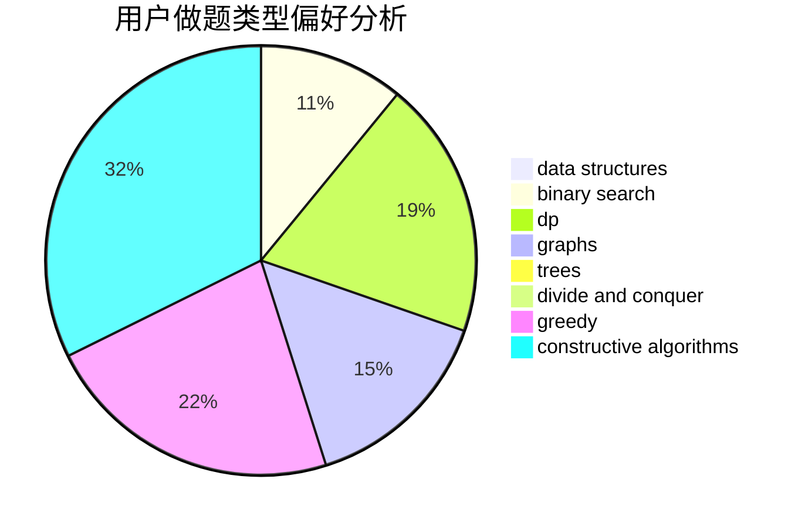
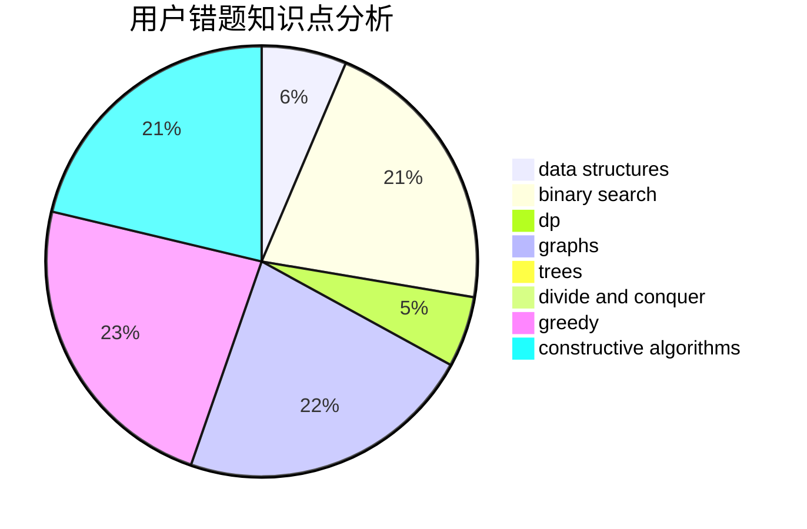

# HungTeen

<!-- tabs:start -->

#### **用户提交结果分析**

#### **用户做题类型偏好分析**

#### **用户错题知识点分析**

<!-- tabs:end -->
# 推荐题目
[345A](https://codeforces.com/contest/345/problem/A)		*special problem,
                        probabilities		  
[757G](https://codeforces.com/contest/757/problem/G)		data structures,
                        divide and conquer,
                        graphs,
                        trees		  
[913D](https://codeforces.com/contest/913/problem/D)		binary search,
                        brute force,
                        data structures,
                        greedy,
                        sortings		  
[1214E](https://codeforces.com/contest/1214/problem/E)		constructive algorithms,
                        graphs,
                        math,
                        sortings,
                        trees		  
[1042D](https://codeforces.com/contest/1042/problem/D)		data structures,
                        divide and conquer,
                        two pointers		  
[1120D](https://codeforces.com/contest/1120/problem/D)		dfs and similar,
                        dp,
                        dsu,
                        graphs,
                        greedy,
                        trees		  
[1174C](https://codeforces.com/contest/1174/problem/C)		constructive algorithms,
                        number theory		  
[1217F](https://codeforces.com/contest/1217/problem/F)		data structures,
                        divide and conquer,
                        dsu,
                        graphs,
                        trees		  
[1371B](https://codeforces.com/contest/1371/problem/B)		math		  
[674G](https://codeforces.com/contest/674/problem/G)		dsu,graphs,sortings,trees		  
