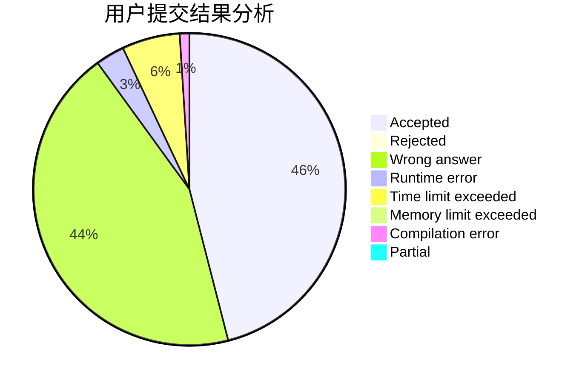
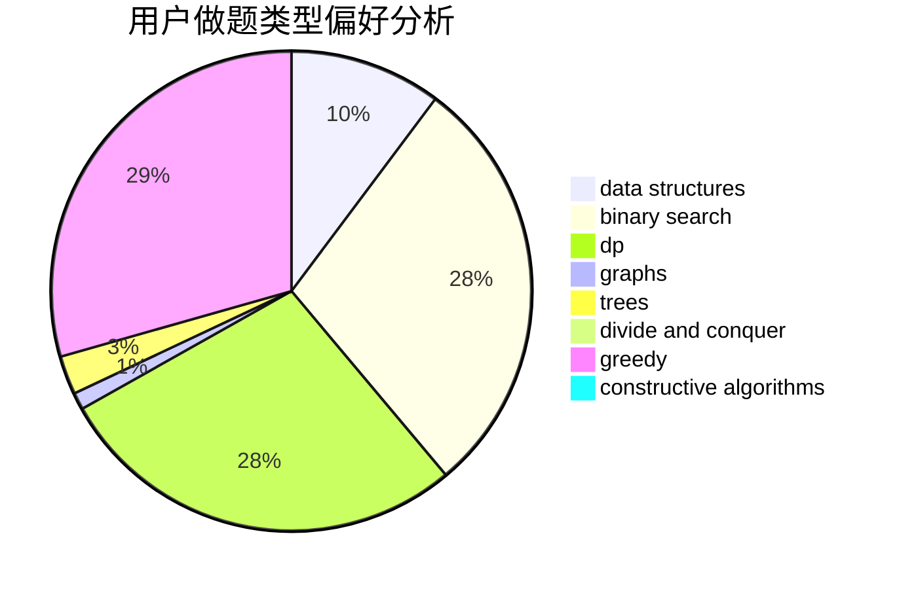
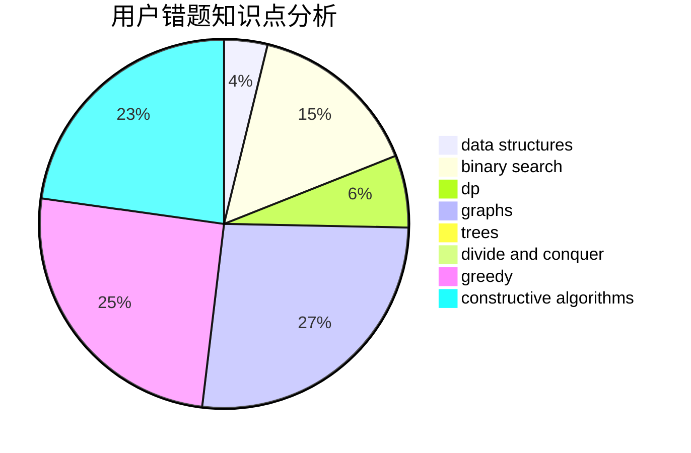

# HungTeen

<!-- tabs:start -->

#### **用户提交结果分析**

#### **用户做题类型偏好分析**

#### **用户错题知识点分析**

<!-- tabs:end -->
# 推荐题目
[371C](https://codeforces.com/contest/371/problem/C)		binary search,
                        brute force		  
[777A](https://codeforces.com/contest/777/problem/A)		constructive algorithms,
                        implementation,
                        math		  
[932B](https://codeforces.com/contest/932/problem/B)		binary search,
                        data structures,
                        dfs and similar		  
[1220A](https://codeforces.com/contest/1220/problem/A)		implementation,
                        sortings,
                        strings		  
[1043A](https://codeforces.com/contest/1043/problem/A)		implementation,
                        math		  
[11301](https://codeforces.com/contest/1130/problem/1)		dsu,graphs,sortings,trees		  
[1176E](https://codeforces.com/contest/1176/problem/E)		dfs and similar,
                        dsu,
                        graphs,
                        shortest paths,
                        trees		  
[1225D](https://codeforces.com/contest/1225/problem/D)		hashing,
                        math,
                        number theory		  
[137D](https://codeforces.com/contest/137/problem/D)		dp,
                        strings		  
[699D](https://codeforces.com/contest/699/problem/D)		dsu,graphs,sortings,trees		  
