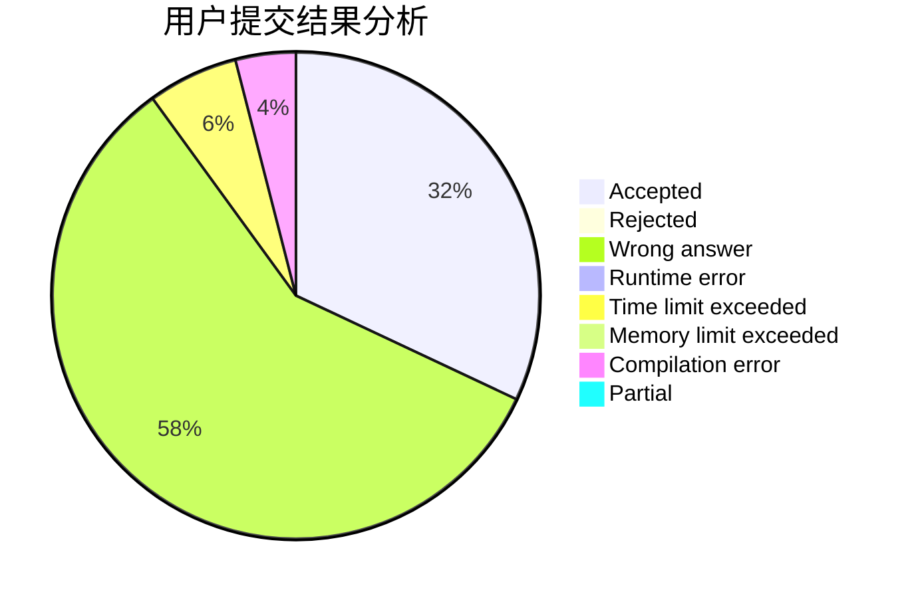
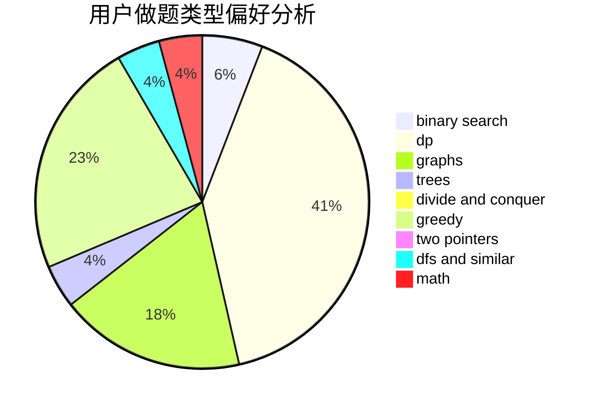

# Hunter_Will

<!-- tabs:start -->

#### **用户提交结果分析**

#### **用户做题类型偏好分析**

<!-- tabs:end -->
# 推荐题目
[802N](https://codeforces.com/contest/802/problem/N)
[367C](https://codeforces.com/contest/367/problem/C)
[120H](https://codeforces.com/contest/120/problem/H)
[1109B](https://codeforces.com/contest/1109/problem/B)
[721E](https://codeforces.com/contest/721/problem/E)
[1428H](https://codeforces.com/contest/1428/problem/H)
[932C](https://codeforces.com/contest/932/problem/C)
[729D](https://codeforces.com/contest/729/problem/D)
[1191F](https://codeforces.com/contest/1191/problem/F)
[1066E](https://codeforces.com/contest/1066/problem/E)
