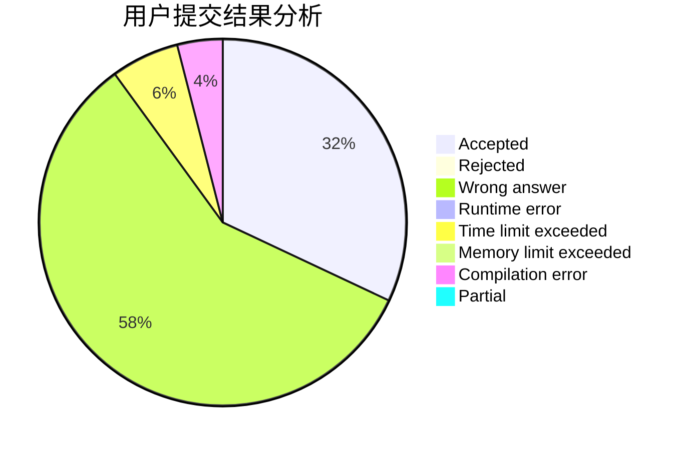
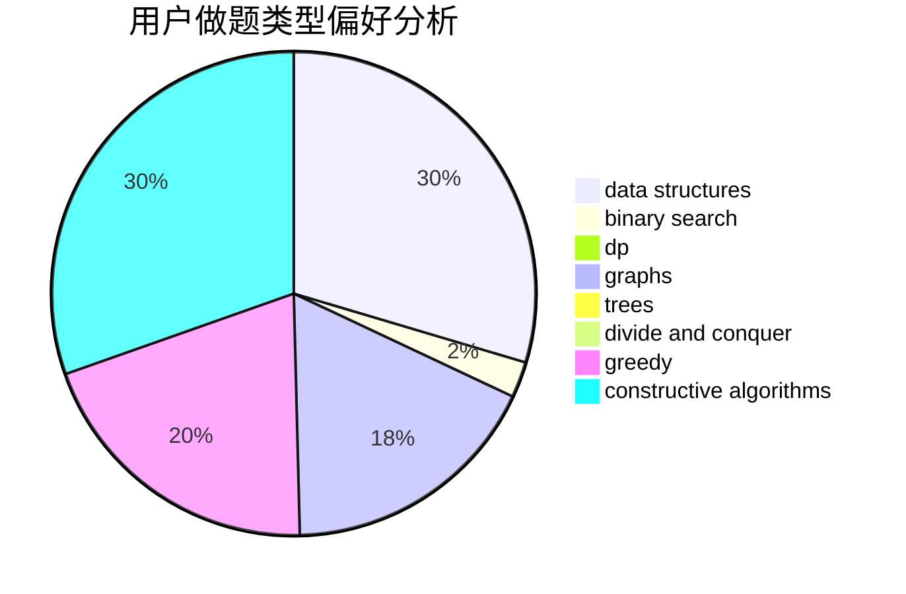

# Hunter_Will

<!-- tabs:start -->

#### **用户提交结果分析**

#### **用户做题类型偏好分析**

#### **用户错题知识点分析**

<!-- tabs:end -->
# 推荐题目
[802N](https://codeforces.com/contest/802/problem/N)		binary search,
                        flows,
                        graphs		  
[367C](https://codeforces.com/contest/367/problem/C)		graphs,
                        greedy,
                        sortings		  
[120H](https://codeforces.com/contest/120/problem/H)		graph matchings		  
[1109B](https://codeforces.com/contest/1109/problem/B)		constructive algorithms,
                        hashing,
                        strings		  
[721E](https://codeforces.com/contest/721/problem/E)		binary search,
                        dp		  
[1428H](https://codeforces.com/contest/1428/problem/H)		binary search,
                        interactive		  
[932C](https://codeforces.com/contest/932/problem/C)		brute force,
                        constructive algorithms		  
[729D](https://codeforces.com/contest/729/problem/D)		constructive algorithms,
                        greedy,
                        math		  
[1191F](https://codeforces.com/contest/1191/problem/F)		dsu,graphs,sortings,trees		  
[1066E](https://codeforces.com/contest/1066/problem/E)		data structures,
                        implementation,
                        math		  
