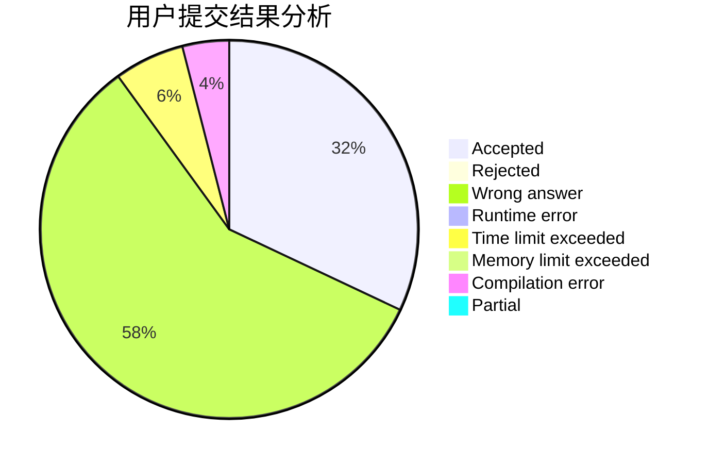
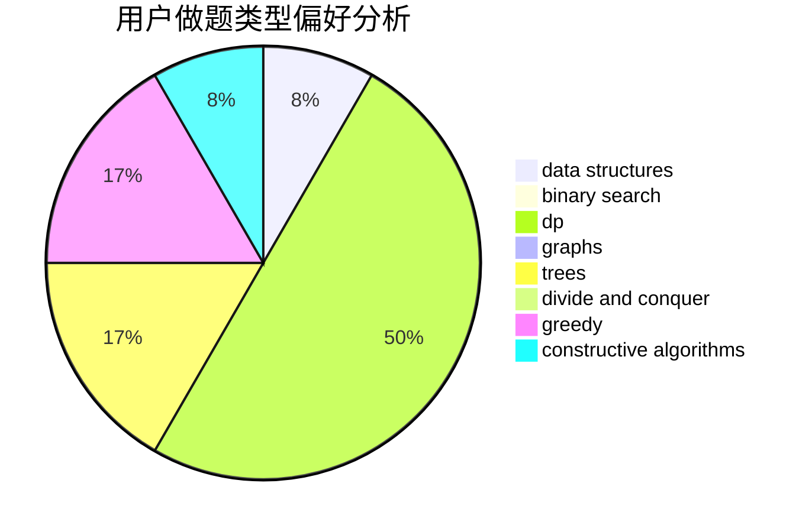

# Hunter_Will

<!-- tabs:start -->

#### **用户提交结果分析**

#### **用户做题类型偏好分析**

#### **用户错题知识点分析**

<!-- tabs:end -->
# 推荐题目
[786C](https://codeforces.com/contest/786/problem/C)		data structures,
                        divide and conquer		  
[33C](https://codeforces.com/contest/33/problem/C)		greedy		  
[1205E](https://codeforces.com/contest/1205/problem/E)		combinatorics,
                        strings		  
[1108E2](https://codeforces.com/contest/1108E/problem/2)		data structures,
                        implementation		  
[703A](https://codeforces.com/contest/703/problem/A)		implementation		  
[1421D](https://codeforces.com/contest/1421/problem/D)		brute force,
                        constructive algorithms,
                        greedy,
                        implementation,
                        math,
                        shortest paths		  
[913E](https://codeforces.com/contest/913/problem/E)		bitmasks,
                        dp,
                        shortest paths		  
[709C](https://codeforces.com/contest/709/problem/C)		dsu,graphs,sortings,trees		  
[1188A2](https://codeforces.com/contest/1188A/problem/2)		constructive algorithms,
                        dfs and similar,
                        implementation,
                        trees		  
[1066B](https://codeforces.com/contest/1066/problem/B)		greedy,
                        two pointers		  
