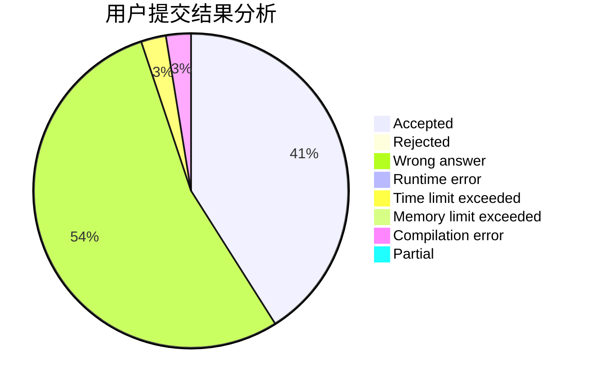
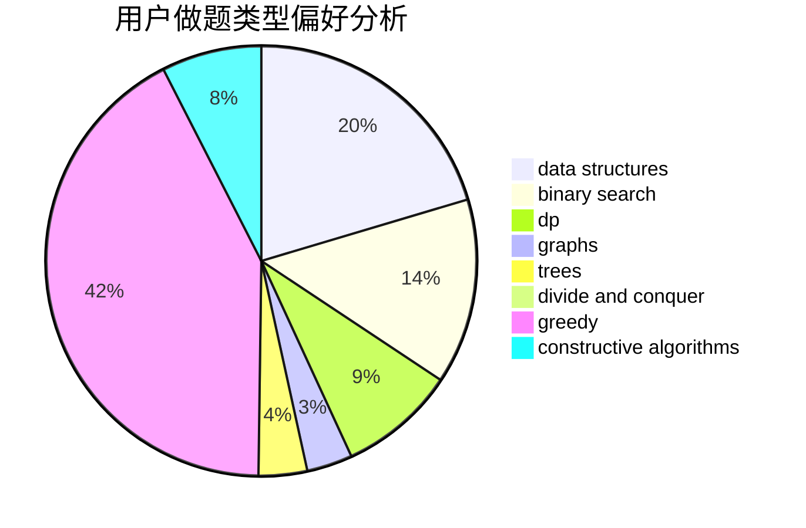
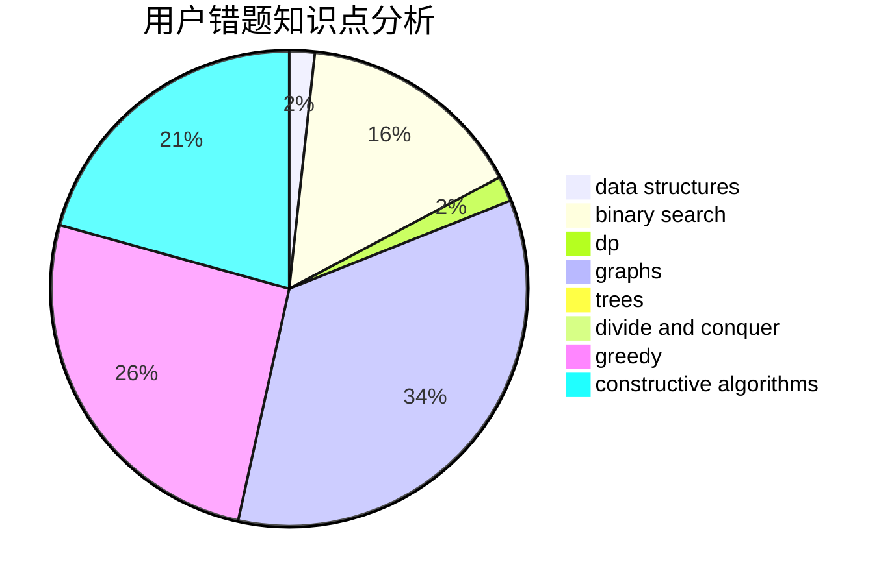

# Huosj

<!-- tabs:start -->

#### **用户提交结果分析**

#### **用户做题类型偏好分析**

#### **用户错题知识点分析**

<!-- tabs:end -->
# 推荐题目
[1415E](https://codeforces.com/contest/1415/problem/E)		constructive algorithms,
                        greedy,
                        math		  
[543C](https://codeforces.com/contest/543/problem/C)		bitmasks,
                        dp		  
[229D](https://codeforces.com/contest/229/problem/D)		dp,
                        greedy,
                        two pointers		  
[1417C](https://codeforces.com/contest/1417/problem/C)		dsu,graphs,sortings,trees		  
[1238E](https://codeforces.com/contest/1238/problem/E)		bitmasks,
                        dp		  
[455A](https://codeforces.com/contest/455/problem/A)		dp		  
[417C](https://codeforces.com/contest/417/problem/C)		constructive algorithms,
                        graphs,
                        implementation		  
[670D1](https://codeforces.com/contest/670D/problem/1)		binary search,
                        brute force,
                        implementation		  
[316D3](https://codeforces.com/contest/316D/problem/3)		dp,
                        math		  
[543A](https://codeforces.com/contest/543/problem/A)		dp		  
