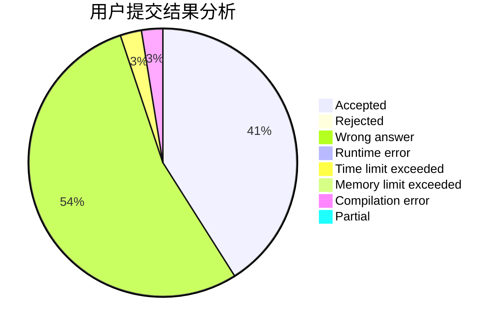
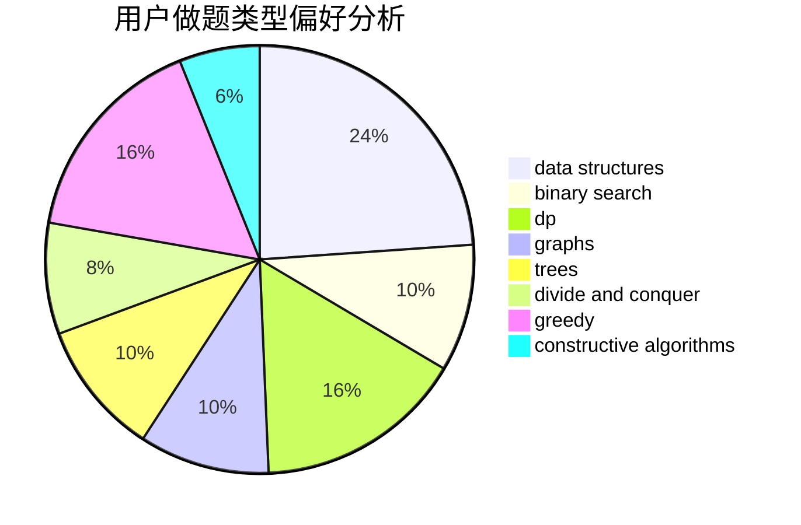
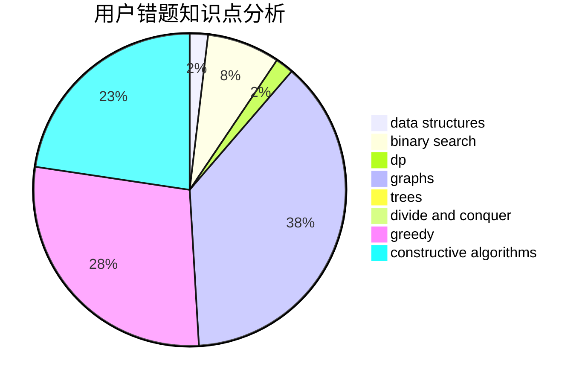

# Huosj

<!-- tabs:start -->

#### **用户提交结果分析**

#### **用户做题类型偏好分析**

#### **用户错题知识点分析**

<!-- tabs:end -->
# 推荐题目
[1423I](https://codeforces.com/contest/1423/problem/I)		bitmasks		  
[567E](https://codeforces.com/contest/567/problem/E)		dfs and similar,
                        graphs,
                        hashing,
                        shortest paths		  
[249E](https://codeforces.com/contest/249/problem/E)		math		  
[1424M](https://codeforces.com/contest/1424/problem/M)		graphs,
                        sortings		  
[1243E](https://codeforces.com/contest/1243/problem/E)		dsu,graphs,sortings,trees		  
[476B](https://codeforces.com/contest/476/problem/B)		bitmasks,
                        brute force,
                        combinatorics,
                        dp,
                        math,
                        probabilities		  
[442B](https://codeforces.com/contest/442/problem/B)		greedy,
                        math,
                        probabilities		  
[696B](https://codeforces.com/contest/696/problem/B)		dfs and similar,
                        math,
                        probabilities,
                        trees		  
[342C](https://codeforces.com/contest/342/problem/C)		geometry		  
[567C](https://codeforces.com/contest/567/problem/C)		binary search,
                        data structures,
                        dp		  
