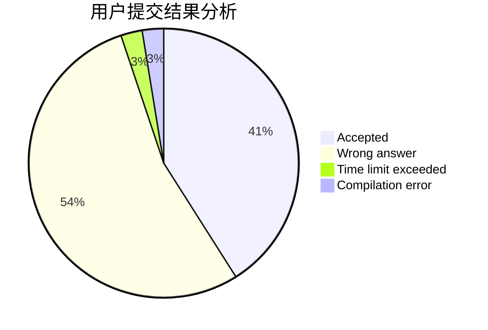
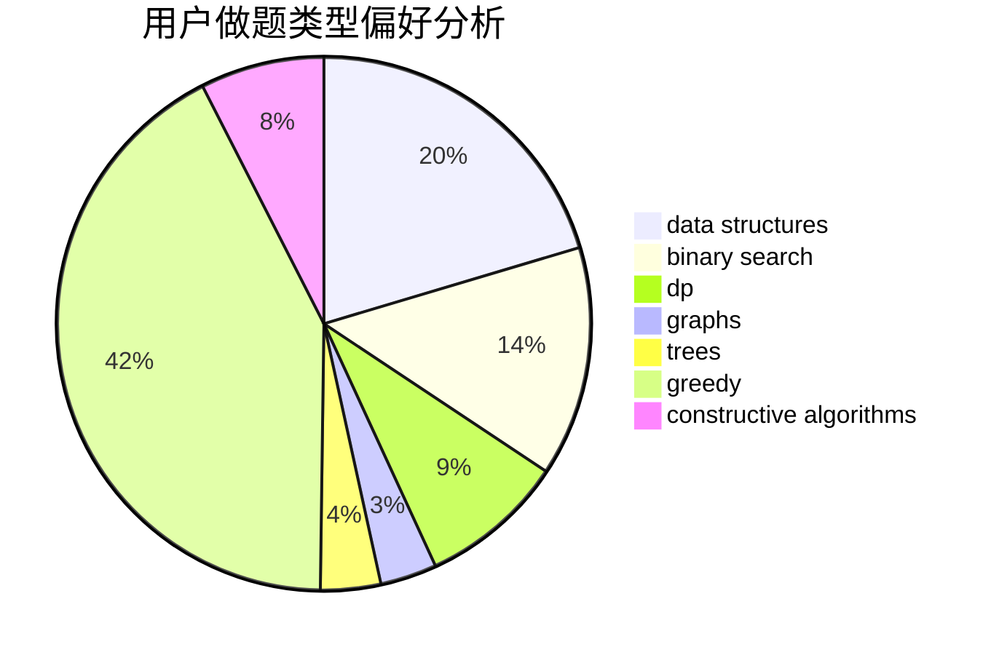
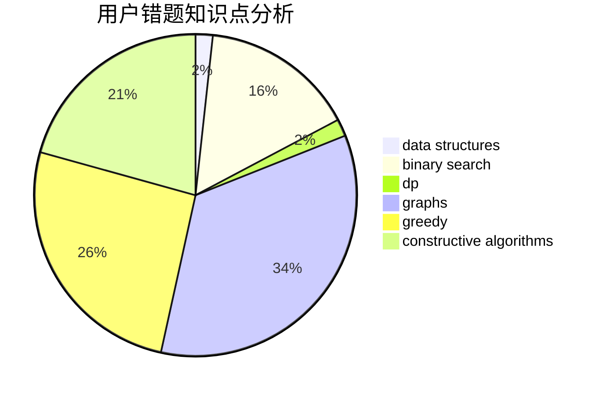

# Huosj
<!-- tabs:start -->
#### **用户提交结果分析**

#### **用户做题类型偏好分析**

#### **用户错题知识点分析**

<!-- tabs:end -->
# 推荐题目
[XORwice](http://codeforces.com/problemset/problem/1421/A)		bitmasks,
                        greedy,
                        math		  
[Aerodynamic](http://codeforces.com/problemset/problem/1299/B)		geometry		  
[k-Amazing Numbers](https://codeforces.com/contest/1417/problem/C)		binary search,
                        data structures,
                        implementation,
                        two pointers		  
[Game With Array](http://codeforces.com/problemset/problem/1355/D)		constructive algorithms,
                        math		  
[Increase and Copy](http://codeforces.com/problemset/problem/1426/C)		binary search,
                        constructive algorithms,
                        math		  
[New Game Plus!](http://codeforces.com/problemset/problem/1415/E)		constructive algorithms,
                        greedy,
                        math		  
[Remembering Strings](http://codeforces.com/problemset/problem/543/C)		bitmasks,
                        dp		  
[Football](http://codeforces.com/problemset/problem/417/C)		constructive algorithms,
                        graphs,
                        implementation		  
[Keyboard Purchase](http://codeforces.com/problemset/problem/1238/E)		bitmasks,
                        dp		  
[Lucky Permutation](http://codeforces.com/problemset/problem/121/C)		brute force,
                        combinatorics,
                        number theory		  
<!-- tabs:start -->
#### **data structures**
[k-Amazing Numbers](https://codeforces.com/contest/1417/problem/C)		binary search,
                        data structures,
                        implementation,
                        two pointers		  
[Lunar New Year and Food Ordering](http://codeforces.com/problemset/problem/1106/B)		data structures,
                        implementation		  
[Andryusha and Nervous Barriers](http://codeforces.com/problemset/problem/780/G)		data structures,
                        dp		  
[Ball](http://codeforces.com/problemset/problem/12/D)		data structures,
                        sortings		  
[Preparing for the Contest](http://codeforces.com/problemset/problem/377/B)		binary search,
                        data structures,
                        greedy,
                        sortings		  
[Watching Fireworks is Fun](http://codeforces.com/problemset/problem/372/C)		data structures,
                        dp,
                        math		  
[Mahmoud and a xor trip](http://codeforces.com/problemset/problem/766/E)		bitmasks,
                        constructive algorithms,
                        data structures,
                        dfs and similar,
                        dp,
                        math,
                        trees		  
[Playlist](https://codeforces.com/contest/1483/problem/B)		data structures,
                        dsu,
                        implementation,
                        shortest paths		  
[Maximum width](http://codeforces.com/problemset/problem/1492/C)		binary search,
                        data structures,
                        dp,
                        greedy,
                        two pointers		  
[Old Floppy Drive](http://codeforces.com/problemset/problem/1490/G)		binary search,
                        data structures,
                        math		  
#### **binary search**
[k-Amazing Numbers](https://codeforces.com/contest/1417/problem/C)		binary search,
                        data structures,
                        implementation,
                        two pointers		  
[Increase and Copy](http://codeforces.com/problemset/problem/1426/C)		binary search,
                        constructive algorithms,
                        math		  
[Magic Powder - 1](http://codeforces.com/problemset/problem/670/D1)		binary search,
                        brute force,
                        implementation		  
[Preparing for the Contest](http://codeforces.com/problemset/problem/377/B)		binary search,
                        data structures,
                        greedy,
                        sortings		  
[Classical?](http://codeforces.com/problemset/problem/1285/F)		binary search,
                        combinatorics,
                        number theory		  
[Michael and Charging Stations](http://codeforces.com/problemset/problem/853/D)		binary search,
                        dp,
                        greedy		  
[Maximum width](http://codeforces.com/problemset/problem/1492/C)		binary search,
                        data structures,
                        dp,
                        greedy,
                        two pointers		  
[Pairs](http://codeforces.com/problemset/problem/1463/D)		binary search,
                        constructive algorithms,
                        greedy,
                        two pointers		  
[Old Floppy Drive](http://codeforces.com/problemset/problem/1490/G)		binary search,
                        data structures,
                        math		  
[Odd Mineral Resource](http://codeforces.com/problemset/problem/1479/D)		binary search,
                        bitmasks,
                        brute force,
                        data structures,
                        probabilities,
                        trees		  
#### **dp**
[Remembering Strings](http://codeforces.com/problemset/problem/543/C)		bitmasks,
                        dp		  
[Keyboard Purchase](http://codeforces.com/problemset/problem/1238/E)		bitmasks,
                        dp		  
[Towers](http://codeforces.com/problemset/problem/229/D)		dp,
                        greedy,
                        two pointers		  
[Andryusha and Nervous Barriers](http://codeforces.com/problemset/problem/780/G)		data structures,
                        dp		  
[Boredom](http://codeforces.com/problemset/problem/455/A)		dp		  
[Yet Another Substring Reverse](http://codeforces.com/problemset/problem/1234/F)		bitmasks,
                        dp		  
[Michael and Charging Stations](http://codeforces.com/problemset/problem/853/D)		binary search,
                        dp,
                        greedy		  
[Thief in a Shop](http://codeforces.com/problemset/problem/632/E)		divide and conquer,
                        dp,
                        fft,
                        math		  
[Watching Fireworks is Fun](http://codeforces.com/problemset/problem/372/C)		data structures,
                        dp,
                        math		  
[Mahmoud and a xor trip](http://codeforces.com/problemset/problem/766/E)		bitmasks,
                        constructive algorithms,
                        data structures,
                        dfs and similar,
                        dp,
                        math,
                        trees		  
#### **graph**
[Football](http://codeforces.com/problemset/problem/417/C)		constructive algorithms,
                        graphs,
                        implementation		  
[Strongly Connected Tournament](http://codeforces.com/problemset/problem/913/F)		dp,
                        graphs,
                        math,
                        probabilities		  
[Monopole Magnets](https://codeforces.com/contest/1345/problem/D)		constructive algorithms,
                        dfs and similar,
                        dsu,
                        graphs		  
[Minimum Ties](http://codeforces.com/problemset/problem/1487/C)		brute force,
                        constructive algorithms,
                        dfs and similar,
                        graphs,
                        greedy,
                        implementation,
                        math		  
[Chef Monocarp](http://codeforces.com/problemset/problem/1437/C)		dp,
                        flows,
                        graph matchings,
                        greedy,
                        math,
                        sortings		  
[Strange Housing](http://codeforces.com/problemset/problem/1470/D)		constructive algorithms,
                        dfs and similar,
                        graph matchings,
                        graphs,
                        greedy		  
[Longest Simple Cycle](http://codeforces.com/problemset/problem/1476/C)		dp,
                        graphs,
                        greedy		  
[Shortest and Longest LIS](http://codeforces.com/problemset/problem/1304/D)		constructive algorithms,
                        graphs,
                        greedy,
                        two pointers		  
[Ball in Berland](http://codeforces.com/problemset/problem/1475/C)		combinatorics,
                        graphs,
                        math		  
[Kyoya and Train](http://codeforces.com/problemset/problem/553/E)		dp,
                        fft,
                        graphs,
                        math,
                        probabilities		  
#### **trees**
[Mahmoud and a xor trip](http://codeforces.com/problemset/problem/766/E)		bitmasks,
                        constructive algorithms,
                        data structures,
                        dfs and similar,
                        dp,
                        math,
                        trees		  
[Drazil and Morning Exercise](http://codeforces.com/problemset/problem/516/D)		dfs and similar,
                        dp,
                        dsu,
                        trees,
                        two pointers		  
[Tree-Tac-Toe](http://codeforces.com/problemset/problem/1110/G)		constructive algorithms,
                        games,
                        trees		  
[Odd Mineral Resource](http://codeforces.com/problemset/problem/1479/D)		binary search,
                        bitmasks,
                        brute force,
                        data structures,
                        probabilities,
                        trees		  
[Yet Another Card Deck](http://codeforces.com/problemset/problem/1511/C)		brute force,
                        data structures,
                        implementation,
                        trees		  
[Diameter Cuts](http://codeforces.com/problemset/problem/1499/F)		combinatorics,
                        dfs and similar,
                        dp,
                        trees		  
[Fib-tree](http://codeforces.com/problemset/problem/1491/E)		brute force,
                        dfs and similar,
                        divide and conquer,
                        number theory,
                        trees		  
[13th Labour of Heracles](http://codeforces.com/problemset/problem/1466/D)		data structures,
                        greedy,
                        sortings,
                        trees		  
[BFS Trees](http://codeforces.com/problemset/problem/1495/D)		combinatorics,
                        dfs and similar,
                        graphs,
                        math,
                        shortest paths,
                        trees		  
[Sum of Prefix Sums](http://codeforces.com/problemset/problem/1303/G)		data structures,
                        divide and conquer,
                        geometry,
                        trees		  
#### **divide and conquer**
[Thief in a Shop](http://codeforces.com/problemset/problem/632/E)		divide and conquer,
                        dp,
                        fft,
                        math		  
[Merge Sort](http://codeforces.com/problemset/problem/873/D)		constructive algorithms,
                        divide and conquer		  
[Divide and Summarize](http://codeforces.com/problemset/problem/1461/D)		binary search,
                        brute force,
                        data structures,
                        divide and conquer,
                        implementation,
                        sortings		  
[Song of the Sirens](http://codeforces.com/problemset/problem/1466/G)		combinatorics,
                        divide and conquer,
                        hashing,
                        math,
                        string suffix structures,
                        strings		  
[Permutation Transformation](http://codeforces.com/problemset/problem/1490/D)		dfs and similar,
                        divide and conquer,
                        implementation		  
[Skyline Photo](https://codeforces.com/contest/1483/problem/C)		data structures,
                        divide and conquer,
                        dp		  
[Fib-tree](http://codeforces.com/problemset/problem/1491/E)		brute force,
                        dfs and similar,
                        divide and conquer,
                        number theory,
                        trees		  
[Sum of Prefix Sums](http://codeforces.com/problemset/problem/1303/G)		data structures,
                        divide and conquer,
                        geometry,
                        trees		  
[Dogeforces](http://codeforces.com/problemset/problem/1494/D)		constructive algorithms,
                        data structures,
                        dfs and similar,
                        divide and conquer,
                        dsu,
                        greedy,
                        sortings,
                        trees		  
[Logistical Questions](http://codeforces.com/problemset/problem/566/C)		dfs and similar,
                        divide and conquer,
                        trees		  
#### **greedy**
[XORwice](http://codeforces.com/problemset/problem/1421/A)		bitmasks,
                        greedy,
                        math		  
[New Game Plus!](http://codeforces.com/problemset/problem/1415/E)		constructive algorithms,
                        greedy,
                        math		  
[Towers](http://codeforces.com/problemset/problem/229/D)		dp,
                        greedy,
                        two pointers		  
[Preparing for the Contest](http://codeforces.com/problemset/problem/377/B)		binary search,
                        data structures,
                        greedy,
                        sortings		  
[Michael and Charging Stations](http://codeforces.com/problemset/problem/853/D)		binary search,
                        dp,
                        greedy		  
[Even Array](http://codeforces.com/problemset/problem/1367/B)		greedy,
                        math		  
[The number on the board](http://codeforces.com/problemset/problem/835/B)		greedy		  
[An abandoned sentiment from past](http://codeforces.com/problemset/problem/814/A)		constructive algorithms,
                        greedy,
                        implementation,
                        sortings		  
[Once in a casino](http://codeforces.com/problemset/problem/1120/B)		constructive algorithms,
                        greedy,
                        implementation,
                        math		  
[Ehab and Prefix MEXs](http://codeforces.com/problemset/problem/1364/C)		brute force,
                        constructive algorithms,
                        greedy		  
#### **constructive algorithms**
[Game With Array](http://codeforces.com/problemset/problem/1355/D)		constructive algorithms,
                        math		  
[Increase and Copy](http://codeforces.com/problemset/problem/1426/C)		binary search,
                        constructive algorithms,
                        math		  
[New Game Plus!](http://codeforces.com/problemset/problem/1415/E)		constructive algorithms,
                        greedy,
                        math		  
[Football](http://codeforces.com/problemset/problem/417/C)		constructive algorithms,
                        graphs,
                        implementation		  
[Valera and Contest](http://codeforces.com/problemset/problem/369/B)		constructive algorithms,
                        implementation,
                        math		  
[Messy](https://codeforces.com/contest/1262/problem/C)		constructive algorithms		  
[Mahmoud and a xor trip](http://codeforces.com/problemset/problem/766/E)		bitmasks,
                        constructive algorithms,
                        data structures,
                        dfs and similar,
                        dp,
                        math,
                        trees		  
[An abandoned sentiment from past](http://codeforces.com/problemset/problem/814/A)		constructive algorithms,
                        greedy,
                        implementation,
                        sortings		  
[Once in a casino](http://codeforces.com/problemset/problem/1120/B)		constructive algorithms,
                        greedy,
                        implementation,
                        math		  
[Merge Sort](http://codeforces.com/problemset/problem/873/D)		constructive algorithms,
                        divide and conquer		  
#### **sortings**
[Ball](http://codeforces.com/problemset/problem/12/D)		data structures,
                        sortings		  
[Preparing for the Contest](http://codeforces.com/problemset/problem/377/B)		binary search,
                        data structures,
                        greedy,
                        sortings		  
[An abandoned sentiment from past](http://codeforces.com/problemset/problem/814/A)		constructive algorithms,
                        greedy,
                        implementation,
                        sortings		  
[Cards](http://codeforces.com/problemset/problem/1220/A)		implementation,
                        sortings,
                        strings		  
[Diamond Miner](https://codeforces.com/contest/1496/problem/C)		geometry,
                        greedy,
                        math,
                        sortings		  
[Meximization](http://codeforces.com/problemset/problem/1497/A)		brute force,
                        data structures,
                        greedy,
                        sortings		  
[Avoiding Zero](http://codeforces.com/problemset/problem/1427/A)		math,
                        sortings		  
[Divide and Summarize](http://codeforces.com/problemset/problem/1461/D)		binary search,
                        brute force,
                        data structures,
                        divide and conquer,
                        implementation,
                        sortings		  
[Chef Monocarp](http://codeforces.com/problemset/problem/1437/C)		dp,
                        flows,
                        graph matchings,
                        greedy,
                        math,
                        sortings		  
[Replacing Elements](http://codeforces.com/problemset/problem/1473/A)		greedy,
                        implementation,
                        math,
                        sortings		  
<!-- tabs:end -->
