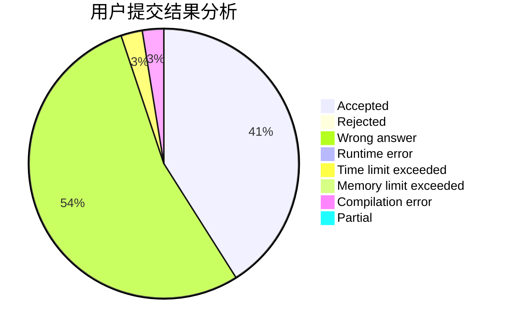
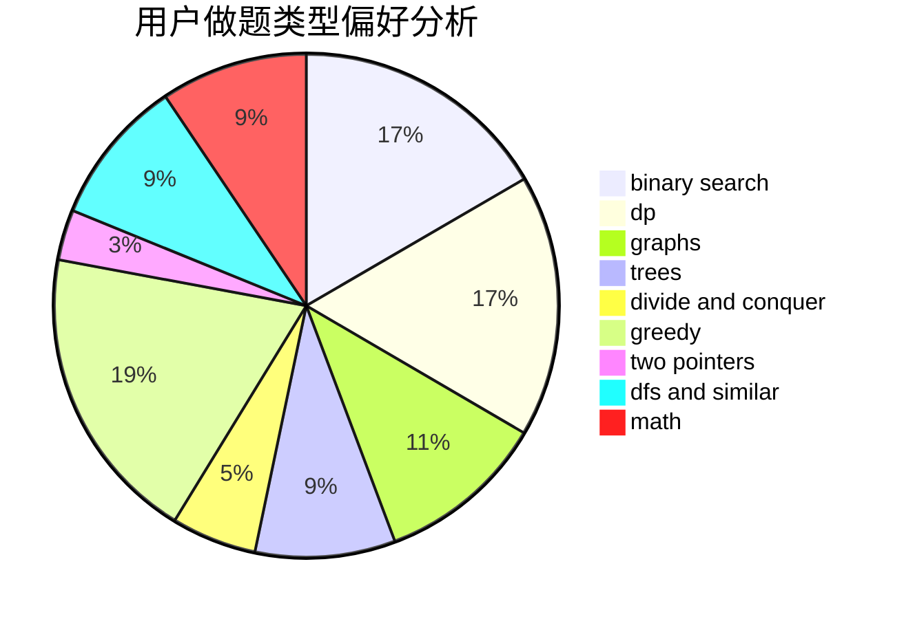

# Huosj

<!-- tabs:start -->

#### **用户提交结果分析**

#### **用户做题类型偏好分析**

<!-- tabs:end -->
# 推荐题目
[1423I](https://codeforces.com/contest/1423/problem/I)
[567E](https://codeforces.com/contest/567/problem/E)
[249E](https://codeforces.com/contest/249/problem/E)
[1424M](https://codeforces.com/contest/1424/problem/M)
[1243E](https://codeforces.com/contest/1243/problem/E)
[476B](https://codeforces.com/contest/476/problem/B)
[442B](https://codeforces.com/contest/442/problem/B)
[696B](https://codeforces.com/contest/696/problem/B)
[342C](https://codeforces.com/contest/342/problem/C)
[567C](https://codeforces.com/contest/567/problem/C)
