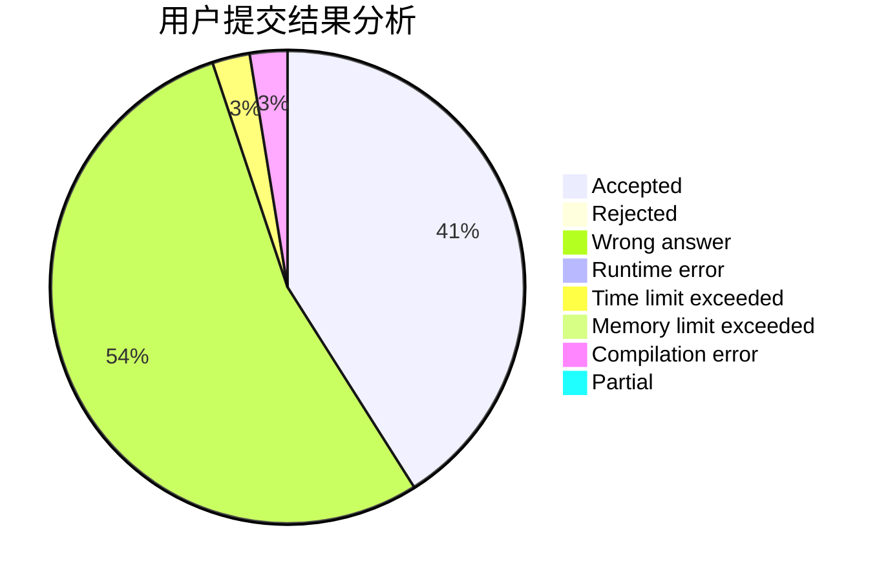
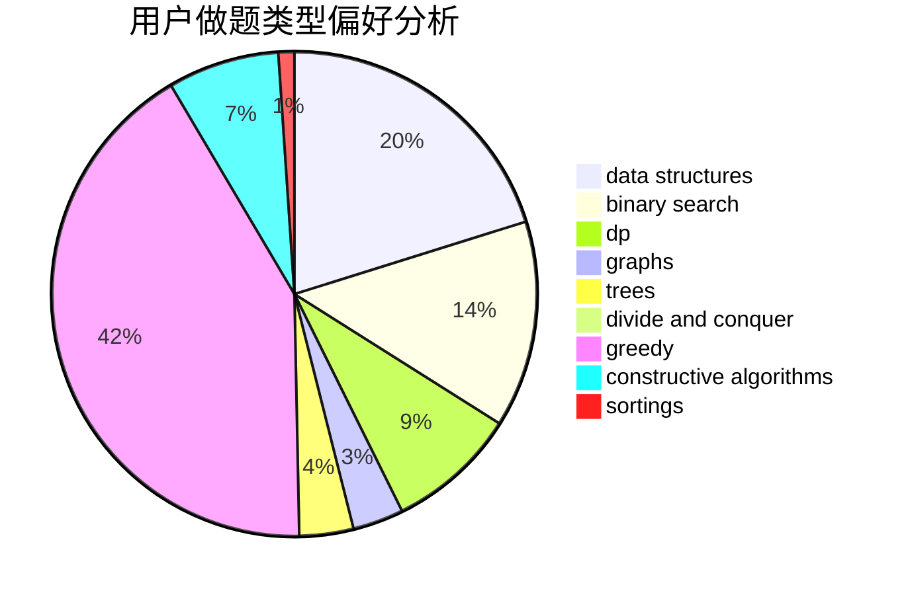
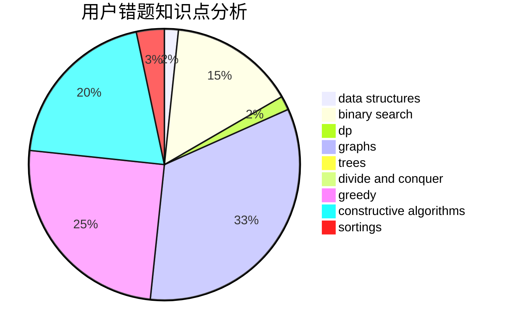

# Huosj
<!-- tabs:start -->
#### **用户提交结果分析**

#### **用户做题类型偏好分析**

#### **用户错题知识点分析**

<!-- tabs:end -->
# 推荐题目
[1421A](http://codeforces.com/problemset/problem/1421/A)		bitmasks,
                        greedy,
                        math		  
[1299B](http://codeforces.com/problemset/problem/1299/B)		geometry		  
[1417C](https://codeforces.com/contest/1417/problem/C)		binary search,
                        data structures,
                        implementation,
                        two pointers		  
[1355D](http://codeforces.com/problemset/problem/1355/D)		constructive algorithms,
                        math		  
[1426C](http://codeforces.com/problemset/problem/1426/C)		binary search,
                        constructive algorithms,
                        math		  
[1415E](http://codeforces.com/problemset/problem/1415/E)		constructive algorithms,
                        greedy,
                        math		  
[543C](http://codeforces.com/problemset/problem/543/C)		bitmasks,
                        dp		  
[417C](http://codeforces.com/problemset/problem/417/C)		constructive algorithms,
                        graphs,
                        implementation		  
[1238E](http://codeforces.com/problemset/problem/1238/E)		bitmasks,
                        dp		  
[121C](http://codeforces.com/problemset/problem/121/C)		brute force,
                        combinatorics,
                        number theory		  
<!-- tabs:start -->
#### **data structures**
[1417C](https://codeforces.com/contest/1417/problem/C)		binary search,
                        data structures,
                        implementation,
                        two pointers		  
[1106B](http://codeforces.com/problemset/problem/1106/B)		data structures,
                        implementation		  
[780G](http://codeforces.com/problemset/problem/780/G)		data structures,
                        dp		  
[12D](http://codeforces.com/problemset/problem/12/D)		data structures,
                        sortings		  
[377B](http://codeforces.com/problemset/problem/377/B)		binary search,
                        data structures,
                        greedy,
                        sortings		  
[372C](http://codeforces.com/problemset/problem/372/C)		data structures,
                        dp,
                        math		  
[766E](http://codeforces.com/problemset/problem/766/E)		bitmasks,
                        constructive algorithms,
                        data structures,
                        dfs and similar,
                        dp,
                        math,
                        trees		  
[1483B](https://codeforces.com/contest/1483/problem/B)		data structures,
                        dsu,
                        implementation,
                        shortest paths		  
[1492C](http://codeforces.com/problemset/problem/1492/C)		binary search,
                        data structures,
                        dp,
                        greedy,
                        two pointers		  
[1490G](http://codeforces.com/problemset/problem/1490/G)		binary search,
                        data structures,
                        math		  
#### **binary search**
[1417C](https://codeforces.com/contest/1417/problem/C)		binary search,
                        data structures,
                        implementation,
                        two pointers		  
[1426C](http://codeforces.com/problemset/problem/1426/C)		binary search,
                        constructive algorithms,
                        math		  
[670D1](http://codeforces.com/problemset/problem/670/D1)		binary search,
                        brute force,
                        implementation		  
[377B](http://codeforces.com/problemset/problem/377/B)		binary search,
                        data structures,
                        greedy,
                        sortings		  
[1285F](http://codeforces.com/problemset/problem/1285/F)		binary search,
                        combinatorics,
                        number theory		  
[853D](http://codeforces.com/problemset/problem/853/D)		binary search,
                        dp,
                        greedy		  
[1492C](http://codeforces.com/problemset/problem/1492/C)		binary search,
                        data structures,
                        dp,
                        greedy,
                        two pointers		  
[1463D](http://codeforces.com/problemset/problem/1463/D)		binary search,
                        constructive algorithms,
                        greedy,
                        two pointers		  
[1490G](http://codeforces.com/problemset/problem/1490/G)		binary search,
                        data structures,
                        math		  
[1479D](http://codeforces.com/problemset/problem/1479/D)		binary search,
                        bitmasks,
                        brute force,
                        data structures,
                        probabilities,
                        trees		  
#### **dp**
[543C](http://codeforces.com/problemset/problem/543/C)		bitmasks,
                        dp		  
[1238E](http://codeforces.com/problemset/problem/1238/E)		bitmasks,
                        dp		  
[229D](http://codeforces.com/problemset/problem/229/D)		dp,
                        greedy,
                        two pointers		  
[780G](http://codeforces.com/problemset/problem/780/G)		data structures,
                        dp		  
[455A](http://codeforces.com/problemset/problem/455/A)		dp		  
[1234F](http://codeforces.com/problemset/problem/1234/F)		bitmasks,
                        dp		  
[853D](http://codeforces.com/problemset/problem/853/D)		binary search,
                        dp,
                        greedy		  
[632E](http://codeforces.com/problemset/problem/632/E)		divide and conquer,
                        dp,
                        fft,
                        math		  
[372C](http://codeforces.com/problemset/problem/372/C)		data structures,
                        dp,
                        math		  
[766E](http://codeforces.com/problemset/problem/766/E)		bitmasks,
                        constructive algorithms,
                        data structures,
                        dfs and similar,
                        dp,
                        math,
                        trees		  
#### **graph**
[417C](http://codeforces.com/problemset/problem/417/C)		constructive algorithms,
                        graphs,
                        implementation		  
[913F](http://codeforces.com/problemset/problem/913/F)		dp,
                        graphs,
                        math,
                        probabilities		  
[1345D](https://codeforces.com/contest/1345/problem/D)		constructive algorithms,
                        dfs and similar,
                        dsu,
                        graphs		  
[1487C](http://codeforces.com/problemset/problem/1487/C)		brute force,
                        constructive algorithms,
                        dfs and similar,
                        graphs,
                        greedy,
                        implementation,
                        math		  
[1437C](http://codeforces.com/problemset/problem/1437/C)		dp,
                        flows,
                        graph matchings,
                        greedy,
                        math,
                        sortings		  
[1470D](http://codeforces.com/problemset/problem/1470/D)		constructive algorithms,
                        dfs and similar,
                        graph matchings,
                        graphs,
                        greedy		  
[1476C](http://codeforces.com/problemset/problem/1476/C)		dp,
                        graphs,
                        greedy		  
[1304D](http://codeforces.com/problemset/problem/1304/D)		constructive algorithms,
                        graphs,
                        greedy,
                        two pointers		  
[1475C](http://codeforces.com/problemset/problem/1475/C)		combinatorics,
                        graphs,
                        math		  
[553E](http://codeforces.com/problemset/problem/553/E)		dp,
                        fft,
                        graphs,
                        math,
                        probabilities		  
#### **trees**
[766E](http://codeforces.com/problemset/problem/766/E)		bitmasks,
                        constructive algorithms,
                        data structures,
                        dfs and similar,
                        dp,
                        math,
                        trees		  
[516D](http://codeforces.com/problemset/problem/516/D)		dfs and similar,
                        dp,
                        dsu,
                        trees,
                        two pointers		  
[1110G](http://codeforces.com/problemset/problem/1110/G)		constructive algorithms,
                        games,
                        trees		  
[1479D](http://codeforces.com/problemset/problem/1479/D)		binary search,
                        bitmasks,
                        brute force,
                        data structures,
                        probabilities,
                        trees		  
[1511C](http://codeforces.com/problemset/problem/1511/C)		brute force,
                        data structures,
                        implementation,
                        trees		  
[1499F](http://codeforces.com/problemset/problem/1499/F)		combinatorics,
                        dfs and similar,
                        dp,
                        trees		  
[1491E](http://codeforces.com/problemset/problem/1491/E)		brute force,
                        dfs and similar,
                        divide and conquer,
                        number theory,
                        trees		  
[1466D](http://codeforces.com/problemset/problem/1466/D)		data structures,
                        greedy,
                        sortings,
                        trees		  
[1495D](http://codeforces.com/problemset/problem/1495/D)		combinatorics,
                        dfs and similar,
                        graphs,
                        math,
                        shortest paths,
                        trees		  
[1303G](http://codeforces.com/problemset/problem/1303/G)		data structures,
                        divide and conquer,
                        geometry,
                        trees		  
#### **divide and conquer**
[632E](http://codeforces.com/problemset/problem/632/E)		divide and conquer,
                        dp,
                        fft,
                        math		  
[873D](http://codeforces.com/problemset/problem/873/D)		constructive algorithms,
                        divide and conquer		  
[1461D](http://codeforces.com/problemset/problem/1461/D)		binary search,
                        brute force,
                        data structures,
                        divide and conquer,
                        implementation,
                        sortings		  
[1466G](http://codeforces.com/problemset/problem/1466/G)		combinatorics,
                        divide and conquer,
                        hashing,
                        math,
                        string suffix structures,
                        strings		  
[1490D](http://codeforces.com/problemset/problem/1490/D)		dfs and similar,
                        divide and conquer,
                        implementation		  
[1483C](https://codeforces.com/contest/1483/problem/C)		data structures,
                        divide and conquer,
                        dp		  
[1491E](http://codeforces.com/problemset/problem/1491/E)		brute force,
                        dfs and similar,
                        divide and conquer,
                        number theory,
                        trees		  
[1303G](http://codeforces.com/problemset/problem/1303/G)		data structures,
                        divide and conquer,
                        geometry,
                        trees		  
[1494D](http://codeforces.com/problemset/problem/1494/D)		constructive algorithms,
                        data structures,
                        dfs and similar,
                        divide and conquer,
                        dsu,
                        greedy,
                        sortings,
                        trees		  
[1482E](http://codeforces.com/problemset/problem/1482/E)		data structures,
                        divide and conquer,
                        dp		  
#### **greedy**
[1421A](http://codeforces.com/problemset/problem/1421/A)		bitmasks,
                        greedy,
                        math		  
[1415E](http://codeforces.com/problemset/problem/1415/E)		constructive algorithms,
                        greedy,
                        math		  
[229D](http://codeforces.com/problemset/problem/229/D)		dp,
                        greedy,
                        two pointers		  
[377B](http://codeforces.com/problemset/problem/377/B)		binary search,
                        data structures,
                        greedy,
                        sortings		  
[853D](http://codeforces.com/problemset/problem/853/D)		binary search,
                        dp,
                        greedy		  
[1367B](http://codeforces.com/problemset/problem/1367/B)		greedy,
                        math		  
[835B](http://codeforces.com/problemset/problem/835/B)		greedy		  
[814A](http://codeforces.com/problemset/problem/814/A)		constructive algorithms,
                        greedy,
                        implementation,
                        sortings		  
[1120B](http://codeforces.com/problemset/problem/1120/B)		constructive algorithms,
                        greedy,
                        implementation,
                        math		  
[1364C](http://codeforces.com/problemset/problem/1364/C)		brute force,
                        constructive algorithms,
                        greedy		  
#### **constructive algorithms**
[1355D](http://codeforces.com/problemset/problem/1355/D)		constructive algorithms,
                        math		  
[1426C](http://codeforces.com/problemset/problem/1426/C)		binary search,
                        constructive algorithms,
                        math		  
[1415E](http://codeforces.com/problemset/problem/1415/E)		constructive algorithms,
                        greedy,
                        math		  
[417C](http://codeforces.com/problemset/problem/417/C)		constructive algorithms,
                        graphs,
                        implementation		  
[369B](http://codeforces.com/problemset/problem/369/B)		constructive algorithms,
                        implementation,
                        math		  
[1262C](https://codeforces.com/contest/1262/problem/C)		constructive algorithms		  
[766E](http://codeforces.com/problemset/problem/766/E)		bitmasks,
                        constructive algorithms,
                        data structures,
                        dfs and similar,
                        dp,
                        math,
                        trees		  
[814A](http://codeforces.com/problemset/problem/814/A)		constructive algorithms,
                        greedy,
                        implementation,
                        sortings		  
[1261A](https://codeforces.com/contest/1261/problem/A)		constructive algorithms		  
[1120B](http://codeforces.com/problemset/problem/1120/B)		constructive algorithms,
                        greedy,
                        implementation,
                        math		  
#### **sortings**
[12D](http://codeforces.com/problemset/problem/12/D)		data structures,
                        sortings		  
[377B](http://codeforces.com/problemset/problem/377/B)		binary search,
                        data structures,
                        greedy,
                        sortings		  
[814A](http://codeforces.com/problemset/problem/814/A)		constructive algorithms,
                        greedy,
                        implementation,
                        sortings		  
[1220A](http://codeforces.com/problemset/problem/1220/A)		implementation,
                        sortings,
                        strings		  
[1496C](https://codeforces.com/contest/1496/problem/C)		geometry,
                        greedy,
                        math,
                        sortings		  
[1495A](http://codeforces.com/problemset/problem/1495/A)		geometry,
                        greedy,
                        math,
                        sortings		  
[1497A](http://codeforces.com/problemset/problem/1497/A)		brute force,
                        data structures,
                        greedy,
                        sortings		  
[1427A](http://codeforces.com/problemset/problem/1427/A)		math,
                        sortings		  
[1461D](http://codeforces.com/problemset/problem/1461/D)		binary search,
                        brute force,
                        data structures,
                        divide and conquer,
                        implementation,
                        sortings		  
[1437C](http://codeforces.com/problemset/problem/1437/C)		dp,
                        flows,
                        graph matchings,
                        greedy,
                        math,
                        sortings		  
<!-- tabs:end -->
