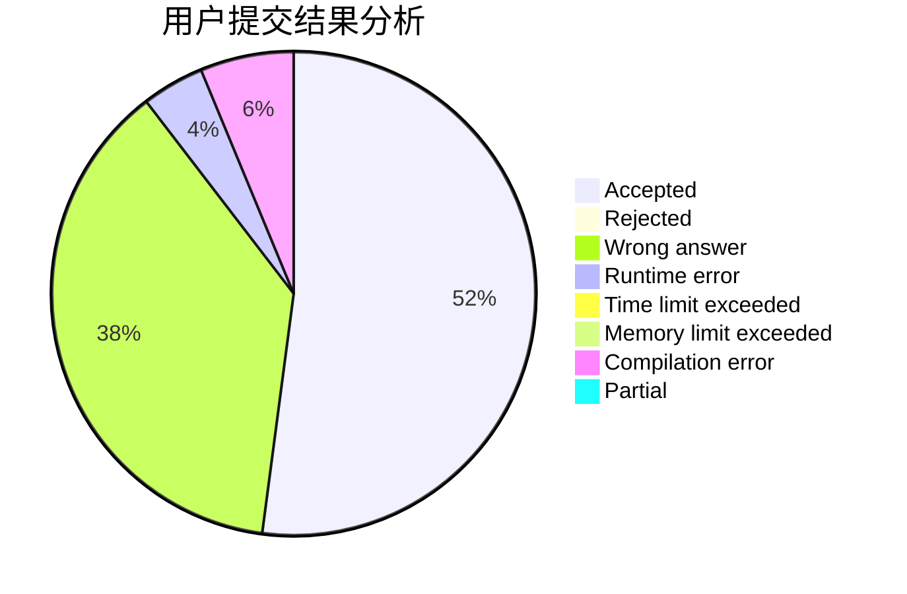
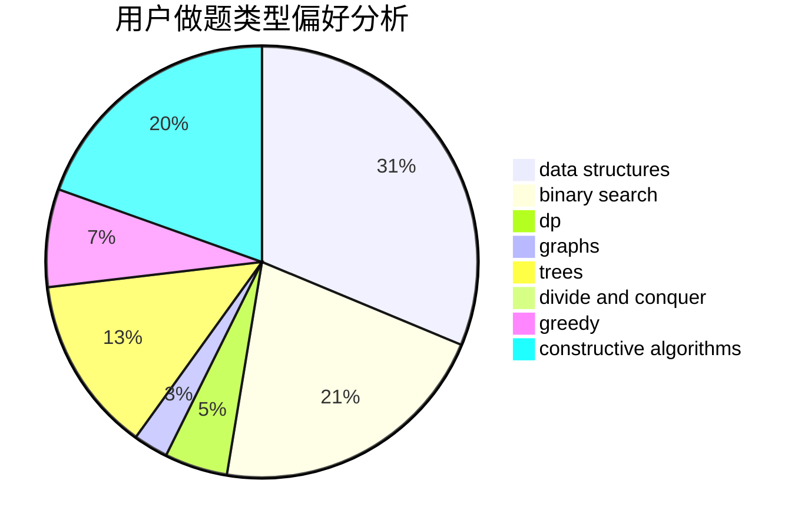

# Huuuuuu
<!-- tabs:start -->
#### **用户提交结果分析**

#### **用户做题类型偏好分析**

#### **用户错题知识点分析**

<!-- tabs:end -->
# 推荐题目
[Same Parity Summands](http://codeforces.com/problemset/problem/1352/B)		constructive algorithms,
                        math		  
[Rarity and New Dress](http://codeforces.com/problemset/problem/1393/D)		dfs and similar,
                        dp,
                        implementation,
                        shortest paths		  
[Dima and Trap Graph](http://codeforces.com/problemset/problem/366/D)		binary search,
                        data structures,
                        dfs and similar,
                        dsu,
                        shortest paths,
                        two pointers		  
[Weights Distributing](http://codeforces.com/problemset/problem/1343/E)		brute force,
                        graphs,
                        greedy,
                        shortest paths,
                        sortings		  
[Monotonic Renumeration](http://codeforces.com/problemset/problem/1102/E)		combinatorics,
                        sortings		  
[Get Ready for the Battle](http://codeforces.com/problemset/problem/1119/G)		constructive algorithms,
                        implementation		  
[Kuriyama Mirai's Stones](http://codeforces.com/problemset/problem/433/B)		dp,
                        implementation,
                        sortings		  
[Integer Sequence Dividing](http://codeforces.com/problemset/problem/1102/A)		math		  
[New Skateboard](http://codeforces.com/problemset/problem/628/B)		dp		  
[Kaavi and Magic Spell](http://codeforces.com/problemset/problem/1336/C)		dp,
                        strings		  
<!-- tabs:start -->
#### **data structures**
[Same Parity Summands](http://codeforces.com/problemset/problem/366/D)		binary search,
                        data structures,
                        dfs and similar,
                        dsu,
                        shortest paths,
                        two pointers		  
[Rarity and New Dress](http://codeforces.com/problemset/problem/362/C)		data structures,
                        dp,
                        implementation,
                        math		  
[Dima and Trap Graph](http://codeforces.com/problemset/problem/1129/C)		binary search,
                        data structures,
                        dp,
                        hashing,
                        sortings,
                        string suffix structures,
                        strings		  
[Weights Distributing](https://codeforces.com/contest/1240/problem/D)		data structures,
                        divide and conquer,
                        dp,
                        hashing		  
[Monotonic Renumeration](http://codeforces.com/problemset/problem/1442/D)		data structures,
                        divide and conquer,
                        dp,
                        greedy		  
[Get Ready for the Battle](http://codeforces.com/problemset/problem/1492/C)		binary search,
                        data structures,
                        dp,
                        greedy,
                        two pointers		  
[Kuriyama Mirai's Stones](http://codeforces.com/problemset/problem/1490/G)		binary search,
                        data structures,
                        math		  
[Integer Sequence Dividing](http://codeforces.com/problemset/problem/1479/D)		binary search,
                        bitmasks,
                        brute force,
                        data structures,
                        probabilities,
                        trees		  
[New Skateboard](http://codeforces.com/problemset/problem/1497/A)		brute force,
                        data structures,
                        greedy,
                        sortings		  
[Kaavi and Magic Spell](http://codeforces.com/problemset/problem/1491/C)		brute force,
                        data structures,
                        dp,
                        greedy,
                        implementation		  
#### **binary search**
[Same Parity Summands](http://codeforces.com/problemset/problem/366/D)		binary search,
                        data structures,
                        dfs and similar,
                        dsu,
                        shortest paths,
                        two pointers		  
[Rarity and New Dress](http://codeforces.com/problemset/problem/1129/C)		binary search,
                        data structures,
                        dp,
                        hashing,
                        sortings,
                        string suffix structures,
                        strings		  
[Dima and Trap Graph](http://codeforces.com/problemset/problem/837/E)		binary search,
                        implementation,
                        math		  
[Weights Distributing](http://codeforces.com/problemset/problem/1399/E2)		binary search,
                        dfs and similar,
                        greedy,
                        sortings,
                        trees,
                        two pointers		  
[Monotonic Renumeration](http://codeforces.com/problemset/problem/1492/C)		binary search,
                        data structures,
                        dp,
                        greedy,
                        two pointers		  
[Get Ready for the Battle](http://codeforces.com/problemset/problem/1463/D)		binary search,
                        constructive algorithms,
                        greedy,
                        two pointers		  
[Kuriyama Mirai's Stones](http://codeforces.com/problemset/problem/1490/G)		binary search,
                        data structures,
                        math		  
[Integer Sequence Dividing](http://codeforces.com/problemset/problem/1479/D)		binary search,
                        bitmasks,
                        brute force,
                        data structures,
                        probabilities,
                        trees		  
[New Skateboard](http://codeforces.com/problemset/problem/1436/E)		binary search,
                        data structures,
                        two pointers		  
[Kaavi and Magic Spell](http://codeforces.com/problemset/problem/1461/D)		binary search,
                        brute force,
                        data structures,
                        divide and conquer,
                        implementation,
                        sortings		  
#### **dp**
[Same Parity Summands](http://codeforces.com/problemset/problem/1393/D)		dfs and similar,
                        dp,
                        implementation,
                        shortest paths		  
[Rarity and New Dress](http://codeforces.com/problemset/problem/433/B)		dp,
                        implementation,
                        sortings		  
[Dima and Trap Graph](http://codeforces.com/problemset/problem/628/B)		dp		  
[Weights Distributing](http://codeforces.com/problemset/problem/1336/C)		dp,
                        strings		  
[Monotonic Renumeration](https://codeforces.com/contest/663/problem/E)		bitmasks,
                        brute force,
                        divide and conquer,
                        dp,
                        fft,
                        math		  
[Get Ready for the Battle](http://codeforces.com/problemset/problem/362/C)		data structures,
                        dp,
                        implementation,
                        math		  
[Kuriyama Mirai's Stones](http://codeforces.com/problemset/problem/1129/C)		binary search,
                        data structures,
                        dp,
                        hashing,
                        sortings,
                        string suffix structures,
                        strings		  
[Integer Sequence Dividing](https://codeforces.com/contest/1240/problem/D)		data structures,
                        divide and conquer,
                        dp,
                        hashing		  
[New Skateboard](http://codeforces.com/problemset/problem/407/B)		dp,
                        implementation		  
[Kaavi and Magic Spell](https://codeforces.com/contest/1173/problem/D)		combinatorics,
                        dfs and similar,
                        dp,
                        trees		  
#### **graph**
[Same Parity Summands](http://codeforces.com/problemset/problem/1343/E)		brute force,
                        graphs,
                        greedy,
                        shortest paths,
                        sortings		  
[Rarity and New Dress](http://codeforces.com/problemset/problem/466/E)		dfs and similar,
                        dsu,
                        graphs,
                        trees		  
[Dima and Trap Graph](http://codeforces.com/problemset/problem/1250/N)		dfs and similar,
                        graphs,
                        greedy		  
[Weights Distributing](http://codeforces.com/problemset/problem/1255/B)		graphs,
                        implementation		  
[Monotonic Renumeration](http://codeforces.com/problemset/problem/770/C)		*special problem,
                        dfs and similar,
                        graphs,
                        implementation		  
[Get Ready for the Battle](http://codeforces.com/problemset/problem/209/C)		constructive algorithms,
                        dsu,
                        graphs,
                        greedy		  
[Kuriyama Mirai's Stones](http://codeforces.com/problemset/problem/1142/E)		graphs,
                        interactive		  
[Integer Sequence Dividing](http://codeforces.com/problemset/problem/1487/C)		brute force,
                        constructive algorithms,
                        dfs and similar,
                        graphs,
                        greedy,
                        implementation,
                        math		  
[New Skateboard](http://codeforces.com/problemset/problem/1437/C)		dp,
                        flows,
                        graph matchings,
                        greedy,
                        math,
                        sortings		  
[Kaavi and Magic Spell](http://codeforces.com/problemset/problem/1470/D)		constructive algorithms,
                        dfs and similar,
                        graph matchings,
                        graphs,
                        greedy		  
#### **trees**
[Same Parity Summands](http://codeforces.com/problemset/problem/466/E)		dfs and similar,
                        dsu,
                        graphs,
                        trees		  
[Rarity and New Dress](http://codeforces.com/problemset/problem/1399/E2)		binary search,
                        dfs and similar,
                        greedy,
                        sortings,
                        trees,
                        two pointers		  
[Dima and Trap Graph](https://codeforces.com/contest/1173/problem/D)		combinatorics,
                        dfs and similar,
                        dp,
                        trees		  
[Weights Distributing](http://codeforces.com/problemset/problem/1479/D)		binary search,
                        bitmasks,
                        brute force,
                        data structures,
                        probabilities,
                        trees		  
[Monotonic Renumeration](http://codeforces.com/problemset/problem/1511/C)		brute force,
                        data structures,
                        implementation,
                        trees		  
[Get Ready for the Battle](http://codeforces.com/problemset/problem/1499/F)		combinatorics,
                        dfs and similar,
                        dp,
                        trees		  
[Kuriyama Mirai's Stones](http://codeforces.com/problemset/problem/1491/E)		brute force,
                        dfs and similar,
                        divide and conquer,
                        number theory,
                        trees		  
[Integer Sequence Dividing](http://codeforces.com/problemset/problem/1466/D)		data structures,
                        greedy,
                        sortings,
                        trees		  
[New Skateboard](http://codeforces.com/problemset/problem/1495/D)		combinatorics,
                        dfs and similar,
                        graphs,
                        math,
                        shortest paths,
                        trees		  
[Kaavi and Magic Spell](http://codeforces.com/problemset/problem/1303/G)		data structures,
                        divide and conquer,
                        geometry,
                        trees		  
#### **divide and conquer**
[Same Parity Summands](https://codeforces.com/contest/663/problem/E)		bitmasks,
                        brute force,
                        divide and conquer,
                        dp,
                        fft,
                        math		  
[Rarity and New Dress](https://codeforces.com/contest/1240/problem/D)		data structures,
                        divide and conquer,
                        dp,
                        hashing		  
[Dima and Trap Graph](http://codeforces.com/problemset/problem/1442/D)		data structures,
                        divide and conquer,
                        dp,
                        greedy		  
[Weights Distributing](http://codeforces.com/problemset/problem/1461/D)		binary search,
                        brute force,
                        data structures,
                        divide and conquer,
                        implementation,
                        sortings		  
[Monotonic Renumeration](http://codeforces.com/problemset/problem/1466/G)		combinatorics,
                        divide and conquer,
                        hashing,
                        math,
                        string suffix structures,
                        strings		  
[Get Ready for the Battle](http://codeforces.com/problemset/problem/1490/D)		dfs and similar,
                        divide and conquer,
                        implementation		  
[Kuriyama Mirai's Stones](https://codeforces.com/contest/1483/problem/C)		data structures,
                        divide and conquer,
                        dp		  
[Integer Sequence Dividing](http://codeforces.com/problemset/problem/1491/E)		brute force,
                        dfs and similar,
                        divide and conquer,
                        number theory,
                        trees		  
[New Skateboard](http://codeforces.com/problemset/problem/1303/G)		data structures,
                        divide and conquer,
                        geometry,
                        trees		  
[Kaavi and Magic Spell](http://codeforces.com/problemset/problem/1494/D)		constructive algorithms,
                        data structures,
                        dfs and similar,
                        divide and conquer,
                        dsu,
                        greedy,
                        sortings,
                        trees		  
#### **greedy**
[Same Parity Summands](http://codeforces.com/problemset/problem/1343/E)		brute force,
                        graphs,
                        greedy,
                        shortest paths,
                        sortings		  
[Rarity and New Dress](http://codeforces.com/problemset/problem/1250/N)		dfs and similar,
                        graphs,
                        greedy		  
[Dima and Trap Graph](http://codeforces.com/problemset/problem/914/B)		games,
                        greedy,
                        implementation		  
[Weights Distributing](http://codeforces.com/problemset/problem/209/C)		constructive algorithms,
                        dsu,
                        graphs,
                        greedy		  
[Monotonic Renumeration](http://codeforces.com/problemset/problem/853/B)		greedy,
                        sortings,
                        two pointers		  
[Get Ready for the Battle](http://codeforces.com/problemset/problem/1399/E2)		binary search,
                        dfs and similar,
                        greedy,
                        sortings,
                        trees,
                        two pointers		  
[Kuriyama Mirai's Stones](http://codeforces.com/problemset/problem/1442/D)		data structures,
                        divide and conquer,
                        dp,
                        greedy		  
[Integer Sequence Dividing](http://codeforces.com/problemset/problem/1492/C)		binary search,
                        data structures,
                        dp,
                        greedy,
                        two pointers		  
[New Skateboard](https://codeforces.com/contest/1496/problem/C)		geometry,
                        greedy,
                        math,
                        sortings		  
[Kaavi and Magic Spell](http://codeforces.com/problemset/problem/1493/A)		constructive algorithms,
                        greedy		  
#### **constructive algorithms**
[Same Parity Summands](http://codeforces.com/problemset/problem/1352/B)		constructive algorithms,
                        math		  
[Rarity and New Dress](http://codeforces.com/problemset/problem/1119/G)		constructive algorithms,
                        implementation		  
[Dima and Trap Graph](https://codeforces.com/contest/816/problem/D)		brute force,
                        combinatorics,
                        constructive algorithms,
                        math		  
[Weights Distributing](http://codeforces.com/problemset/problem/209/C)		constructive algorithms,
                        dsu,
                        graphs,
                        greedy		  
[Monotonic Renumeration](http://codeforces.com/problemset/problem/457/E)		constructive algorithms,
                        flows,
                        math		  
[Get Ready for the Battle](http://codeforces.com/problemset/problem/1493/A)		constructive algorithms,
                        greedy		  
[Kuriyama Mirai's Stones](http://codeforces.com/problemset/problem/1463/D)		binary search,
                        constructive algorithms,
                        greedy,
                        two pointers		  
[Integer Sequence Dividing](https://codeforces.com/contest/1456/problem/B)		bitmasks,
                        brute force,
                        constructive algorithms		  
[New Skateboard](http://codeforces.com/problemset/problem/1492/D)		bitmasks,
                        constructive algorithms,
                        greedy,
                        math		  
[Kaavi and Magic Spell](https://codeforces.com/contest/1504/problem/D)		constructive algorithms,
                        games,
                        interactive		  
#### **sortings**
[Same Parity Summands](http://codeforces.com/problemset/problem/1343/E)		brute force,
                        graphs,
                        greedy,
                        shortest paths,
                        sortings		  
[Rarity and New Dress](http://codeforces.com/problemset/problem/1102/E)		combinatorics,
                        sortings		  
[Dima and Trap Graph](http://codeforces.com/problemset/problem/433/B)		dp,
                        implementation,
                        sortings		  
[Weights Distributing](http://codeforces.com/problemset/problem/1129/C)		binary search,
                        data structures,
                        dp,
                        hashing,
                        sortings,
                        string suffix structures,
                        strings		  
[Monotonic Renumeration](http://codeforces.com/problemset/problem/853/B)		greedy,
                        sortings,
                        two pointers		  
[Get Ready for the Battle](http://codeforces.com/problemset/problem/1399/E2)		binary search,
                        dfs and similar,
                        greedy,
                        sortings,
                        trees,
                        two pointers		  
[Kuriyama Mirai's Stones](http://codeforces.com/problemset/problem/1444/B)		combinatorics,
                        math,
                        sortings		  
[Integer Sequence Dividing](https://codeforces.com/contest/1496/problem/C)		geometry,
                        greedy,
                        math,
                        sortings		  
[New Skateboard](http://codeforces.com/problemset/problem/1495/A)		geometry,
                        greedy,
                        math,
                        sortings		  
[Kaavi and Magic Spell](http://codeforces.com/problemset/problem/1497/A)		brute force,
                        data structures,
                        greedy,
                        sortings		  
<!-- tabs:end -->
