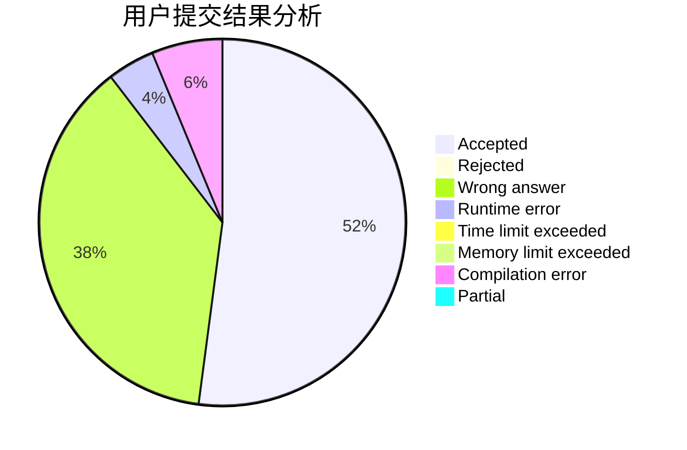
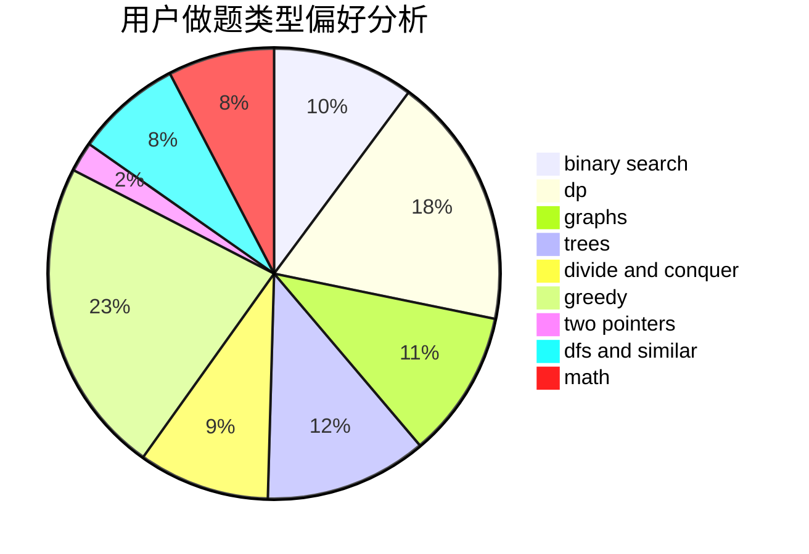

# Huuuuuu

<!-- tabs:start -->

#### **用户提交结果分析**

#### **用户做题类型偏好分析**

<!-- tabs:end -->
# 推荐题目
[396C](https://codeforces.com/contest/396/problem/C)
[1350C](https://codeforces.com/contest/1350/problem/C)
[933A](https://codeforces.com/contest/933/problem/A)
[1343D](https://codeforces.com/contest/1343/problem/D)
[656A](https://codeforces.com/contest/656/problem/A)
[1358F](https://codeforces.com/contest/1358/problem/F)
[683A](https://codeforces.com/contest/683/problem/A)
[1103B](https://codeforces.com/contest/1103/problem/B)
[1102D](https://codeforces.com/contest/1102/problem/D)
[871D](https://codeforces.com/contest/871/problem/D)
