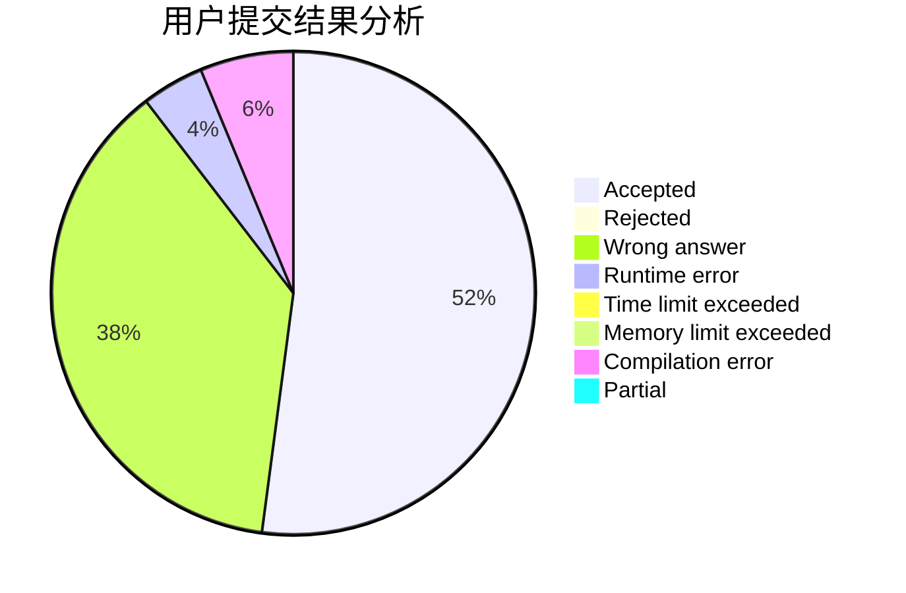
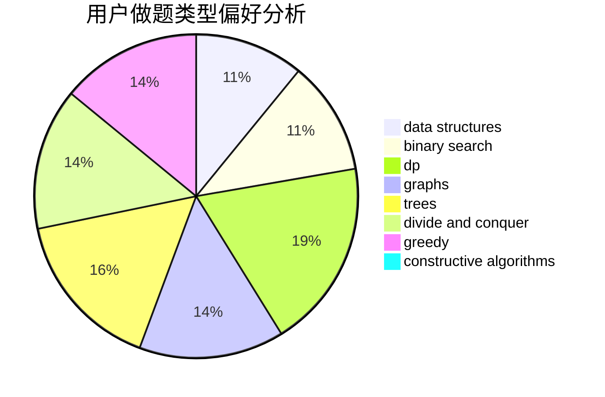

# Huuuuuu

<!-- tabs:start -->

#### **用户提交结果分析**

#### **用户做题类型偏好分析**

#### **用户错题知识点分析**

<!-- tabs:end -->
# 推荐题目
[396C](https://codeforces.com/contest/396/problem/C)		data structures,
                        graphs,
                        trees		  
[1350C](https://codeforces.com/contest/1350/problem/C)		dsu,graphs,sortings,trees		  
[933A](https://codeforces.com/contest/933/problem/A)		dp		  
[1343D](https://codeforces.com/contest/1343/problem/D)		brute force,
                        data structures,
                        greedy,
                        two pointers		  
[656A](https://codeforces.com/contest/656/problem/A)		*special problem		  
[1358F](https://codeforces.com/contest/1358/problem/F)		binary search,
                        constructive algorithms,
                        greedy,
                        implementation		  
[683A](https://codeforces.com/contest/683/problem/A)		*special problem,
                        geometry		  
[1103B](https://codeforces.com/contest/1103/problem/B)		binary search,
                        constructive algorithms,
                        interactive		  
[1102D](https://codeforces.com/contest/1102/problem/D)		greedy,
                        strings		  
[871D](https://codeforces.com/contest/871/problem/D)		dsu,graphs,sortings,trees		  
