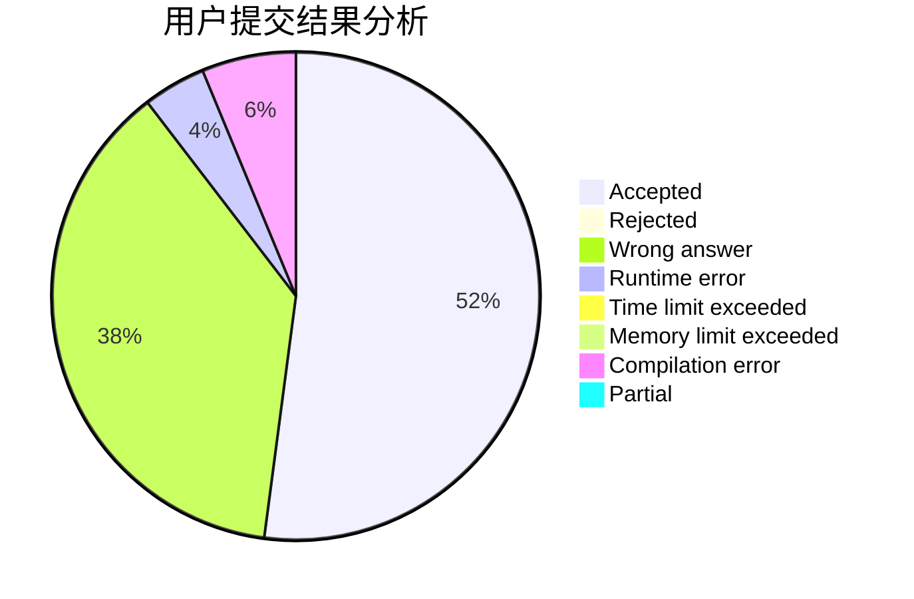
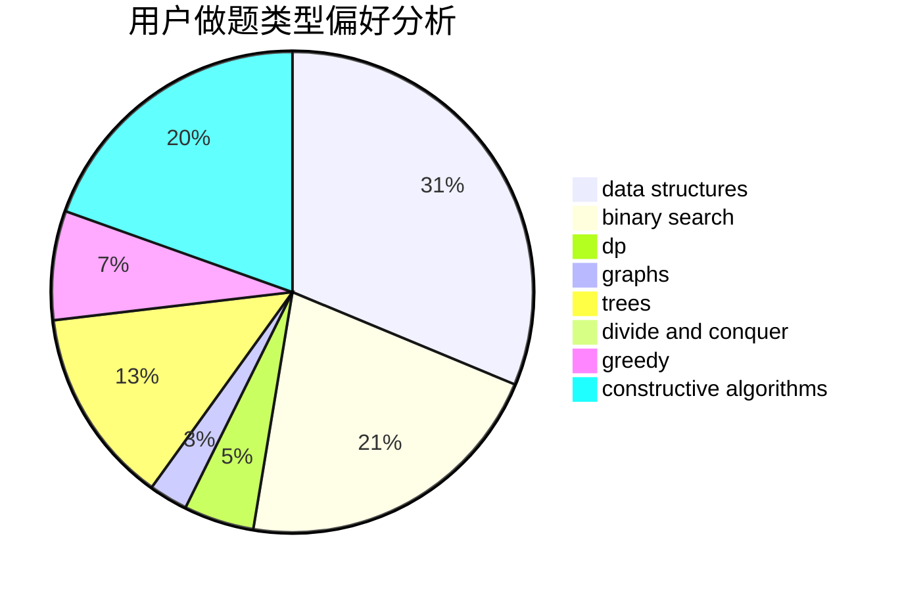

# Huuuuuu

<!-- tabs:start -->

#### **用户提交结果分析**

#### **用户做题类型偏好分析**

#### **用户错题知识点分析**

<!-- tabs:end -->
# 推荐题目
[366D](https://codeforces.com/contest/366/problem/D)		binary search,
                        data structures,
                        dfs and similar,
                        dsu,
                        shortest paths,
                        two pointers		  
[1343E](https://codeforces.com/contest/1343/problem/E)		brute force,
                        graphs,
                        greedy,
                        shortest paths,
                        sortings		  
[914B](https://codeforces.com/contest/914/problem/B)		games,
                        greedy,
                        implementation		  
[1336C](https://codeforces.com/contest/1336/problem/C)		dp,
                        strings		  
[628B](https://codeforces.com/contest/628/problem/B)		dp		  
[1352B](https://codeforces.com/contest/1352/problem/B)		constructive algorithms,
                        math		  
[663E](https://codeforces.com/contest/663/problem/E)		dsu,graphs,sortings,trees		  
[1102E](https://codeforces.com/contest/1102/problem/E)		combinatorics,
                        sortings		  
[1102A](https://codeforces.com/contest/1102/problem/A)		math		  
[853B](https://codeforces.com/contest/853/problem/B)		greedy,
                        sortings,
                        two pointers		  
