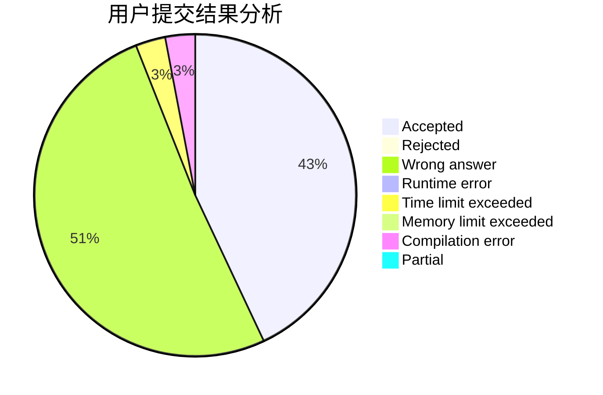
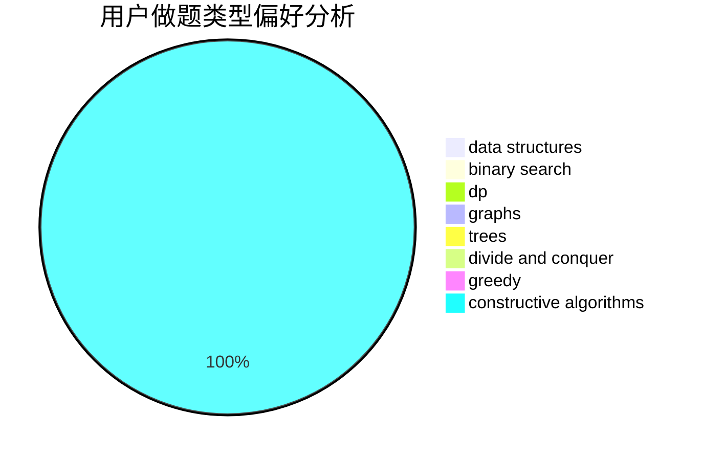
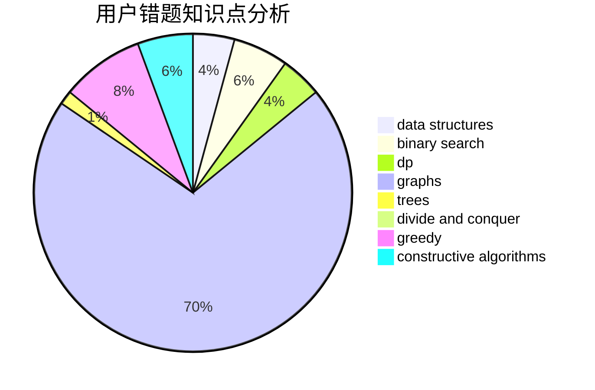

# Hydrogen_zyx

<!-- tabs:start -->

#### **用户提交结果分析**

#### **用户做题类型偏好分析**

#### **用户错题知识点分析**

<!-- tabs:end -->
# 推荐题目
[736B](https://codeforces.com/contest/736/problem/B)		dsu,graphs,sortings,trees		  
[794G](https://codeforces.com/contest/794/problem/G)		combinatorics,
                        dp,
                        math		  
[12492](https://codeforces.com/contest/1249/problem/2)		dsu,graphs,sortings,trees		  
[876D](https://codeforces.com/contest/876/problem/D)		dsu,graphs,sortings,trees		  
[1179B](https://codeforces.com/contest/1179/problem/B)		constructive algorithms		  
[1350B](https://codeforces.com/contest/1350/problem/B)		dp,
                        math,
                        number theory		  
[830A](https://codeforces.com/contest/830/problem/A)		binary search,
                        brute force,
                        dp,
                        greedy,
                        sortings		  
[888F](https://codeforces.com/contest/888/problem/F)		dp,
                        graphs		  
[1321D](https://codeforces.com/contest/1321/problem/D)		dsu,graphs,sortings,trees		  
[1328B](https://codeforces.com/contest/1328/problem/B)		binary search,
                        brute force,
                        combinatorics,
                        implementation,
                        math		  
