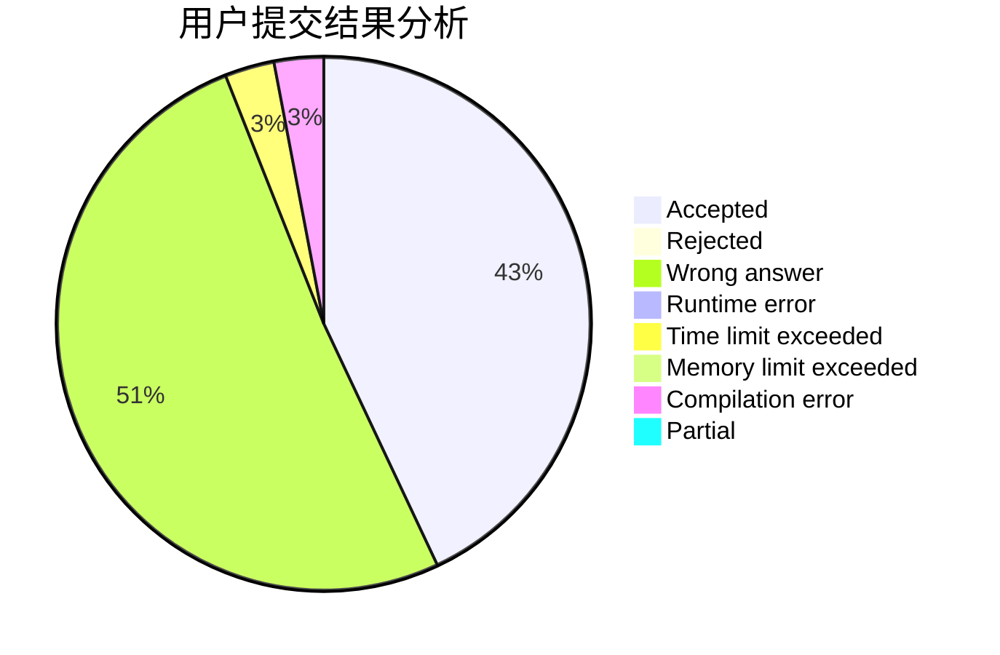
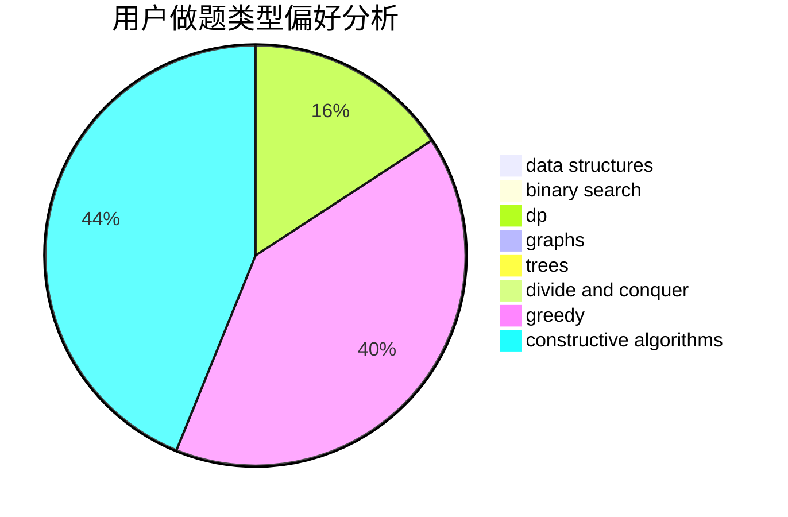
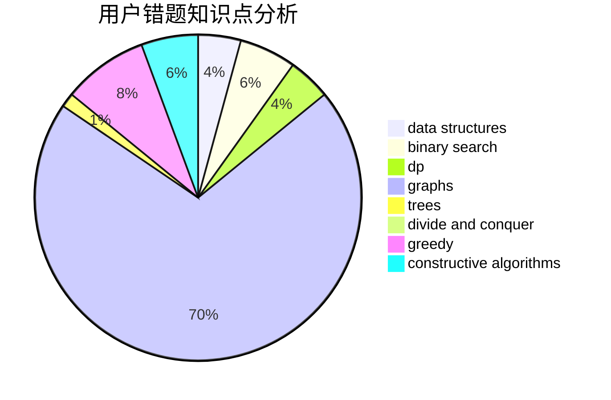

# Hydrogen_zyx

<!-- tabs:start -->

#### **用户提交结果分析**

#### **用户做题类型偏好分析**

#### **用户错题知识点分析**

<!-- tabs:end -->
# 推荐题目
[719A](https://codeforces.com/contest/719/problem/A)		implementation		  
[777A](https://codeforces.com/contest/777/problem/A)		constructive algorithms,
                        implementation,
                        math		  
[1244A](https://codeforces.com/contest/1244/problem/A)		math		  
[859A](https://codeforces.com/contest/859/problem/A)		greedy,
                        implementation		  
[1176A](https://codeforces.com/contest/1176/problem/A)		brute force,
                        greedy,
                        implementation		  
[1343D](https://codeforces.com/contest/1343/problem/D)		brute force,
                        data structures,
                        greedy,
                        two pointers		  
[811C](https://codeforces.com/contest/811/problem/C)		dp,
                        implementation		  
[869C](https://codeforces.com/contest/869/problem/C)		combinatorics,
                        dp,
                        math		  
[1312B](https://codeforces.com/contest/1312/problem/B)		constructive algorithms,
                        sortings		  
[1321C](https://codeforces.com/contest/1321/problem/C)		brute force,
                        constructive algorithms,
                        greedy,
                        strings		  
