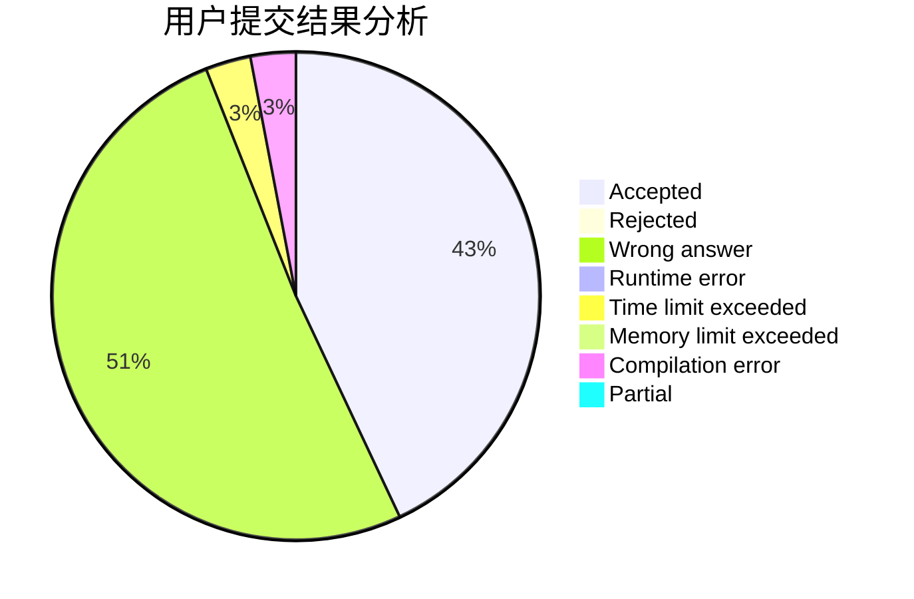
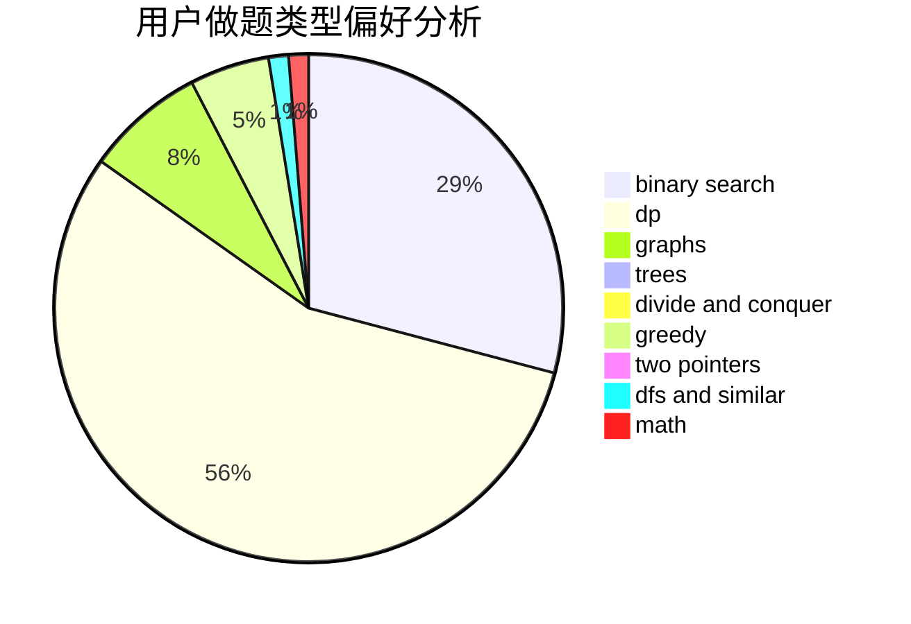

# Hydrogen_zyx

<!-- tabs:start -->

#### **用户提交结果分析**

#### **用户做题类型偏好分析**

<!-- tabs:end -->
# 推荐题目
[736B](https://codeforces.com/contest/736/problem/B)
[794G](https://codeforces.com/contest/794/problem/G)
[12492](https://codeforces.com/contest/1249/problem/2)
[876D](https://codeforces.com/contest/876/problem/D)
[1179B](https://codeforces.com/contest/1179/problem/B)
[1350B](https://codeforces.com/contest/1350/problem/B)
[830A](https://codeforces.com/contest/830/problem/A)
[888F](https://codeforces.com/contest/888/problem/F)
[1321D](https://codeforces.com/contest/1321/problem/D)
[1328B](https://codeforces.com/contest/1328/problem/B)
