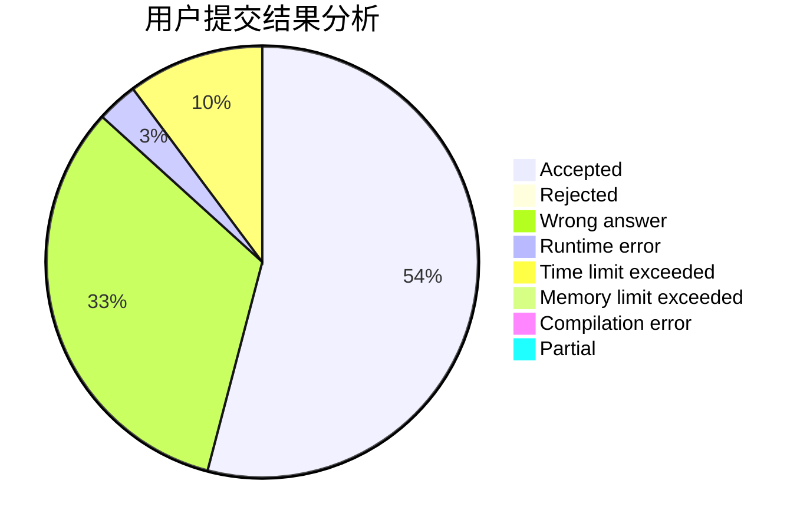
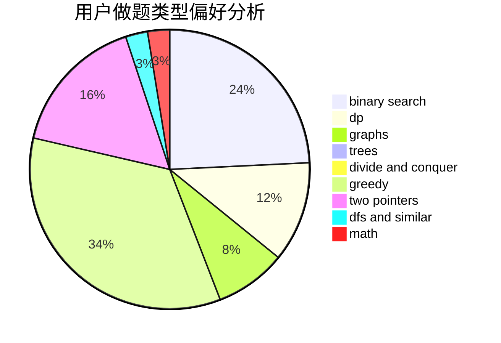

# Hyperion_LR

<!-- tabs:start -->

#### **用户提交结果分析**

#### **用户做题类型偏好分析**

<!-- tabs:end -->
# 推荐题目
[875B](https://codeforces.com/contest/875/problem/B)
[1339B](https://codeforces.com/contest/1339/problem/B)
[52C](https://codeforces.com/contest/52/problem/C)
[1474F](https://codeforces.com/contest/1474/problem/F)
[682A](https://codeforces.com/contest/682/problem/A)
[208A](https://codeforces.com/contest/208/problem/A)
[13D](https://codeforces.com/contest/13/problem/D)
[1265A](https://codeforces.com/contest/1265/problem/A)
[265D](https://codeforces.com/contest/265/problem/D)
[1080B](https://codeforces.com/contest/1080/problem/B)
