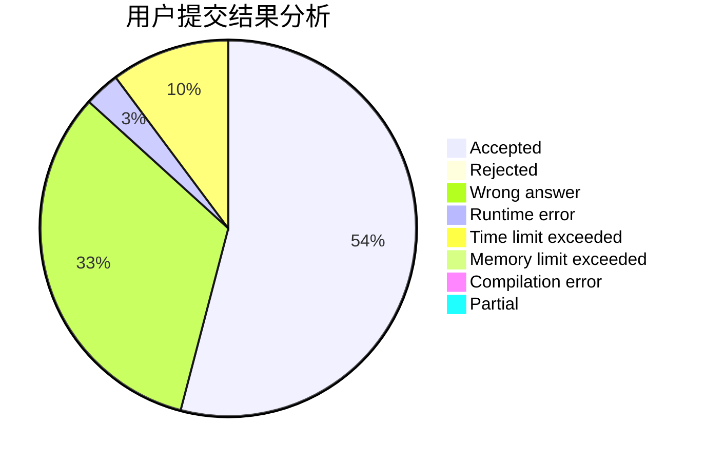
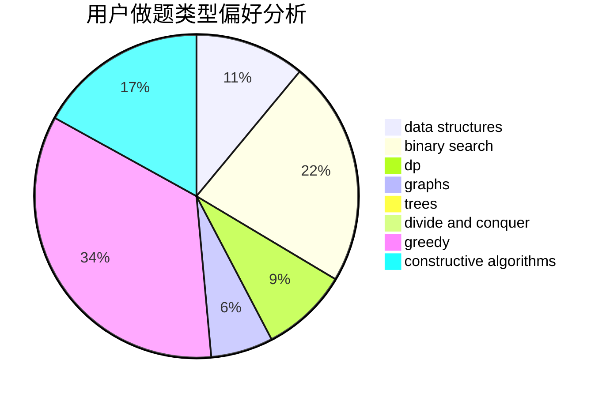

# Hyperion_LR

<!-- tabs:start -->

#### **用户提交结果分析**

#### **用户做题类型偏好分析**

#### **用户错题知识点分析**

<!-- tabs:end -->
# 推荐题目
[875B](https://codeforces.com/contest/875/problem/B)		dsu,
                        implementation,
                        sortings,
                        two pointers		  
[1339B](https://codeforces.com/contest/1339/problem/B)		constructive algorithms,
                        sortings		  
[52C](https://codeforces.com/contest/52/problem/C)		data structures		  
[1474F](https://codeforces.com/contest/1474/problem/F)		dp,
                        math,
                        matrices		  
[682A](https://codeforces.com/contest/682/problem/A)		constructive algorithms,
                        math,
                        number theory		  
[208A](https://codeforces.com/contest/208/problem/A)		strings		  
[13D](https://codeforces.com/contest/13/problem/D)		dp,
                        geometry		  
[1265A](https://codeforces.com/contest/1265/problem/A)		constructive algorithms,
                        greedy		  
[265D](https://codeforces.com/contest/265/problem/D)		dsu,graphs,sortings,trees		  
[1080B](https://codeforces.com/contest/1080/problem/B)		math		  
