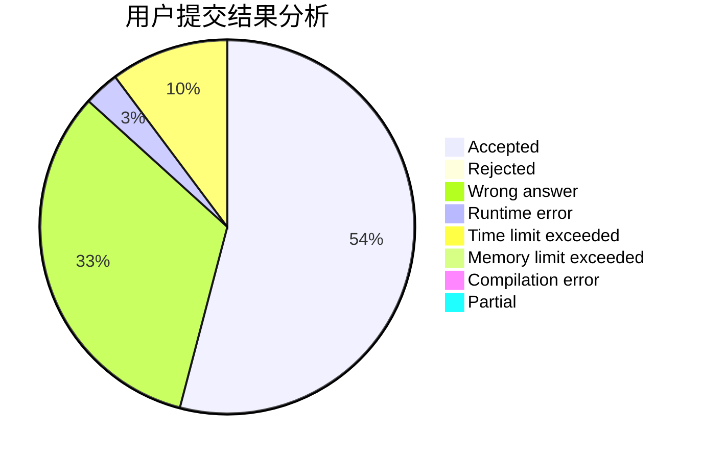
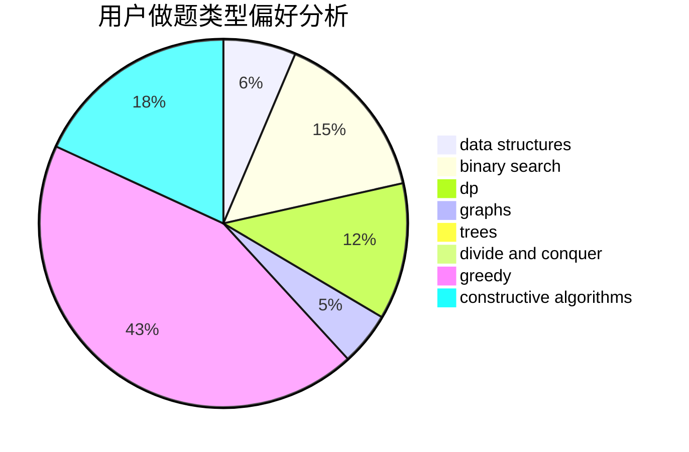

# Hyperion_LR

<!-- tabs:start -->

#### **用户提交结果分析**

#### **用户做题类型偏好分析**

#### **用户错题知识点分析**

<!-- tabs:end -->
# 推荐题目
[855G](https://codeforces.com/contest/855/problem/G)		dfs and similar,
                        dp,
                        graphs,
                        trees		  
[1332E](https://codeforces.com/contest/1332/problem/E)		combinatorics,
                        constructive algorithms,
                        math,
                        matrices		  
[509D](https://codeforces.com/contest/509/problem/D)		constructive algorithms,
                        math		  
[1467D](https://codeforces.com/contest/1467/problem/D)		combinatorics,
                        dp,
                        math		  
[662A](https://codeforces.com/contest/662/problem/A)		bitmasks,
                        math,
                        matrices,
                        probabilities		  
[180D](https://codeforces.com/contest/180/problem/D)		greedy,
                        strings		  
[1392B](https://codeforces.com/contest/1392/problem/B)		implementation,
                        math		  
[1257F](https://codeforces.com/contest/1257/problem/F)		bitmasks,
                        brute force,
                        hashing,
                        meet-in-the-middle		  
[244C](https://codeforces.com/contest/244/problem/C)		dsu,graphs,sortings,trees		  
[107C](https://codeforces.com/contest/107/problem/C)		bitmasks,
                        dp		  
