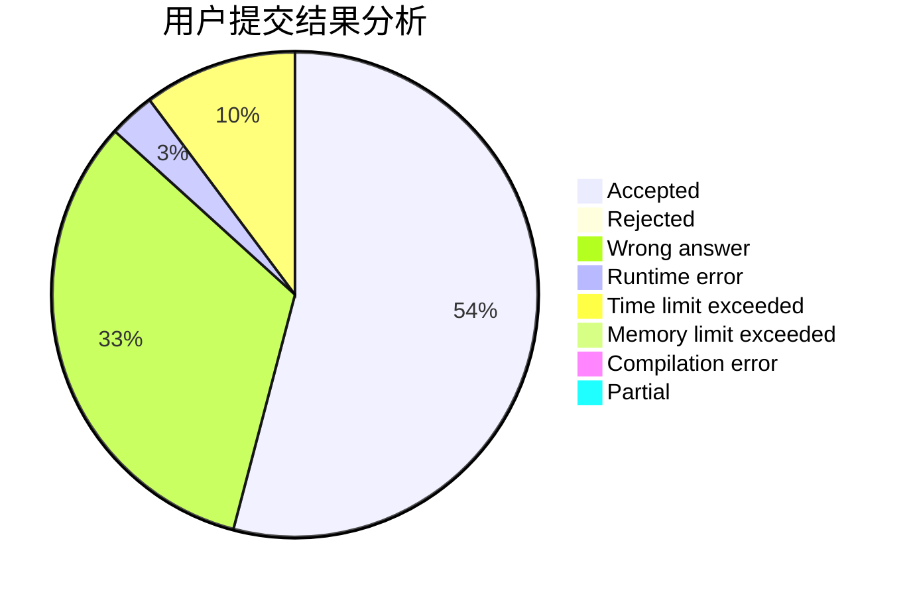
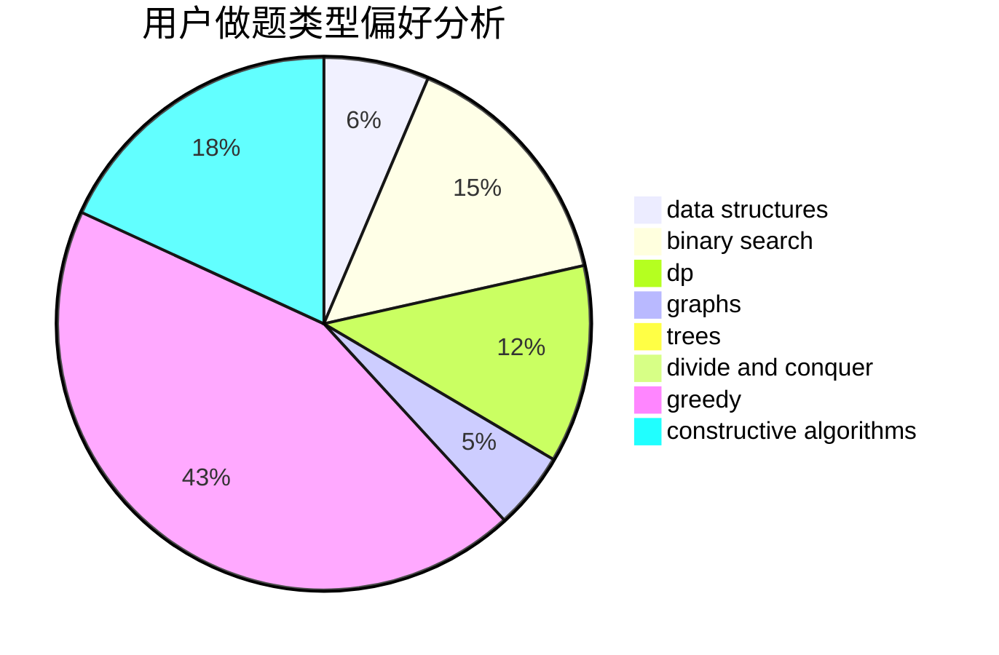

# Hyperion_LR
<!-- tabs:start -->
#### **用户提交结果分析**

#### **用户做题类型偏好分析**

#### **用户错题知识点分析**

<!-- tabs:end -->
# 推荐题目
[Height All the Same](http://codeforces.com/problemset/problem/1332/E)		combinatorics,
                        constructive algorithms,
                        math,
                        matrices		  
[Almost Same Distance](http://codeforces.com/problemset/problem/1266/F)		dfs and similar,
                        graphs		  
[Name](http://codeforces.com/problemset/problem/180/D)		greedy,
                        strings		  
[Megacity](http://codeforces.com/problemset/problem/424/B)		binary search,
                        greedy,
                        implementation,
                        sortings		  
[Make Them Similar](http://codeforces.com/problemset/problem/1257/F)		bitmasks,
                        brute force,
                        hashing,
                        meet-in-the-middle		  
[Seven Digit Number (2 points)](https://codeforces.com/contest/1164/problem/M)		nan		  
[Coloring Edges](http://codeforces.com/problemset/problem/1217/D)		constructive algorithms,
                        dfs and similar,
                        graphs		  
[Arrangement](http://codeforces.com/problemset/problem/107/C)		bitmasks,
                        dp		  
[Summoning Minions](http://codeforces.com/problemset/problem/1354/F)		constructive algorithms,
                        dp,
                        flows,
                        graph matchings,
                        greedy,
                        sortings		  
[George and Number](http://codeforces.com/problemset/problem/387/C)		greedy,
                        implementation		  
<!-- tabs:start -->
#### **data structures**
[Nanosoft](http://codeforces.com/problemset/problem/1301/E)		binary search,
                        data structures,
                        dp,
                        implementation		  
[Game with string](http://codeforces.com/problemset/problem/1104/B)		data structures,
                        implementation,
                        math		  
[Queue in the Train](http://codeforces.com/problemset/problem/1239/C)		data structures,
                        greedy,
                        implementation		  
[The Number of Subpermutations](http://codeforces.com/problemset/problem/1175/F)		brute force,
                        data structures,
                        divide and conquer,
                        hashing,
                        math		  
[ELCA](http://codeforces.com/problemset/problem/482/E)		data structures,
                        trees		  
[Maximum width](http://codeforces.com/problemset/problem/1492/C)		binary search,
                        data structures,
                        dp,
                        greedy,
                        two pointers		  
[Old Floppy Drive](http://codeforces.com/problemset/problem/1490/G)		binary search,
                        data structures,
                        math		  
[Odd Mineral Resource](http://codeforces.com/problemset/problem/1479/D)		binary search,
                        bitmasks,
                        brute force,
                        data structures,
                        probabilities,
                        trees		  
[Meximization](http://codeforces.com/problemset/problem/1497/A)		brute force,
                        data structures,
                        greedy,
                        sortings		  
[Pekora and Trampoline](http://codeforces.com/problemset/problem/1491/C)		brute force,
                        data structures,
                        dp,
                        greedy,
                        implementation		  
#### **binary search**
[Megacity](http://codeforces.com/problemset/problem/424/B)		binary search,
                        greedy,
                        implementation,
                        sortings		  
[Nanosoft](http://codeforces.com/problemset/problem/1301/E)		binary search,
                        data structures,
                        dp,
                        implementation		  
[Match Points](http://codeforces.com/problemset/problem/1156/C)		binary search,
                        greedy,
                        sortings,
                        ternary search,
                        two pointers		  
[Pairs](http://codeforces.com/problemset/problem/1463/D)		binary search,
                        constructive algorithms,
                        greedy,
                        two pointers		  
[Remove the Substring (hard version)](http://codeforces.com/problemset/problem/1203/D2)		binary search,
                        greedy,
                        implementation,
                        two pointers		  
[Maximum width](http://codeforces.com/problemset/problem/1492/C)		binary search,
                        data structures,
                        dp,
                        greedy,
                        two pointers		  
[Old Floppy Drive](http://codeforces.com/problemset/problem/1490/G)		binary search,
                        data structures,
                        math		  
[Odd Mineral Resource](http://codeforces.com/problemset/problem/1479/D)		binary search,
                        bitmasks,
                        brute force,
                        data structures,
                        probabilities,
                        trees		  
[Complicated Computations](http://codeforces.com/problemset/problem/1436/E)		binary search,
                        data structures,
                        two pointers		  
[Divide and Summarize](http://codeforces.com/problemset/problem/1461/D)		binary search,
                        brute force,
                        data structures,
                        divide and conquer,
                        implementation,
                        sortings		  
#### **dp**
[Arrangement](http://codeforces.com/problemset/problem/107/C)		bitmasks,
                        dp		  
[Summoning Minions](http://codeforces.com/problemset/problem/1354/F)		constructive algorithms,
                        dp,
                        flows,
                        graph matchings,
                        greedy,
                        sortings		  
[Nanosoft](http://codeforces.com/problemset/problem/1301/E)		binary search,
                        data structures,
                        dp,
                        implementation		  
[Magic Tricks](http://codeforces.com/problemset/problem/1346/E)		*special problem,
                        dp,
                        graphs		  
[Bath Queue](http://codeforces.com/problemset/problem/28/C)		combinatorics,
                        dp,
                        probabilities		  
[Eleventh Birthday](http://codeforces.com/problemset/problem/856/C)		combinatorics,
                        dp,
                        math		  
[Simba on the Circle](http://codeforces.com/problemset/problem/612/F)		dp		  
[Harry Vs Voldemort](http://codeforces.com/problemset/problem/855/G)		dfs and similar,
                        dp,
                        graphs,
                        trees		  
[Lesson Timetable](http://codeforces.com/problemset/problem/37/D)		combinatorics,
                        dp,
                        math		  
[Sum of Paths](http://codeforces.com/problemset/problem/1467/D)		combinatorics,
                        dp,
                        math		  
#### **graph**
[Almost Same Distance](http://codeforces.com/problemset/problem/1266/F)		dfs and similar,
                        graphs		  
[Coloring Edges](http://codeforces.com/problemset/problem/1217/D)		constructive algorithms,
                        dfs and similar,
                        graphs		  
[Summoning Minions](http://codeforces.com/problemset/problem/1354/F)		constructive algorithms,
                        dp,
                        flows,
                        graph matchings,
                        greedy,
                        sortings		  
[Magic Tricks](http://codeforces.com/problemset/problem/1346/E)		*special problem,
                        dp,
                        graphs		  
[Harry Vs Voldemort](http://codeforces.com/problemset/problem/855/G)		dfs and similar,
                        dp,
                        graphs,
                        trees		  
[Crime Management](http://codeforces.com/problemset/problem/107/D)		dp,
                        graphs,
                        matrices		  
[Fix a Tree](http://codeforces.com/problemset/problem/698/B)		constructive algorithms,
                        dfs and similar,
                        dsu,
                        graphs,
                        trees		  
[Minimum Ties](http://codeforces.com/problemset/problem/1487/C)		brute force,
                        constructive algorithms,
                        dfs and similar,
                        graphs,
                        greedy,
                        implementation,
                        math		  
[Chef Monocarp](http://codeforces.com/problemset/problem/1437/C)		dp,
                        flows,
                        graph matchings,
                        greedy,
                        math,
                        sortings		  
[Strange Housing](http://codeforces.com/problemset/problem/1470/D)		constructive algorithms,
                        dfs and similar,
                        graph matchings,
                        graphs,
                        greedy		  
#### **trees**
[Harry Vs Voldemort](http://codeforces.com/problemset/problem/855/G)		dfs and similar,
                        dp,
                        graphs,
                        trees		  
[Fix a Tree](http://codeforces.com/problemset/problem/698/B)		constructive algorithms,
                        dfs and similar,
                        dsu,
                        graphs,
                        trees		  
[ELCA](http://codeforces.com/problemset/problem/482/E)		data structures,
                        trees		  
[Odd Mineral Resource](http://codeforces.com/problemset/problem/1479/D)		binary search,
                        bitmasks,
                        brute force,
                        data structures,
                        probabilities,
                        trees		  
[Yet Another Card Deck](http://codeforces.com/problemset/problem/1511/C)		brute force,
                        data structures,
                        implementation,
                        trees		  
[Diameter Cuts](http://codeforces.com/problemset/problem/1499/F)		combinatorics,
                        dfs and similar,
                        dp,
                        trees		  
[Fib-tree](http://codeforces.com/problemset/problem/1491/E)		brute force,
                        dfs and similar,
                        divide and conquer,
                        number theory,
                        trees		  
[13th Labour of Heracles](http://codeforces.com/problemset/problem/1466/D)		data structures,
                        greedy,
                        sortings,
                        trees		  
[BFS Trees](http://codeforces.com/problemset/problem/1495/D)		combinatorics,
                        dfs and similar,
                        graphs,
                        math,
                        shortest paths,
                        trees		  
[Sum of Prefix Sums](http://codeforces.com/problemset/problem/1303/G)		data structures,
                        divide and conquer,
                        geometry,
                        trees		  
#### **divide and conquer**
[Algoland and Berland](http://codeforces.com/problemset/problem/1070/M)		constructive algorithms,
                        divide and conquer,
                        geometry		  
[The Number of Subpermutations](http://codeforces.com/problemset/problem/1175/F)		brute force,
                        data structures,
                        divide and conquer,
                        hashing,
                        math		  
[Divide and Summarize](http://codeforces.com/problemset/problem/1461/D)		binary search,
                        brute force,
                        data structures,
                        divide and conquer,
                        implementation,
                        sortings		  
[Song of the Sirens](http://codeforces.com/problemset/problem/1466/G)		combinatorics,
                        divide and conquer,
                        hashing,
                        math,
                        string suffix structures,
                        strings		  
[Permutation Transformation](http://codeforces.com/problemset/problem/1490/D)		dfs and similar,
                        divide and conquer,
                        implementation		  
[Skyline Photo](https://codeforces.com/contest/1483/problem/C)		data structures,
                        divide and conquer,
                        dp		  
[Fib-tree](http://codeforces.com/problemset/problem/1491/E)		brute force,
                        dfs and similar,
                        divide and conquer,
                        number theory,
                        trees		  
[Sum of Prefix Sums](http://codeforces.com/problemset/problem/1303/G)		data structures,
                        divide and conquer,
                        geometry,
                        trees		  
[Dogeforces](http://codeforces.com/problemset/problem/1494/D)		constructive algorithms,
                        data structures,
                        dfs and similar,
                        divide and conquer,
                        dsu,
                        greedy,
                        sortings,
                        trees		  
[Logistical Questions](http://codeforces.com/problemset/problem/566/C)		dfs and similar,
                        divide and conquer,
                        trees		  
#### **greedy**
[Name](http://codeforces.com/problemset/problem/180/D)		greedy,
                        strings		  
[Megacity](http://codeforces.com/problemset/problem/424/B)		binary search,
                        greedy,
                        implementation,
                        sortings		  
[Summoning Minions](http://codeforces.com/problemset/problem/1354/F)		constructive algorithms,
                        dp,
                        flows,
                        graph matchings,
                        greedy,
                        sortings		  
[George and Number](http://codeforces.com/problemset/problem/387/C)		greedy,
                        implementation		  
[Increasing Subsequence (easy version)](http://codeforces.com/problemset/problem/1157/C1)		greedy		  
[Queue in the Train](http://codeforces.com/problemset/problem/1239/C)		data structures,
                        greedy,
                        implementation		  
[Match Points](http://codeforces.com/problemset/problem/1156/C)		binary search,
                        greedy,
                        sortings,
                        ternary search,
                        two pointers		  
[Pairs](http://codeforces.com/problemset/problem/1463/D)		binary search,
                        constructive algorithms,
                        greedy,
                        two pointers		  
[Coins](http://codeforces.com/problemset/problem/58/B)		greedy		  
[Remove the Substring (hard version)](http://codeforces.com/problemset/problem/1203/D2)		binary search,
                        greedy,
                        implementation,
                        two pointers		  
#### **constructive algorithms**
[Height All the Same](http://codeforces.com/problemset/problem/1332/E)		combinatorics,
                        constructive algorithms,
                        math,
                        matrices		  
[Coloring Edges](http://codeforces.com/problemset/problem/1217/D)		constructive algorithms,
                        dfs and similar,
                        graphs		  
[Summoning Minions](http://codeforces.com/problemset/problem/1354/F)		constructive algorithms,
                        dp,
                        flows,
                        graph matchings,
                        greedy,
                        sortings		  
[Restoring Numbers](http://codeforces.com/problemset/problem/509/D)		constructive algorithms,
                        math		  
[Algoland and Berland](http://codeforces.com/problemset/problem/1070/M)		constructive algorithms,
                        divide and conquer,
                        geometry		  
[Strange Addition](http://codeforces.com/problemset/problem/305/A)		brute force,
                        constructive algorithms,
                        implementation		  
[Pairs](http://codeforces.com/problemset/problem/1463/D)		binary search,
                        constructive algorithms,
                        greedy,
                        two pointers		  
[Fix a Tree](http://codeforces.com/problemset/problem/698/B)		constructive algorithms,
                        dfs and similar,
                        dsu,
                        graphs,
                        trees		  
[Game of Pairs](http://codeforces.com/problemset/problem/1404/D)		constructive algorithms,
                        dfs and similar,
                        interactive,
                        math,
                        number theory		  
[3-Coloring](http://codeforces.com/problemset/problem/1503/B)		constructive algorithms,
                        games,
                        interactive		  
#### **sortings**
[Megacity](http://codeforces.com/problemset/problem/424/B)		binary search,
                        greedy,
                        implementation,
                        sortings		  
[Summoning Minions](http://codeforces.com/problemset/problem/1354/F)		constructive algorithms,
                        dp,
                        flows,
                        graph matchings,
                        greedy,
                        sortings		  
[Optimal Point on a Line](http://codeforces.com/problemset/problem/710/B)		brute force,
                        sortings		  
[Match Points](http://codeforces.com/problemset/problem/1156/C)		binary search,
                        greedy,
                        sortings,
                        ternary search,
                        two pointers		  
[Diamond Miner](https://codeforces.com/contest/1496/problem/C)		geometry,
                        greedy,
                        math,
                        sortings		  
[Meximization](http://codeforces.com/problemset/problem/1497/A)		brute force,
                        data structures,
                        greedy,
                        sortings		  
[Avoiding Zero](http://codeforces.com/problemset/problem/1427/A)		math,
                        sortings		  
[Divide and Summarize](http://codeforces.com/problemset/problem/1461/D)		binary search,
                        brute force,
                        data structures,
                        divide and conquer,
                        implementation,
                        sortings		  
[Chef Monocarp](http://codeforces.com/problemset/problem/1437/C)		dp,
                        flows,
                        graph matchings,
                        greedy,
                        math,
                        sortings		  
[Replacing Elements](http://codeforces.com/problemset/problem/1473/A)		greedy,
                        implementation,
                        math,
                        sortings		  
<!-- tabs:end -->
