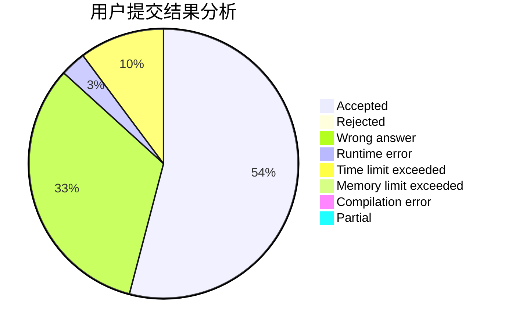
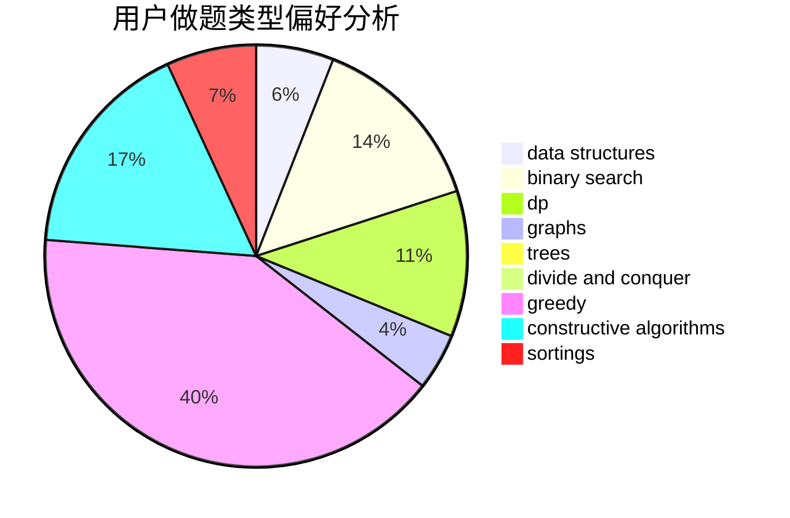

# Hyperion_LR
<!-- tabs:start -->
#### **用户提交结果分析**

#### **用户做题类型偏好分析**

#### **用户错题知识点分析**

<!-- tabs:end -->
# 推荐题目
[1332E](http://codeforces.com/problemset/problem/1332/E)		combinatorics,
                        constructive algorithms,
                        math,
                        matrices		  
[1266F](http://codeforces.com/problemset/problem/1266/F)		dfs and similar,
                        graphs		  
[180D](http://codeforces.com/problemset/problem/180/D)		greedy,
                        strings		  
[424B](http://codeforces.com/problemset/problem/424/B)		binary search,
                        greedy,
                        implementation,
                        sortings		  
[1257F](http://codeforces.com/problemset/problem/1257/F)		bitmasks,
                        brute force,
                        hashing,
                        meet-in-the-middle		  
[1164M](https://codeforces.com/contest/1164/problem/M)		nan		  
[1217D](http://codeforces.com/problemset/problem/1217/D)		constructive algorithms,
                        dfs and similar,
                        graphs		  
[107C](http://codeforces.com/problemset/problem/107/C)		bitmasks,
                        dp		  
[1354F](http://codeforces.com/problemset/problem/1354/F)		constructive algorithms,
                        dp,
                        flows,
                        graph matchings,
                        greedy,
                        sortings		  
[387C](http://codeforces.com/problemset/problem/387/C)		greedy,
                        implementation		  
<!-- tabs:start -->
#### **data structures**
[1301E](http://codeforces.com/problemset/problem/1301/E)		binary search,
                        data structures,
                        dp,
                        implementation		  
[1104B](http://codeforces.com/problemset/problem/1104/B)		data structures,
                        implementation,
                        math		  
[1239C](http://codeforces.com/problemset/problem/1239/C)		data structures,
                        greedy,
                        implementation		  
[1175F](http://codeforces.com/problemset/problem/1175/F)		brute force,
                        data structures,
                        divide and conquer,
                        hashing,
                        math		  
[482E](http://codeforces.com/problemset/problem/482/E)		data structures,
                        trees		  
[1492C](http://codeforces.com/problemset/problem/1492/C)		binary search,
                        data structures,
                        dp,
                        greedy,
                        two pointers		  
[1490G](http://codeforces.com/problemset/problem/1490/G)		binary search,
                        data structures,
                        math		  
[1479D](http://codeforces.com/problemset/problem/1479/D)		binary search,
                        bitmasks,
                        brute force,
                        data structures,
                        probabilities,
                        trees		  
[1497A](http://codeforces.com/problemset/problem/1497/A)		brute force,
                        data structures,
                        greedy,
                        sortings		  
[1491C](http://codeforces.com/problemset/problem/1491/C)		brute force,
                        data structures,
                        dp,
                        greedy,
                        implementation		  
#### **binary search**
[424B](http://codeforces.com/problemset/problem/424/B)		binary search,
                        greedy,
                        implementation,
                        sortings		  
[1301E](http://codeforces.com/problemset/problem/1301/E)		binary search,
                        data structures,
                        dp,
                        implementation		  
[1156C](http://codeforces.com/problemset/problem/1156/C)		binary search,
                        greedy,
                        sortings,
                        ternary search,
                        two pointers		  
[1463D](http://codeforces.com/problemset/problem/1463/D)		binary search,
                        constructive algorithms,
                        greedy,
                        two pointers		  
[1203D2](http://codeforces.com/problemset/problem/1203/D2)		binary search,
                        greedy,
                        implementation,
                        two pointers		  
[1492C](http://codeforces.com/problemset/problem/1492/C)		binary search,
                        data structures,
                        dp,
                        greedy,
                        two pointers		  
[1463D](http://codeforces.com/problemset/problem/1463/D)		binary search,
                        constructive algorithms,
                        greedy,
                        two pointers		  
[1490G](http://codeforces.com/problemset/problem/1490/G)		binary search,
                        data structures,
                        math		  
[1479D](http://codeforces.com/problemset/problem/1479/D)		binary search,
                        bitmasks,
                        brute force,
                        data structures,
                        probabilities,
                        trees		  
[1436E](http://codeforces.com/problemset/problem/1436/E)		binary search,
                        data structures,
                        two pointers		  
#### **dp**
[107C](http://codeforces.com/problemset/problem/107/C)		bitmasks,
                        dp		  
[1354F](http://codeforces.com/problemset/problem/1354/F)		constructive algorithms,
                        dp,
                        flows,
                        graph matchings,
                        greedy,
                        sortings		  
[1301E](http://codeforces.com/problemset/problem/1301/E)		binary search,
                        data structures,
                        dp,
                        implementation		  
[1346E](http://codeforces.com/problemset/problem/1346/E)		*special problem,
                        dp,
                        graphs		  
[28C](http://codeforces.com/problemset/problem/28/C)		combinatorics,
                        dp,
                        probabilities		  
[856C](http://codeforces.com/problemset/problem/856/C)		combinatorics,
                        dp,
                        math		  
[612F](http://codeforces.com/problemset/problem/612/F)		dp		  
[855G](http://codeforces.com/problemset/problem/855/G)		dfs and similar,
                        dp,
                        graphs,
                        trees		  
[37D](http://codeforces.com/problemset/problem/37/D)		combinatorics,
                        dp,
                        math		  
[1467D](http://codeforces.com/problemset/problem/1467/D)		combinatorics,
                        dp,
                        math		  
#### **graph**
[1266F](http://codeforces.com/problemset/problem/1266/F)		dfs and similar,
                        graphs		  
[1217D](http://codeforces.com/problemset/problem/1217/D)		constructive algorithms,
                        dfs and similar,
                        graphs		  
[1354F](http://codeforces.com/problemset/problem/1354/F)		constructive algorithms,
                        dp,
                        flows,
                        graph matchings,
                        greedy,
                        sortings		  
[1346E](http://codeforces.com/problemset/problem/1346/E)		*special problem,
                        dp,
                        graphs		  
[855G](http://codeforces.com/problemset/problem/855/G)		dfs and similar,
                        dp,
                        graphs,
                        trees		  
[107D](http://codeforces.com/problemset/problem/107/D)		dp,
                        graphs,
                        matrices		  
[698B](http://codeforces.com/problemset/problem/698/B)		constructive algorithms,
                        dfs and similar,
                        dsu,
                        graphs,
                        trees		  
[1487C](http://codeforces.com/problemset/problem/1487/C)		brute force,
                        constructive algorithms,
                        dfs and similar,
                        graphs,
                        greedy,
                        implementation,
                        math		  
[1437C](http://codeforces.com/problemset/problem/1437/C)		dp,
                        flows,
                        graph matchings,
                        greedy,
                        math,
                        sortings		  
[1470D](http://codeforces.com/problemset/problem/1470/D)		constructive algorithms,
                        dfs and similar,
                        graph matchings,
                        graphs,
                        greedy		  
#### **trees**
[855G](http://codeforces.com/problemset/problem/855/G)		dfs and similar,
                        dp,
                        graphs,
                        trees		  
[698B](http://codeforces.com/problemset/problem/698/B)		constructive algorithms,
                        dfs and similar,
                        dsu,
                        graphs,
                        trees		  
[482E](http://codeforces.com/problemset/problem/482/E)		data structures,
                        trees		  
[1479D](http://codeforces.com/problemset/problem/1479/D)		binary search,
                        bitmasks,
                        brute force,
                        data structures,
                        probabilities,
                        trees		  
[1511C](http://codeforces.com/problemset/problem/1511/C)		brute force,
                        data structures,
                        implementation,
                        trees		  
[1499F](http://codeforces.com/problemset/problem/1499/F)		combinatorics,
                        dfs and similar,
                        dp,
                        trees		  
[1491E](http://codeforces.com/problemset/problem/1491/E)		brute force,
                        dfs and similar,
                        divide and conquer,
                        number theory,
                        trees		  
[1466D](http://codeforces.com/problemset/problem/1466/D)		data structures,
                        greedy,
                        sortings,
                        trees		  
[1495D](http://codeforces.com/problemset/problem/1495/D)		combinatorics,
                        dfs and similar,
                        graphs,
                        math,
                        shortest paths,
                        trees		  
[1303G](http://codeforces.com/problemset/problem/1303/G)		data structures,
                        divide and conquer,
                        geometry,
                        trees		  
#### **divide and conquer**
[1070M](http://codeforces.com/problemset/problem/1070/M)		constructive algorithms,
                        divide and conquer,
                        geometry		  
[1175F](http://codeforces.com/problemset/problem/1175/F)		brute force,
                        data structures,
                        divide and conquer,
                        hashing,
                        math		  
[1461D](http://codeforces.com/problemset/problem/1461/D)		binary search,
                        brute force,
                        data structures,
                        divide and conquer,
                        implementation,
                        sortings		  
[1466G](http://codeforces.com/problemset/problem/1466/G)		combinatorics,
                        divide and conquer,
                        hashing,
                        math,
                        string suffix structures,
                        strings		  
[1490D](http://codeforces.com/problemset/problem/1490/D)		dfs and similar,
                        divide and conquer,
                        implementation		  
[1483C](https://codeforces.com/contest/1483/problem/C)		data structures,
                        divide and conquer,
                        dp		  
[1491E](http://codeforces.com/problemset/problem/1491/E)		brute force,
                        dfs and similar,
                        divide and conquer,
                        number theory,
                        trees		  
[1303G](http://codeforces.com/problemset/problem/1303/G)		data structures,
                        divide and conquer,
                        geometry,
                        trees		  
[1494D](http://codeforces.com/problemset/problem/1494/D)		constructive algorithms,
                        data structures,
                        dfs and similar,
                        divide and conquer,
                        dsu,
                        greedy,
                        sortings,
                        trees		  
[1482E](http://codeforces.com/problemset/problem/1482/E)		data structures,
                        divide and conquer,
                        dp		  
#### **greedy**
[180D](http://codeforces.com/problemset/problem/180/D)		greedy,
                        strings		  
[424B](http://codeforces.com/problemset/problem/424/B)		binary search,
                        greedy,
                        implementation,
                        sortings		  
[1354F](http://codeforces.com/problemset/problem/1354/F)		constructive algorithms,
                        dp,
                        flows,
                        graph matchings,
                        greedy,
                        sortings		  
[387C](http://codeforces.com/problemset/problem/387/C)		greedy,
                        implementation		  
[1157C1](http://codeforces.com/problemset/problem/1157/C1)		greedy		  
[1239C](http://codeforces.com/problemset/problem/1239/C)		data structures,
                        greedy,
                        implementation		  
[1156C](http://codeforces.com/problemset/problem/1156/C)		binary search,
                        greedy,
                        sortings,
                        ternary search,
                        two pointers		  
[1463D](http://codeforces.com/problemset/problem/1463/D)		binary search,
                        constructive algorithms,
                        greedy,
                        two pointers		  
[58B](http://codeforces.com/problemset/problem/58/B)		greedy		  
[1203D2](http://codeforces.com/problemset/problem/1203/D2)		binary search,
                        greedy,
                        implementation,
                        two pointers		  
#### **constructive algorithms**
[1332E](http://codeforces.com/problemset/problem/1332/E)		combinatorics,
                        constructive algorithms,
                        math,
                        matrices		  
[1217D](http://codeforces.com/problemset/problem/1217/D)		constructive algorithms,
                        dfs and similar,
                        graphs		  
[1354F](http://codeforces.com/problemset/problem/1354/F)		constructive algorithms,
                        dp,
                        flows,
                        graph matchings,
                        greedy,
                        sortings		  
[509D](http://codeforces.com/problemset/problem/509/D)		constructive algorithms,
                        math		  
[1070M](http://codeforces.com/problemset/problem/1070/M)		constructive algorithms,
                        divide and conquer,
                        geometry		  
[305A](http://codeforces.com/problemset/problem/305/A)		brute force,
                        constructive algorithms,
                        implementation		  
[1463D](http://codeforces.com/problemset/problem/1463/D)		binary search,
                        constructive algorithms,
                        greedy,
                        two pointers		  
[698B](http://codeforces.com/problemset/problem/698/B)		constructive algorithms,
                        dfs and similar,
                        dsu,
                        graphs,
                        trees		  
[1404D](http://codeforces.com/problemset/problem/1404/D)		constructive algorithms,
                        dfs and similar,
                        interactive,
                        math,
                        number theory		  
[1503B](http://codeforces.com/problemset/problem/1503/B)		constructive algorithms,
                        games,
                        interactive		  
#### **sortings**
[424B](http://codeforces.com/problemset/problem/424/B)		binary search,
                        greedy,
                        implementation,
                        sortings		  
[1354F](http://codeforces.com/problemset/problem/1354/F)		constructive algorithms,
                        dp,
                        flows,
                        graph matchings,
                        greedy,
                        sortings		  
[710B](http://codeforces.com/problemset/problem/710/B)		brute force,
                        sortings		  
[1156C](http://codeforces.com/problemset/problem/1156/C)		binary search,
                        greedy,
                        sortings,
                        ternary search,
                        two pointers		  
[1496C](https://codeforces.com/contest/1496/problem/C)		geometry,
                        greedy,
                        math,
                        sortings		  
[1495A](http://codeforces.com/problemset/problem/1495/A)		geometry,
                        greedy,
                        math,
                        sortings		  
[1497A](http://codeforces.com/problemset/problem/1497/A)		brute force,
                        data structures,
                        greedy,
                        sortings		  
[1427A](http://codeforces.com/problemset/problem/1427/A)		math,
                        sortings		  
[1461D](http://codeforces.com/problemset/problem/1461/D)		binary search,
                        brute force,
                        data structures,
                        divide and conquer,
                        implementation,
                        sortings		  
[1437C](http://codeforces.com/problemset/problem/1437/C)		dp,
                        flows,
                        graph matchings,
                        greedy,
                        math,
                        sortings		  
<!-- tabs:end -->
