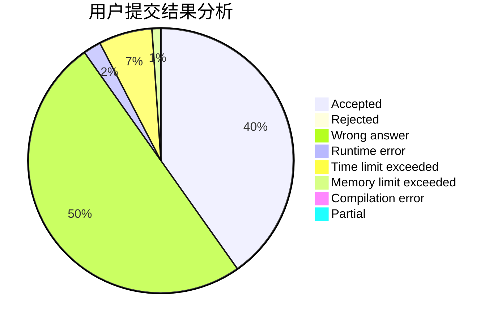
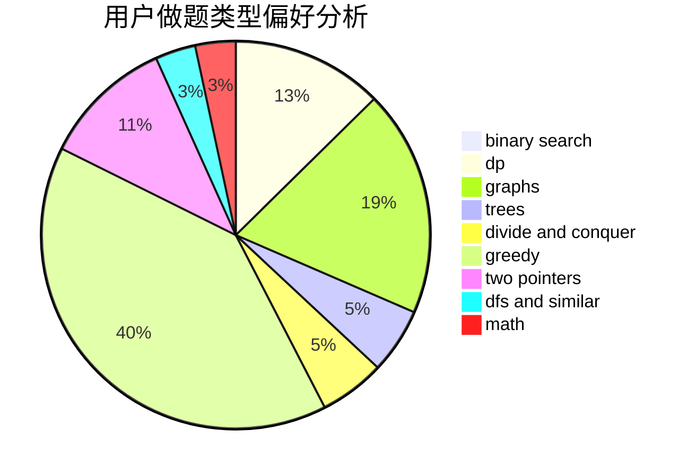

# Hzyuer

<!-- tabs:start -->

#### **用户提交结果分析**

#### **用户做题类型偏好分析**

<!-- tabs:end -->
# 推荐题目
[1186F](https://codeforces.com/contest/1186/problem/F)
[801B](https://codeforces.com/contest/801/problem/B)
[463C](https://codeforces.com/contest/463/problem/C)
[870C](https://codeforces.com/contest/870/problem/C)
[771D](https://codeforces.com/contest/771/problem/D)
[749B](https://codeforces.com/contest/749/problem/B)
[358B](https://codeforces.com/contest/358/problem/B)
[603E](https://codeforces.com/contest/603/problem/E)
[1003E](https://codeforces.com/contest/1003/problem/E)
[1205B](https://codeforces.com/contest/1205/problem/B)
