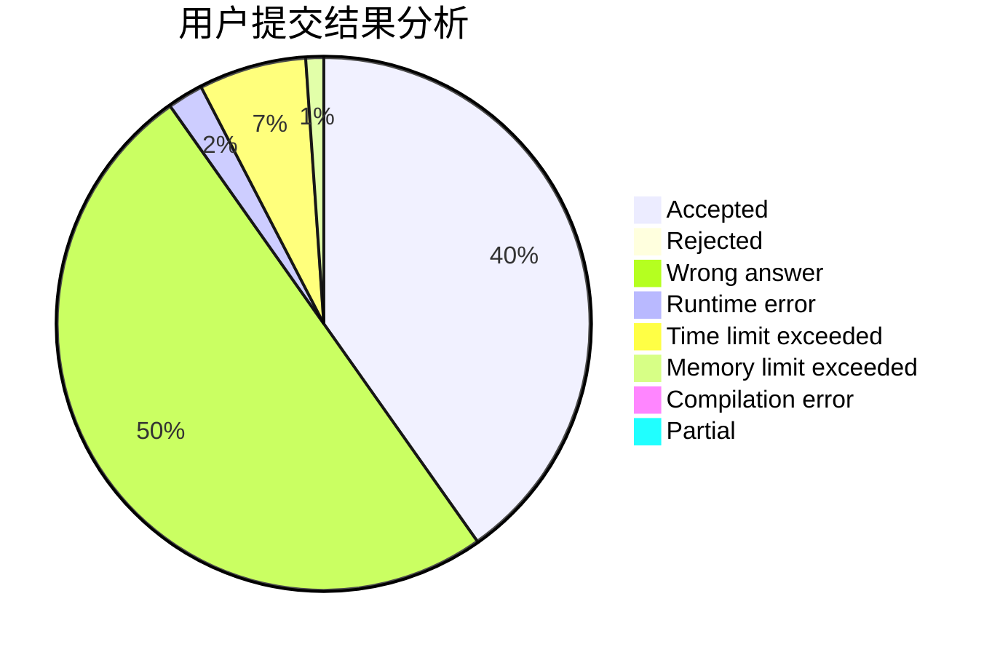
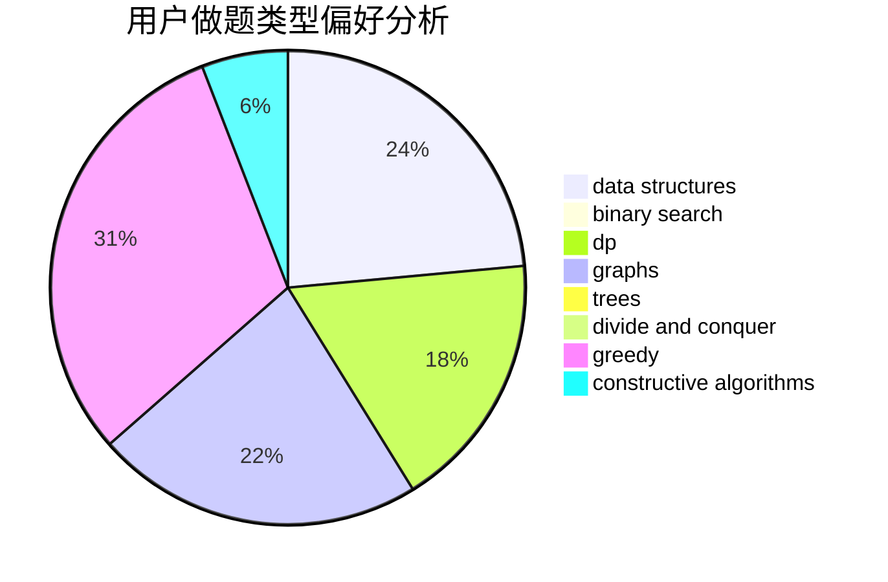
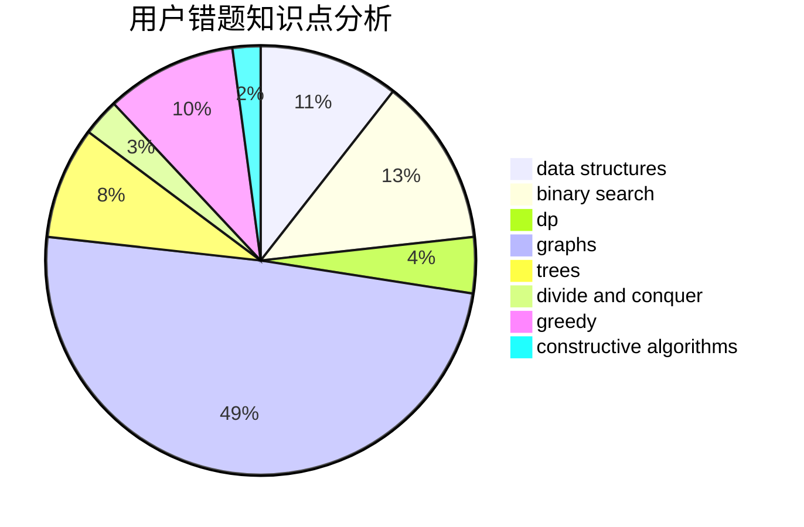

# Hzyuer

<!-- tabs:start -->

#### **用户提交结果分析**

#### **用户做题类型偏好分析**

#### **用户错题知识点分析**

<!-- tabs:end -->
# 推荐题目
[1186F](https://codeforces.com/contest/1186/problem/F)		dfs and similar,
                        graphs,
                        greedy,
                        implementation		  
[801B](https://codeforces.com/contest/801/problem/B)		constructive algorithms,
                        greedy,
                        strings		  
[463C](https://codeforces.com/contest/463/problem/C)		greedy,
                        hashing,
                        implementation		  
[870C](https://codeforces.com/contest/870/problem/C)		dp,
                        greedy,
                        math,
                        number theory		  
[771D](https://codeforces.com/contest/771/problem/D)		dp		  
[749B](https://codeforces.com/contest/749/problem/B)		brute force,
                        constructive algorithms,
                        geometry		  
[358B](https://codeforces.com/contest/358/problem/B)		brute force,
                        strings		  
[603E](https://codeforces.com/contest/603/problem/E)		data structures,
                        divide and conquer,
                        dsu,
                        math,
                        trees		  
[1003E](https://codeforces.com/contest/1003/problem/E)		constructive algorithms,
                        graphs		  
[1205B](https://codeforces.com/contest/1205/problem/B)		bitmasks,
                        brute force,
                        graphs,
                        shortest paths		  
