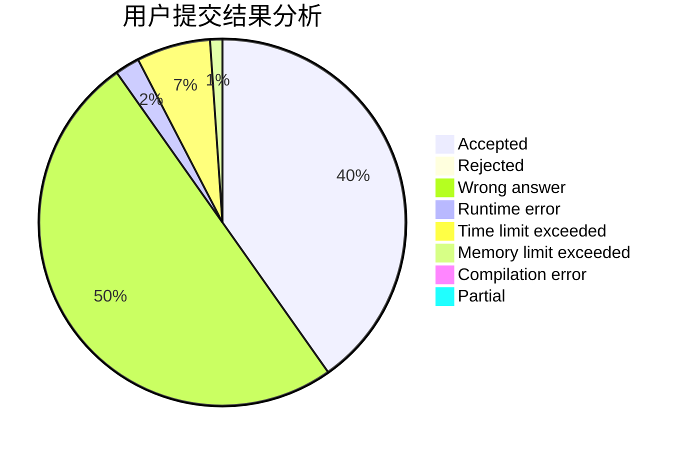
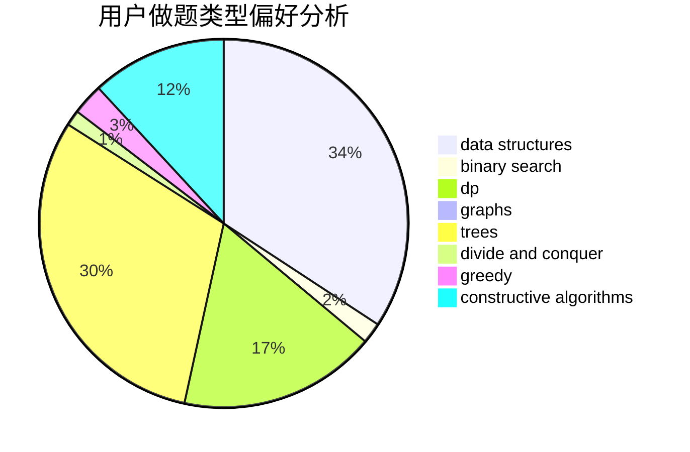
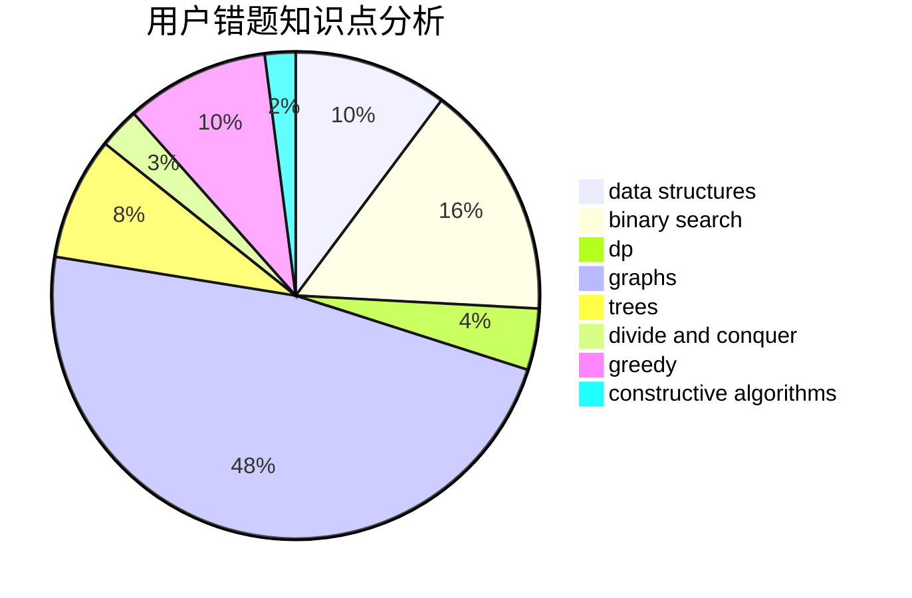

# Hzyuer

<!-- tabs:start -->

#### **用户提交结果分析**

#### **用户做题类型偏好分析**

#### **用户错题知识点分析**

<!-- tabs:end -->
# 推荐题目
[1183G](https://codeforces.com/contest/1183/problem/G)		greedy,
                        implementation,
                        sortings		  
[784B](https://codeforces.com/contest/784/problem/B)		*special problem		  
[442E](https://codeforces.com/contest/442/problem/E)		geometry		  
[852D](https://codeforces.com/contest/852/problem/D)		binary search,
                        flows,
                        graph matchings,
                        shortest paths		  
[750H](https://codeforces.com/contest/750/problem/H)		dfs and similar,
                        dsu,
                        graphs,
                        interactive		  
[731A](https://codeforces.com/contest/731/problem/A)		implementation,
                        strings		  
[32A](https://codeforces.com/contest/32/problem/A)		brute force		  
[582D](https://codeforces.com/contest/582/problem/D)		dp,
                        math,
                        number theory		  
[1003B](https://codeforces.com/contest/1003/problem/B)		constructive algorithms		  
[1200C](https://codeforces.com/contest/1200/problem/C)		math,
                        number theory		  
