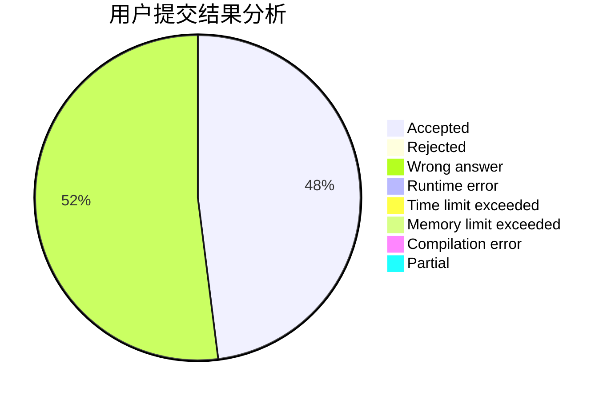
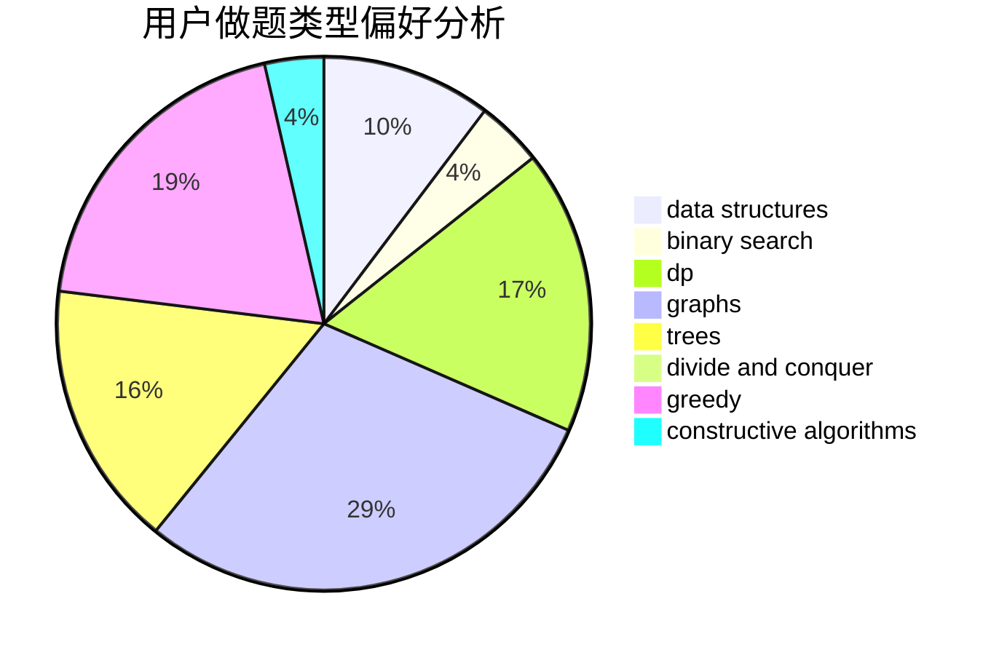

# I-Ripple

<!-- tabs:start -->

#### **用户提交结果分析**

#### **用户做题类型偏好分析**

#### **用户错题知识点分析**

<!-- tabs:end -->
# 推荐题目
[1086C](https://codeforces.com/contest/1086/problem/C)		dsu,graphs,sortings,trees		  
[357B](https://codeforces.com/contest/357/problem/B)		constructive algorithms,
                        implementation		  
[852D](https://codeforces.com/contest/852/problem/D)		binary search,
                        flows,
                        graph matchings,
                        shortest paths		  
[461A](https://codeforces.com/contest/461/problem/A)		greedy,
                        sortings		  
[863E](https://codeforces.com/contest/863/problem/E)		data structures,
                        sortings		  
[400E](https://codeforces.com/contest/400/problem/E)		binary search,
                        bitmasks,
                        data structures		  
[46F](https://codeforces.com/contest/46/problem/F)		dsu,
                        graphs		  
[341C](https://codeforces.com/contest/341/problem/C)		dsu,graphs,sortings,trees		  
[1147E](https://codeforces.com/contest/1147/problem/E)		interactive		  
[1200D](https://codeforces.com/contest/1200/problem/D)		brute force,
                        data structures,
                        dp,
                        implementation,
                        two pointers		  
