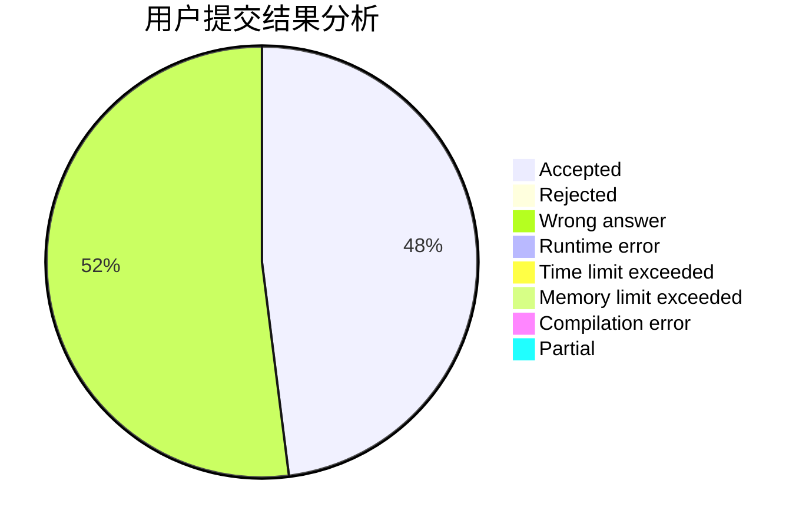
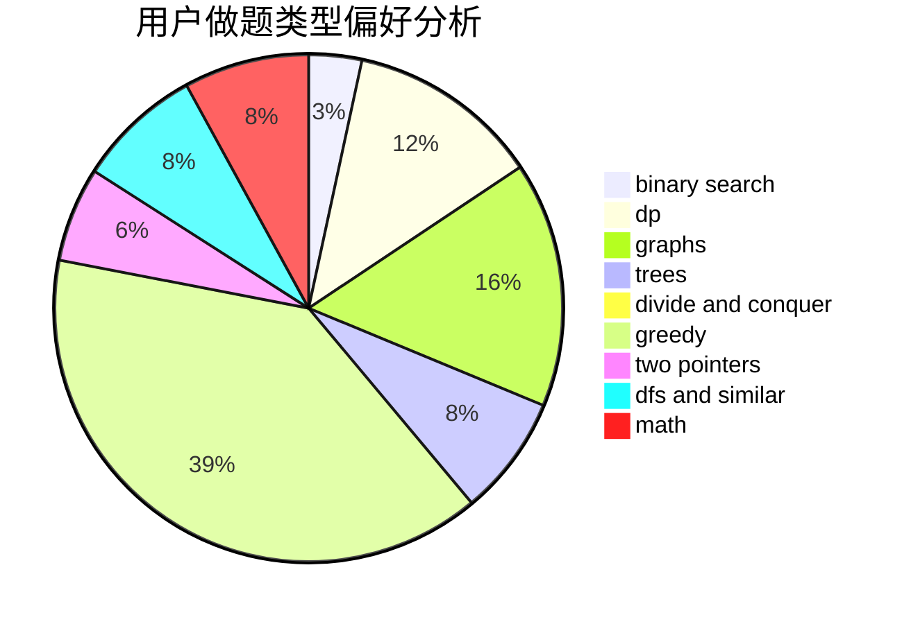

# I-Ripple

<!-- tabs:start -->

#### **用户提交结果分析**

#### **用户做题类型偏好分析**

<!-- tabs:end -->
# 推荐题目
[1086C](https://codeforces.com/contest/1086/problem/C)
[357B](https://codeforces.com/contest/357/problem/B)
[852D](https://codeforces.com/contest/852/problem/D)
[461A](https://codeforces.com/contest/461/problem/A)
[863E](https://codeforces.com/contest/863/problem/E)
[400E](https://codeforces.com/contest/400/problem/E)
[46F](https://codeforces.com/contest/46/problem/F)
[341C](https://codeforces.com/contest/341/problem/C)
[1147E](https://codeforces.com/contest/1147/problem/E)
[1200D](https://codeforces.com/contest/1200/problem/D)
