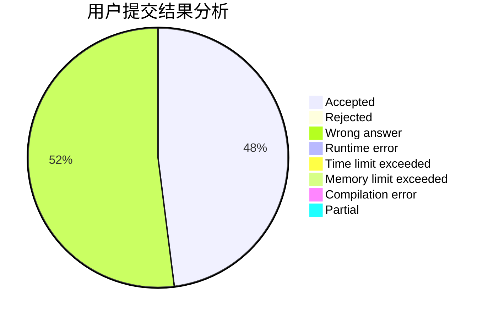
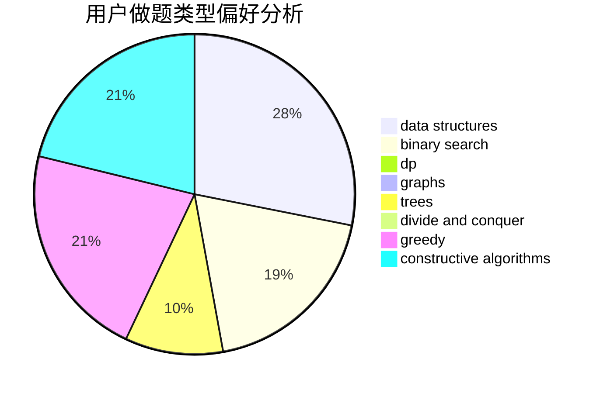

# I-Ripple
<!-- tabs:start -->
#### **用户提交结果分析**

#### **用户做题类型偏好分析**

#### **用户错题知识点分析**

<!-- tabs:end -->
# 推荐题目
[Lucky Year](http://codeforces.com/problemset/problem/808/A)		implementation		  
[Sea and Islands](http://codeforces.com/problemset/problem/544/B)		constructive algorithms,
                        implementation		  
[Beautiful Matrix](http://codeforces.com/problemset/problem/1085/G)		combinatorics,
                        data structures,
                        dp		  
[Pigeon d'Or](http://codeforces.com/problemset/problem/1145/D)		implementation		  
[Tidying Up](http://codeforces.com/problemset/problem/316/C2)		flows,
                        graph matchings		  
[Dune II: Battle For Arrakis](http://codeforces.com/problemset/problem/1346/F)		*special problem,
                        data structures,
                        greedy,
                        math		  
[Till I Collapse](http://codeforces.com/problemset/problem/786/C)		data structures,
                        divide and conquer		  
[Indian Summer](http://codeforces.com/problemset/problem/44/A)		implementation		  
[Evil](http://codeforces.com/problemset/problem/329/E)		math		  
[The Meaningless Game](https://codeforces.com/contest/834/problem/C)		math,
                        number theory		  
<!-- tabs:start -->
#### **data structures**
[Lucky Year](http://codeforces.com/problemset/problem/1085/G)		combinatorics,
                        data structures,
                        dp		  
[Sea and Islands](http://codeforces.com/problemset/problem/1346/F)		*special problem,
                        data structures,
                        greedy,
                        math		  
[Beautiful Matrix](http://codeforces.com/problemset/problem/786/C)		data structures,
                        divide and conquer		  
[Pigeon d'Or](http://codeforces.com/problemset/problem/799/B)		data structures,
                        implementation		  
[Tidying Up](http://codeforces.com/problemset/problem/845/D)		data structures,
                        dp,
                        greedy		  
[Dune II: Battle For Arrakis](https://codeforces.com/contest/528/problem/B)		data structures,
                        dp,
                        greedy,
                        implementation,
                        sortings		  
[Till I Collapse](http://codeforces.com/problemset/problem/1503/D)		2-sat,
                        constructive algorithms,
                        data structures,
                        greedy,
                        sortings,
                        two pointers		  
[Indian Summer](http://codeforces.com/problemset/problem/232/D)		binary search,
                        data structures,
                        string suffix structures		  
[Evil](http://codeforces.com/problemset/problem/1492/C)		binary search,
                        data structures,
                        dp,
                        greedy,
                        two pointers		  
[The Meaningless Game](http://codeforces.com/problemset/problem/1490/G)		binary search,
                        data structures,
                        math		  
#### **binary search**
[Lucky Year](http://codeforces.com/problemset/problem/1249/C2)		binary search,
                        greedy,
                        math,
                        meet-in-the-middle		  
[Sea and Islands](http://codeforces.com/problemset/problem/371/C)		binary search,
                        brute force		  
[Beautiful Matrix](http://codeforces.com/problemset/problem/232/D)		binary search,
                        data structures,
                        string suffix structures		  
[Pigeon d'Or](http://codeforces.com/problemset/problem/1492/C)		binary search,
                        data structures,
                        dp,
                        greedy,
                        two pointers		  
[Tidying Up](http://codeforces.com/problemset/problem/1463/D)		binary search,
                        constructive algorithms,
                        greedy,
                        two pointers		  
[Dune II: Battle For Arrakis](http://codeforces.com/problemset/problem/1490/G)		binary search,
                        data structures,
                        math		  
[Till I Collapse](http://codeforces.com/problemset/problem/1479/D)		binary search,
                        bitmasks,
                        brute force,
                        data structures,
                        probabilities,
                        trees		  
[Indian Summer](http://codeforces.com/problemset/problem/1436/E)		binary search,
                        data structures,
                        two pointers		  
[Evil](http://codeforces.com/problemset/problem/1461/D)		binary search,
                        brute force,
                        data structures,
                        divide and conquer,
                        implementation,
                        sortings		  
[The Meaningless Game](http://codeforces.com/problemset/problem/1493/C)		binary search,
                        brute force,
                        constructive algorithms,
                        greedy,
                        strings		  
#### **dp**
[Lucky Year](http://codeforces.com/problemset/problem/1085/G)		combinatorics,
                        data structures,
                        dp		  
[Sea and Islands](http://codeforces.com/problemset/problem/845/D)		data structures,
                        dp,
                        greedy		  
[Beautiful Matrix](https://codeforces.com/contest/528/problem/B)		data structures,
                        dp,
                        greedy,
                        implementation,
                        sortings		  
[Pigeon d'Or](http://codeforces.com/problemset/problem/439/E)		combinatorics,
                        dp,
                        math		  
[Tidying Up](http://codeforces.com/problemset/problem/1360/E)		dp,
                        graphs,
                        implementation,
                        shortest paths		  
[Dune II: Battle For Arrakis](http://codeforces.com/problemset/problem/1492/C)		binary search,
                        data structures,
                        dp,
                        greedy,
                        two pointers		  
[Till I Collapse](https://codeforces.com/contest/1457/problem/C)		brute force,
                        dp,
                        implementation		  
[Indian Summer](http://codeforces.com/problemset/problem/1491/C)		brute force,
                        data structures,
                        dp,
                        greedy,
                        implementation		  
[Evil](http://codeforces.com/problemset/problem/1437/C)		dp,
                        flows,
                        graph matchings,
                        greedy,
                        math,
                        sortings		  
[The Meaningless Game](http://codeforces.com/problemset/problem/1499/B)		brute force,
                        dp,
                        greedy,
                        implementation		  
#### **graph**
[Lucky Year](http://codeforces.com/problemset/problem/316/C2)		flows,
                        graph matchings		  
[Sea and Islands](http://codeforces.com/problemset/problem/1360/E)		dp,
                        graphs,
                        implementation,
                        shortest paths		  
[Beautiful Matrix](http://codeforces.com/problemset/problem/1487/C)		brute force,
                        constructive algorithms,
                        dfs and similar,
                        graphs,
                        greedy,
                        implementation,
                        math		  
[Pigeon d'Or](http://codeforces.com/problemset/problem/1437/C)		dp,
                        flows,
                        graph matchings,
                        greedy,
                        math,
                        sortings		  
[Tidying Up](http://codeforces.com/problemset/problem/1470/D)		constructive algorithms,
                        dfs and similar,
                        graph matchings,
                        graphs,
                        greedy		  
[Dune II: Battle For Arrakis](http://codeforces.com/problemset/problem/1476/C)		dp,
                        graphs,
                        greedy		  
[Till I Collapse](http://codeforces.com/problemset/problem/1304/D)		constructive algorithms,
                        graphs,
                        greedy,
                        two pointers		  
[Indian Summer](http://codeforces.com/problemset/problem/1475/C)		combinatorics,
                        graphs,
                        math		  
[Evil](http://codeforces.com/problemset/problem/553/E)		dp,
                        fft,
                        graphs,
                        math,
                        probabilities		  
[The Meaningless Game](http://codeforces.com/problemset/problem/1495/C)		constructive algorithms,
                        graphs		  
#### **trees**
[Lucky Year](http://codeforces.com/problemset/problem/1479/D)		binary search,
                        bitmasks,
                        brute force,
                        data structures,
                        probabilities,
                        trees		  
[Sea and Islands](http://codeforces.com/problemset/problem/1511/C)		brute force,
                        data structures,
                        implementation,
                        trees		  
[Beautiful Matrix](http://codeforces.com/problemset/problem/1499/F)		combinatorics,
                        dfs and similar,
                        dp,
                        trees		  
[Pigeon d'Or](http://codeforces.com/problemset/problem/1491/E)		brute force,
                        dfs and similar,
                        divide and conquer,
                        number theory,
                        trees		  
[Tidying Up](http://codeforces.com/problemset/problem/1466/D)		data structures,
                        greedy,
                        sortings,
                        trees		  
[Dune II: Battle For Arrakis](http://codeforces.com/problemset/problem/1495/D)		combinatorics,
                        dfs and similar,
                        graphs,
                        math,
                        shortest paths,
                        trees		  
[Till I Collapse](http://codeforces.com/problemset/problem/1303/G)		data structures,
                        divide and conquer,
                        geometry,
                        trees		  
[Indian Summer](http://codeforces.com/problemset/problem/1454/E)		combinatorics,
                        dfs and similar,
                        graphs,
                        trees		  
[Evil](http://codeforces.com/problemset/problem/1494/D)		constructive algorithms,
                        data structures,
                        dfs and similar,
                        divide and conquer,
                        dsu,
                        greedy,
                        sortings,
                        trees		  
[The Meaningless Game](http://codeforces.com/problemset/problem/1292/C)		combinatorics,
                        dfs and similar,
                        dp,
                        greedy,
                        trees		  
#### **divide and conquer**
[Lucky Year](http://codeforces.com/problemset/problem/786/C)		data structures,
                        divide and conquer		  
[Sea and Islands](http://codeforces.com/problemset/problem/1461/D)		binary search,
                        brute force,
                        data structures,
                        divide and conquer,
                        implementation,
                        sortings		  
[Beautiful Matrix](http://codeforces.com/problemset/problem/1466/G)		combinatorics,
                        divide and conquer,
                        hashing,
                        math,
                        string suffix structures,
                        strings		  
[Pigeon d'Or](http://codeforces.com/problemset/problem/1490/D)		dfs and similar,
                        divide and conquer,
                        implementation		  
[Tidying Up](https://codeforces.com/contest/1483/problem/C)		data structures,
                        divide and conquer,
                        dp		  
[Dune II: Battle For Arrakis](http://codeforces.com/problemset/problem/1491/E)		brute force,
                        dfs and similar,
                        divide and conquer,
                        number theory,
                        trees		  
[Till I Collapse](http://codeforces.com/problemset/problem/1303/G)		data structures,
                        divide and conquer,
                        geometry,
                        trees		  
[Indian Summer](http://codeforces.com/problemset/problem/1494/D)		constructive algorithms,
                        data structures,
                        dfs and similar,
                        divide and conquer,
                        dsu,
                        greedy,
                        sortings,
                        trees		  
[Evil](http://codeforces.com/problemset/problem/1482/E)		data structures,
                        divide and conquer,
                        dp		  
[The Meaningless Game](http://codeforces.com/problemset/problem/566/C)		dfs and similar,
                        divide and conquer,
                        trees		  
#### **greedy**
[Lucky Year](http://codeforces.com/problemset/problem/1346/F)		*special problem,
                        data structures,
                        greedy,
                        math		  
[Sea and Islands](http://codeforces.com/problemset/problem/1462/C)		brute force,
                        greedy,
                        math		  
[Beautiful Matrix](https://codeforces.com/contest/1068/problem/F)		constructive algorithms,
                        greedy		  
[Pigeon d'Or](http://codeforces.com/problemset/problem/845/D)		data structures,
                        dp,
                        greedy		  
[Tidying Up](http://codeforces.com/problemset/problem/1249/C2)		binary search,
                        greedy,
                        math,
                        meet-in-the-middle		  
[Dune II: Battle For Arrakis](https://codeforces.com/contest/528/problem/B)		data structures,
                        dp,
                        greedy,
                        implementation,
                        sortings		  
[Till I Collapse](http://codeforces.com/problemset/problem/1197/B)		greedy,
                        implementation		  
[Indian Summer](http://codeforces.com/problemset/problem/339/E)		constructive algorithms,
                        dfs and similar,
                        greedy		  
[Evil](http://codeforces.com/problemset/problem/1503/D)		2-sat,
                        constructive algorithms,
                        data structures,
                        greedy,
                        sortings,
                        two pointers		  
[The Meaningless Game](http://codeforces.com/problemset/problem/1492/C)		binary search,
                        data structures,
                        dp,
                        greedy,
                        two pointers		  
#### **constructive algorithms**
[Lucky Year](http://codeforces.com/problemset/problem/544/B)		constructive algorithms,
                        implementation		  
[Sea and Islands](https://codeforces.com/contest/1068/problem/F)		constructive algorithms,
                        greedy		  
[Beautiful Matrix](http://codeforces.com/problemset/problem/1332/D)		bitmasks,
                        constructive algorithms,
                        math		  
[Pigeon d'Or](http://codeforces.com/problemset/problem/339/E)		constructive algorithms,
                        dfs and similar,
                        greedy		  
[Tidying Up](http://codeforces.com/problemset/problem/1503/D)		2-sat,
                        constructive algorithms,
                        data structures,
                        greedy,
                        sortings,
                        two pointers		  
[Dune II: Battle For Arrakis](http://codeforces.com/problemset/problem/1493/A)		constructive algorithms,
                        greedy		  
[Till I Collapse](http://codeforces.com/problemset/problem/1463/D)		binary search,
                        constructive algorithms,
                        greedy,
                        two pointers		  
[Indian Summer](https://codeforces.com/contest/1456/problem/B)		bitmasks,
                        brute force,
                        constructive algorithms		  
[Evil](http://codeforces.com/problemset/problem/1492/D)		bitmasks,
                        constructive algorithms,
                        greedy,
                        math		  
[The Meaningless Game](https://codeforces.com/contest/1504/problem/D)		constructive algorithms,
                        games,
                        interactive		  
#### **sortings**
[Lucky Year](https://codeforces.com/contest/528/problem/B)		data structures,
                        dp,
                        greedy,
                        implementation,
                        sortings		  
[Sea and Islands](http://codeforces.com/problemset/problem/817/B)		combinatorics,
                        implementation,
                        math,
                        sortings		  
[Beautiful Matrix](http://codeforces.com/problemset/problem/1503/D)		2-sat,
                        constructive algorithms,
                        data structures,
                        greedy,
                        sortings,
                        two pointers		  
[Pigeon d'Or](https://codeforces.com/contest/1496/problem/C)		geometry,
                        greedy,
                        math,
                        sortings		  
[Tidying Up](http://codeforces.com/problemset/problem/1495/A)		geometry,
                        greedy,
                        math,
                        sortings		  
[Dune II: Battle For Arrakis](http://codeforces.com/problemset/problem/1497/A)		brute force,
                        data structures,
                        greedy,
                        sortings		  
[Till I Collapse](http://codeforces.com/problemset/problem/1427/A)		math,
                        sortings		  
[Indian Summer](http://codeforces.com/problemset/problem/1461/D)		binary search,
                        brute force,
                        data structures,
                        divide and conquer,
                        implementation,
                        sortings		  
[Evil](http://codeforces.com/problemset/problem/1437/C)		dp,
                        flows,
                        graph matchings,
                        greedy,
                        math,
                        sortings		  
[The Meaningless Game](http://codeforces.com/problemset/problem/1473/A)		greedy,
                        implementation,
                        math,
                        sortings		  
<!-- tabs:end -->
