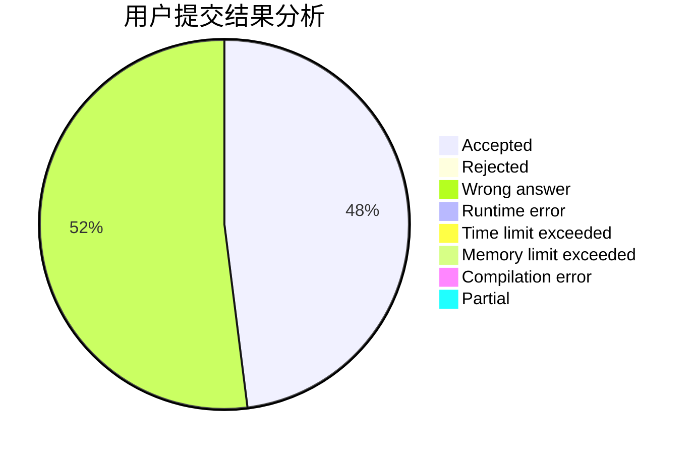
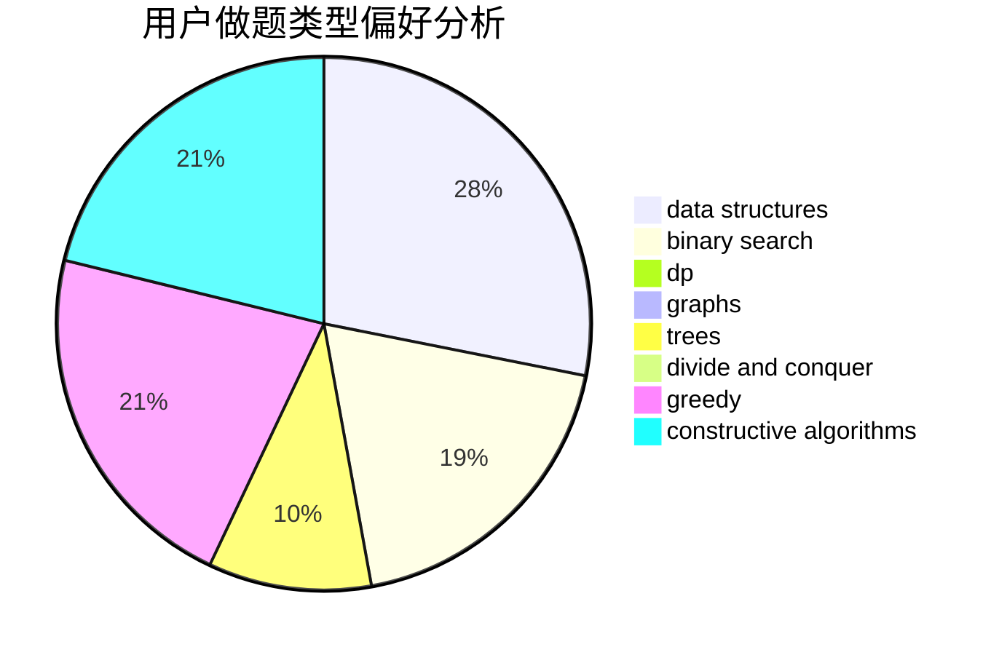

# I-Ripple

<!-- tabs:start -->

#### **用户提交结果分析**

#### **用户做题类型偏好分析**

#### **用户错题知识点分析**

<!-- tabs:end -->
# 推荐题目
[1085G](https://codeforces.com/contest/1085/problem/G)		combinatorics,
                        data structures,
                        dp		  
[329E](https://codeforces.com/contest/329/problem/E)		math		  
[834C](https://codeforces.com/contest/834/problem/C)		dsu,graphs,sortings,trees		  
[439E](https://codeforces.com/contest/439/problem/E)		combinatorics,
                        dp,
                        math		  
[845D](https://codeforces.com/contest/845/problem/D)		data structures,
                        dp,
                        greedy		  
[371C](https://codeforces.com/contest/371/problem/C)		binary search,
                        brute force		  
[44A](https://codeforces.com/contest/44/problem/A)		implementation		  
[316C2](https://codeforces.com/contest/316C/problem/2)		flows,
                        graph matchings		  
[1145D](https://codeforces.com/contest/1145/problem/D)		implementation		  
[1197B](https://codeforces.com/contest/1197/problem/B)		greedy,
                        implementation		  
