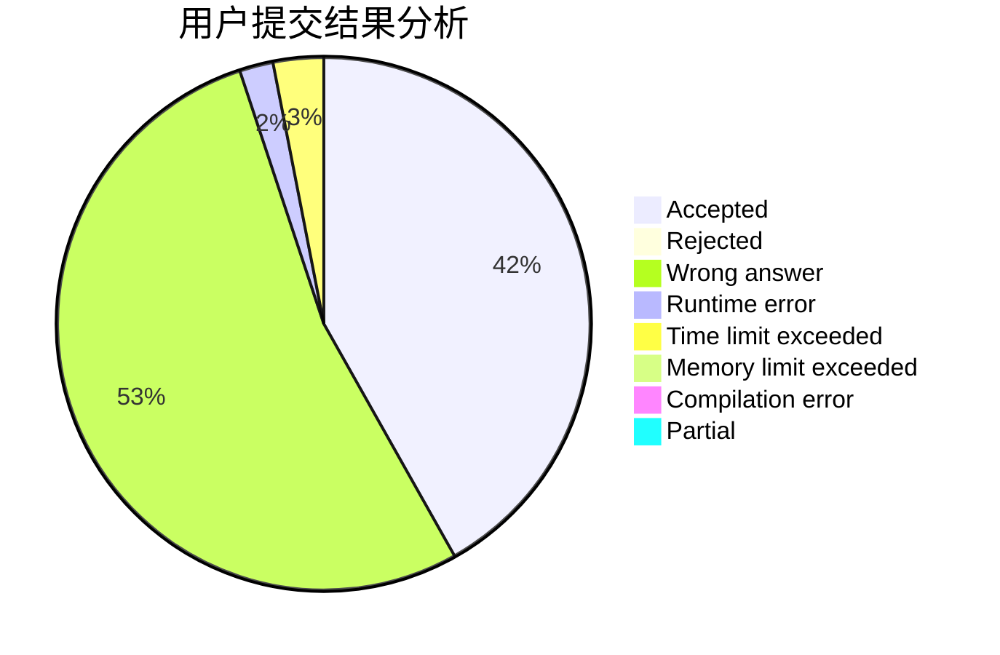
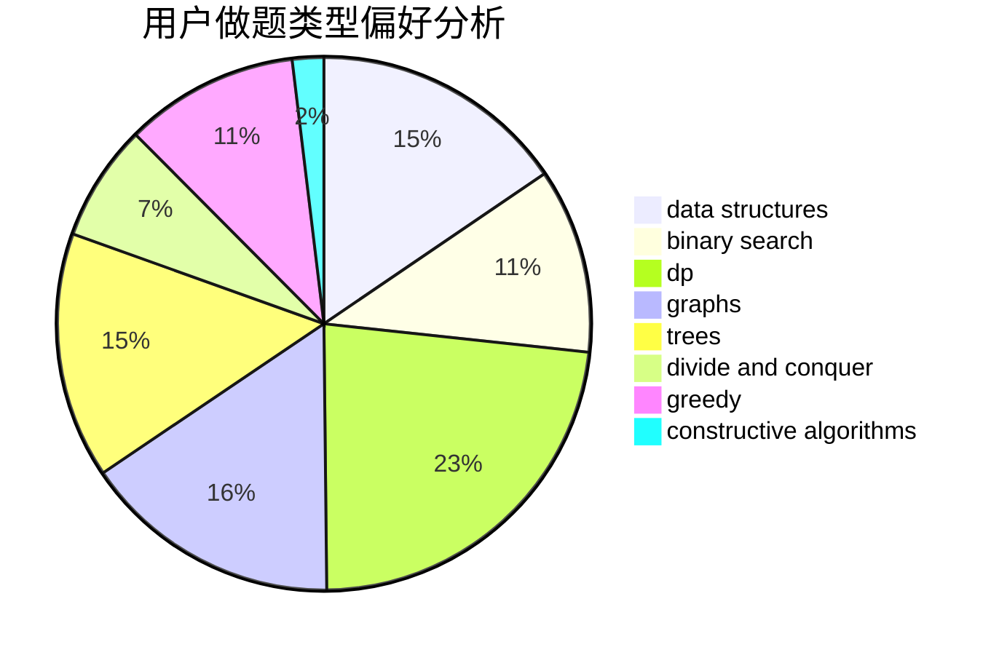
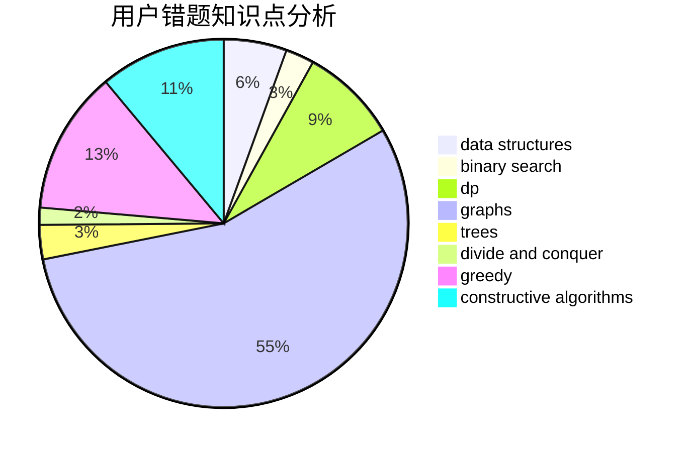

# ICANTAKIOI

<!-- tabs:start -->

#### **用户提交结果分析**

#### **用户做题类型偏好分析**

#### **用户错题知识点分析**

<!-- tabs:end -->
# 推荐题目
[1296F](https://codeforces.com/contest/1296/problem/F)		constructive algorithms,
                        dfs and similar,
                        greedy,
                        sortings,
                        trees		  
[249E](https://codeforces.com/contest/249/problem/E)		math		  
[794C](https://codeforces.com/contest/794/problem/C)		games,
                        greedy,
                        sortings		  
[512B](https://codeforces.com/contest/512/problem/B)		dsu,graphs,sortings,trees		  
[876F](https://codeforces.com/contest/876/problem/F)		dsu,graphs,sortings,trees		  
[876D](https://codeforces.com/contest/876/problem/D)		dsu,graphs,sortings,trees		  
[877A](https://codeforces.com/contest/877/problem/A)		implementation,
                        strings		  
[784C](https://codeforces.com/contest/784/problem/C)		*special problem,
                        implementation		  
[21D](https://codeforces.com/contest/21/problem/D)		bitmasks,
                        graph matchings,
                        graphs		  
[1096D](https://codeforces.com/contest/1096/problem/D)		dp		  
