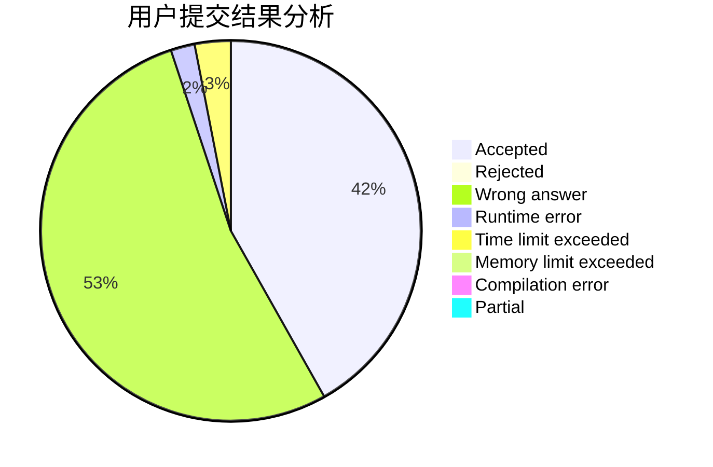
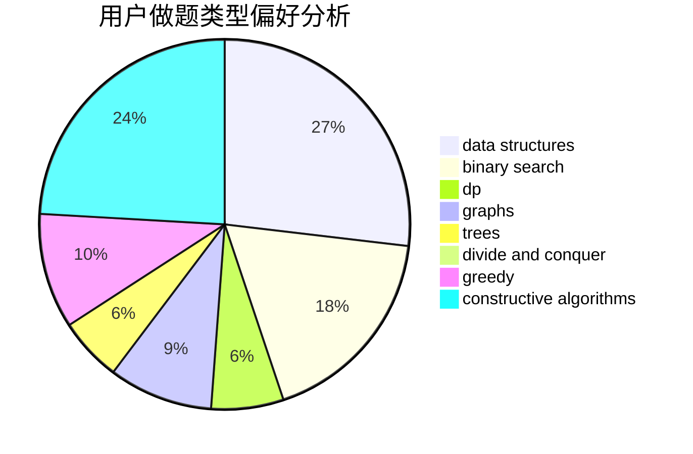
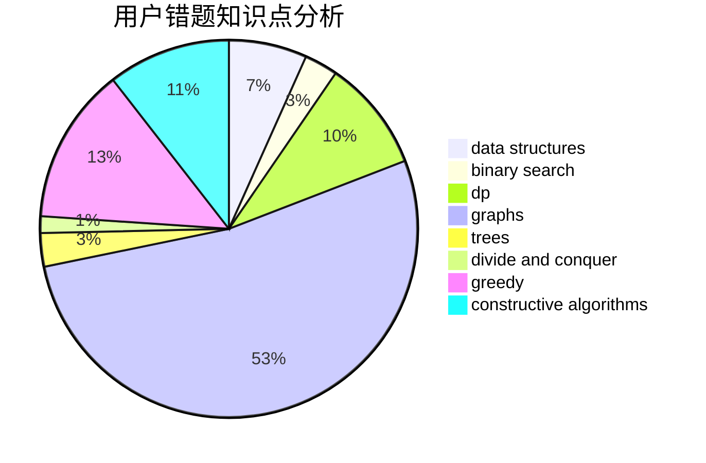

# ICANTAKIOI
<!-- tabs:start -->
#### **用户提交结果分析**

#### **用户做题类型偏好分析**

#### **用户错题知识点分析**

<!-- tabs:end -->
# 推荐题目
[Timofey and remoduling](https://codeforces.com/contest/764/problem/E)		brute force,
                        implementation,
                        math,
                        number theory		  
[Prefix Enlightenment](http://codeforces.com/problemset/problem/1290/C)		dfs and similar,
                        dsu,
                        graphs		  
[Gripping Story](http://codeforces.com/problemset/problem/198/E)		binary search,
                        data structures,
                        sortings		  
[Towers](http://codeforces.com/problemset/problem/229/D)		dp,
                        greedy,
                        two pointers		  
[Interesting Array](https://codeforces.com/contest/483/problem/D)		constructive algorithms,
                        data structures,
                        trees		  
[Prepare superposition of basis states with 0s](http://codeforces.com/problemset/problem/1357/C1)		nan		  
[Two strings](http://codeforces.com/problemset/problem/762/C)		binary search,
                        hashing,
                        strings,
                        two pointers		  
[Lazy Security Guard](http://codeforces.com/problemset/problem/859/B)		brute force,
                        geometry,
                        math		  
[Strictly Positive Matrix](http://codeforces.com/problemset/problem/402/E)		graphs,
                        math		  
[Declined Finalists](http://codeforces.com/problemset/problem/859/A)		greedy,
                        implementation		  
<!-- tabs:start -->
#### **data structures**
[Timofey and remoduling](http://codeforces.com/problemset/problem/198/E)		binary search,
                        data structures,
                        sortings		  
[Prefix Enlightenment](https://codeforces.com/contest/483/problem/D)		constructive algorithms,
                        data structures,
                        trees		  
[Gripping Story](https://codeforces.com/contest/668/problem/D)		data structures		  
[Towers](http://codeforces.com/problemset/problem/1239/C)		data structures,
                        greedy,
                        implementation		  
[Interesting Array](http://codeforces.com/problemset/problem/893/F)		data structures,
                        trees		  
[Prepare superposition of basis states with 0s](https://codeforces.com/contest/1262/problem/D1)		data structures,
                        greedy		  
[Two strings](http://codeforces.com/problemset/problem/1398/C)		data structures,
                        dp,
                        math		  
[Lazy Security Guard](http://codeforces.com/problemset/problem/1492/C)		binary search,
                        data structures,
                        dp,
                        greedy,
                        two pointers		  
[Strictly Positive Matrix](http://codeforces.com/problemset/problem/1490/G)		binary search,
                        data structures,
                        math		  
[Declined Finalists](http://codeforces.com/problemset/problem/1479/D)		binary search,
                        bitmasks,
                        brute force,
                        data structures,
                        probabilities,
                        trees		  
#### **binary search**
[Timofey and remoduling](http://codeforces.com/problemset/problem/198/E)		binary search,
                        data structures,
                        sortings		  
[Prefix Enlightenment](http://codeforces.com/problemset/problem/762/C)		binary search,
                        hashing,
                        strings,
                        two pointers		  
[Gripping Story](http://codeforces.com/problemset/problem/1428/H)		binary search,
                        interactive		  
[Towers](http://codeforces.com/problemset/problem/201/E)		binary search,
                        combinatorics		  
[Interesting Array](http://codeforces.com/problemset/problem/380/A)		binary search,
                        brute force		  
[Prepare superposition of basis states with 0s](http://codeforces.com/problemset/problem/1366/E)		binary search,
                        brute force,
                        combinatorics,
                        constructive algorithms,
                        dp,
                        two pointers		  
[Two strings](http://codeforces.com/problemset/problem/1492/C)		binary search,
                        data structures,
                        dp,
                        greedy,
                        two pointers		  
[Lazy Security Guard](http://codeforces.com/problemset/problem/1463/D)		binary search,
                        constructive algorithms,
                        greedy,
                        two pointers		  
[Strictly Positive Matrix](http://codeforces.com/problemset/problem/1490/G)		binary search,
                        data structures,
                        math		  
[Declined Finalists](http://codeforces.com/problemset/problem/1479/D)		binary search,
                        bitmasks,
                        brute force,
                        data structures,
                        probabilities,
                        trees		  
#### **dp**
[Timofey and remoduling](http://codeforces.com/problemset/problem/229/D)		dp,
                        greedy,
                        two pointers		  
[Prefix Enlightenment](http://codeforces.com/problemset/problem/1439/D)		combinatorics,
                        dp,
                        fft		  
[Gripping Story](http://codeforces.com/problemset/problem/859/C)		dp,
                        games		  
[Towers](http://codeforces.com/problemset/problem/582/E)		bitmasks,
                        dp,
                        expression parsing		  
[Interesting Array](http://codeforces.com/problemset/problem/476/B)		bitmasks,
                        brute force,
                        combinatorics,
                        dp,
                        math,
                        probabilities		  
[Prepare superposition of basis states with 0s](http://codeforces.com/problemset/problem/1420/C1)		constructive algorithms,
                        dp,
                        greedy		  
[Two strings](http://codeforces.com/problemset/problem/755/G)		combinatorics,
                        divide and conquer,
                        dp,
                        fft,
                        math,
                        number theory		  
[Lazy Security Guard](http://codeforces.com/problemset/problem/1366/E)		binary search,
                        brute force,
                        combinatorics,
                        constructive algorithms,
                        dp,
                        two pointers		  
[Strictly Positive Matrix](http://codeforces.com/problemset/problem/448/C)		divide and conquer,
                        dp,
                        greedy		  
[Declined Finalists](http://codeforces.com/problemset/problem/1398/C)		data structures,
                        dp,
                        math		  
#### **graph**
[Timofey and remoduling](http://codeforces.com/problemset/problem/1290/C)		dfs and similar,
                        dsu,
                        graphs		  
[Prefix Enlightenment](http://codeforces.com/problemset/problem/402/E)		graphs,
                        math		  
[Gripping Story](http://codeforces.com/problemset/problem/776/D)		2-sat,
                        dfs and similar,
                        dsu,
                        graphs		  
[Towers](http://codeforces.com/problemset/problem/858/F)		constructive algorithms,
                        dfs and similar,
                        graphs		  
[Interesting Array](http://codeforces.com/problemset/problem/491/C)		flows,
                        graph matchings		  
[Prepare superposition of basis states with 0s](http://codeforces.com/problemset/problem/1475/C)		combinatorics,
                        graphs,
                        math		  
[Two strings](http://codeforces.com/problemset/problem/1487/C)		brute force,
                        constructive algorithms,
                        dfs and similar,
                        graphs,
                        greedy,
                        implementation,
                        math		  
[Lazy Security Guard](http://codeforces.com/problemset/problem/1437/C)		dp,
                        flows,
                        graph matchings,
                        greedy,
                        math,
                        sortings		  
[Strictly Positive Matrix](http://codeforces.com/problemset/problem/1470/D)		constructive algorithms,
                        dfs and similar,
                        graph matchings,
                        graphs,
                        greedy		  
[Declined Finalists](http://codeforces.com/problemset/problem/1476/C)		dp,
                        graphs,
                        greedy		  
#### **trees**
[Timofey and remoduling](https://codeforces.com/contest/483/problem/D)		constructive algorithms,
                        data structures,
                        trees		  
[Prefix Enlightenment](http://codeforces.com/problemset/problem/893/F)		data structures,
                        trees		  
[Gripping Story](http://codeforces.com/problemset/problem/1479/D)		binary search,
                        bitmasks,
                        brute force,
                        data structures,
                        probabilities,
                        trees		  
[Towers](http://codeforces.com/problemset/problem/1511/C)		brute force,
                        data structures,
                        implementation,
                        trees		  
[Interesting Array](http://codeforces.com/problemset/problem/1499/F)		combinatorics,
                        dfs and similar,
                        dp,
                        trees		  
[Prepare superposition of basis states with 0s](http://codeforces.com/problemset/problem/1491/E)		brute force,
                        dfs and similar,
                        divide and conquer,
                        number theory,
                        trees		  
[Two strings](http://codeforces.com/problemset/problem/1466/D)		data structures,
                        greedy,
                        sortings,
                        trees		  
[Lazy Security Guard](http://codeforces.com/problemset/problem/1495/D)		combinatorics,
                        dfs and similar,
                        graphs,
                        math,
                        shortest paths,
                        trees		  
[Strictly Positive Matrix](http://codeforces.com/problemset/problem/1303/G)		data structures,
                        divide and conquer,
                        geometry,
                        trees		  
[Declined Finalists](http://codeforces.com/problemset/problem/1454/E)		combinatorics,
                        dfs and similar,
                        graphs,
                        trees		  
#### **divide and conquer**
[Timofey and remoduling](http://codeforces.com/problemset/problem/755/G)		combinatorics,
                        divide and conquer,
                        dp,
                        fft,
                        math,
                        number theory		  
[Prefix Enlightenment](http://codeforces.com/problemset/problem/448/C)		divide and conquer,
                        dp,
                        greedy		  
[Gripping Story](http://codeforces.com/problemset/problem/1461/D)		binary search,
                        brute force,
                        data structures,
                        divide and conquer,
                        implementation,
                        sortings		  
[Towers](http://codeforces.com/problemset/problem/1466/G)		combinatorics,
                        divide and conquer,
                        hashing,
                        math,
                        string suffix structures,
                        strings		  
[Interesting Array](http://codeforces.com/problemset/problem/1490/D)		dfs and similar,
                        divide and conquer,
                        implementation		  
[Prepare superposition of basis states with 0s](https://codeforces.com/contest/1483/problem/C)		data structures,
                        divide and conquer,
                        dp		  
[Two strings](http://codeforces.com/problemset/problem/1491/E)		brute force,
                        dfs and similar,
                        divide and conquer,
                        number theory,
                        trees		  
[Lazy Security Guard](http://codeforces.com/problemset/problem/1303/G)		data structures,
                        divide and conquer,
                        geometry,
                        trees		  
[Strictly Positive Matrix](http://codeforces.com/problemset/problem/1494/D)		constructive algorithms,
                        data structures,
                        dfs and similar,
                        divide and conquer,
                        dsu,
                        greedy,
                        sortings,
                        trees		  
[Declined Finalists](http://codeforces.com/problemset/problem/1482/E)		data structures,
                        divide and conquer,
                        dp		  
#### **greedy**
[Timofey and remoduling](http://codeforces.com/problemset/problem/229/D)		dp,
                        greedy,
                        two pointers		  
[Prefix Enlightenment](http://codeforces.com/problemset/problem/859/A)		greedy,
                        implementation		  
[Gripping Story](http://codeforces.com/problemset/problem/1239/C)		data structures,
                        greedy,
                        implementation		  
[Towers](http://codeforces.com/problemset/problem/1420/C1)		constructive algorithms,
                        dp,
                        greedy		  
[Interesting Array](http://codeforces.com/problemset/problem/1096/A)		greedy,
                        implementation,
                        math		  
[Prepare superposition of basis states with 0s](http://codeforces.com/problemset/problem/1384/A)		constructive algorithms,
                        greedy,
                        strings		  
[Two strings](https://codeforces.com/contest/1262/problem/D1)		data structures,
                        greedy		  
[Lazy Security Guard](http://codeforces.com/problemset/problem/1348/A)		greedy,
                        math		  
[Strictly Positive Matrix](http://codeforces.com/problemset/problem/448/C)		divide and conquer,
                        dp,
                        greedy		  
[Declined Finalists](http://codeforces.com/problemset/problem/1492/C)		binary search,
                        data structures,
                        dp,
                        greedy,
                        two pointers		  
#### **constructive algorithms**
[Timofey and remoduling](https://codeforces.com/contest/483/problem/D)		constructive algorithms,
                        data structures,
                        trees		  
[Prefix Enlightenment](http://codeforces.com/problemset/problem/858/F)		constructive algorithms,
                        dfs and similar,
                        graphs		  
[Gripping Story](http://codeforces.com/problemset/problem/798/D)		constructive algorithms,
                        sortings		  
[Towers](http://codeforces.com/problemset/problem/1420/C1)		constructive algorithms,
                        dp,
                        greedy		  
[Interesting Array](http://codeforces.com/problemset/problem/1384/A)		constructive algorithms,
                        greedy,
                        strings		  
[Prepare superposition of basis states with 0s](http://codeforces.com/problemset/problem/538/G)		constructive algorithms,
                        math,
                        sortings		  
[Two strings](http://codeforces.com/problemset/problem/1366/E)		binary search,
                        brute force,
                        combinatorics,
                        constructive algorithms,
                        dp,
                        two pointers		  
[Lazy Security Guard](http://codeforces.com/problemset/problem/1493/A)		constructive algorithms,
                        greedy		  
[Strictly Positive Matrix](http://codeforces.com/problemset/problem/1463/D)		binary search,
                        constructive algorithms,
                        greedy,
                        two pointers		  
[Declined Finalists](https://codeforces.com/contest/1456/problem/B)		bitmasks,
                        brute force,
                        constructive algorithms		  
#### **sortings**
[Timofey and remoduling](http://codeforces.com/problemset/problem/198/E)		binary search,
                        data structures,
                        sortings		  
[Prefix Enlightenment](http://codeforces.com/problemset/problem/798/D)		constructive algorithms,
                        sortings		  
[Gripping Story](http://codeforces.com/problemset/problem/538/G)		constructive algorithms,
                        math,
                        sortings		  
[Towers](https://codeforces.com/contest/1496/problem/C)		geometry,
                        greedy,
                        math,
                        sortings		  
[Interesting Array](http://codeforces.com/problemset/problem/1495/A)		geometry,
                        greedy,
                        math,
                        sortings		  
[Prepare superposition of basis states with 0s](http://codeforces.com/problemset/problem/1497/A)		brute force,
                        data structures,
                        greedy,
                        sortings		  
[Two strings](http://codeforces.com/problemset/problem/1427/A)		math,
                        sortings		  
[Lazy Security Guard](http://codeforces.com/problemset/problem/1461/D)		binary search,
                        brute force,
                        data structures,
                        divide and conquer,
                        implementation,
                        sortings		  
[Strictly Positive Matrix](http://codeforces.com/problemset/problem/1437/C)		dp,
                        flows,
                        graph matchings,
                        greedy,
                        math,
                        sortings		  
[Declined Finalists](http://codeforces.com/problemset/problem/1473/A)		greedy,
                        implementation,
                        math,
                        sortings		  
<!-- tabs:end -->
