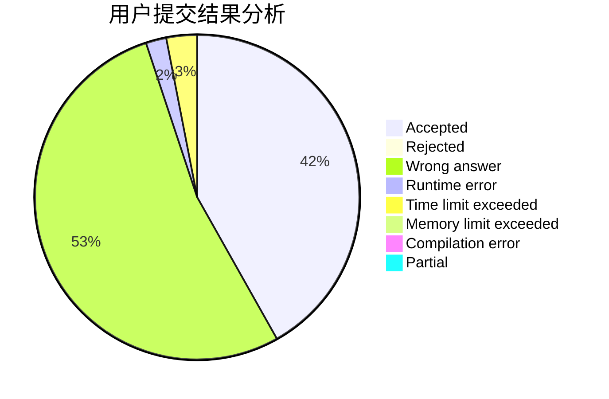
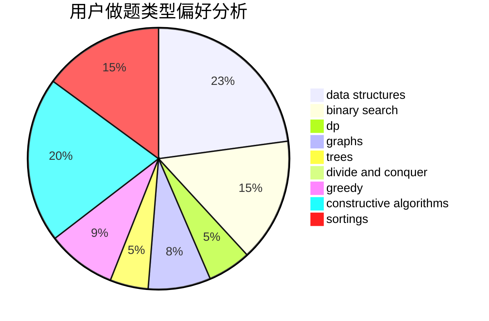
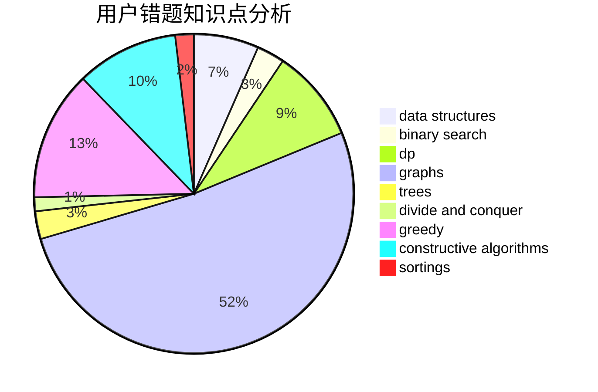

# ICANTAKIOI
<!-- tabs:start -->
#### **用户提交结果分析**

#### **用户做题类型偏好分析**

#### **用户错题知识点分析**

<!-- tabs:end -->
# 推荐题目
[764E](https://codeforces.com/contest/764/problem/E)		brute force,
                        implementation,
                        math,
                        number theory		  
[1290C](http://codeforces.com/problemset/problem/1290/C)		dfs and similar,
                        dsu,
                        graphs		  
[198E](http://codeforces.com/problemset/problem/198/E)		binary search,
                        data structures,
                        sortings		  
[229D](http://codeforces.com/problemset/problem/229/D)		dp,
                        greedy,
                        two pointers		  
[483D](https://codeforces.com/contest/483/problem/D)		constructive algorithms,
                        data structures,
                        trees		  
[1357C1](http://codeforces.com/problemset/problem/1357/C1)		nan		  
[762C](http://codeforces.com/problemset/problem/762/C)		binary search,
                        hashing,
                        strings,
                        two pointers		  
[859B](http://codeforces.com/problemset/problem/859/B)		brute force,
                        geometry,
                        math		  
[402E](http://codeforces.com/problemset/problem/402/E)		graphs,
                        math		  
[859A](http://codeforces.com/problemset/problem/859/A)		greedy,
                        implementation		  
<!-- tabs:start -->
#### **data structures**
[198E](http://codeforces.com/problemset/problem/198/E)		binary search,
                        data structures,
                        sortings		  
[483D](https://codeforces.com/contest/483/problem/D)		constructive algorithms,
                        data structures,
                        trees		  
[668D](https://codeforces.com/contest/668/problem/D)		data structures		  
[1239C](http://codeforces.com/problemset/problem/1239/C)		data structures,
                        greedy,
                        implementation		  
[893F](http://codeforces.com/problemset/problem/893/F)		data structures,
                        trees		  
[1262D1](https://codeforces.com/contest/1262/problem/D1)		data structures,
                        greedy		  
[1398C](http://codeforces.com/problemset/problem/1398/C)		data structures,
                        dp,
                        math		  
[1492C](http://codeforces.com/problemset/problem/1492/C)		binary search,
                        data structures,
                        dp,
                        greedy,
                        two pointers		  
[1490G](http://codeforces.com/problemset/problem/1490/G)		binary search,
                        data structures,
                        math		  
[1479D](http://codeforces.com/problemset/problem/1479/D)		binary search,
                        bitmasks,
                        brute force,
                        data structures,
                        probabilities,
                        trees		  
#### **binary search**
[198E](http://codeforces.com/problemset/problem/198/E)		binary search,
                        data structures,
                        sortings		  
[762C](http://codeforces.com/problemset/problem/762/C)		binary search,
                        hashing,
                        strings,
                        two pointers		  
[1428H](http://codeforces.com/problemset/problem/1428/H)		binary search,
                        interactive		  
[201E](http://codeforces.com/problemset/problem/201/E)		binary search,
                        combinatorics		  
[380A](http://codeforces.com/problemset/problem/380/A)		binary search,
                        brute force		  
[1366E](http://codeforces.com/problemset/problem/1366/E)		binary search,
                        brute force,
                        combinatorics,
                        constructive algorithms,
                        dp,
                        two pointers		  
[1492C](http://codeforces.com/problemset/problem/1492/C)		binary search,
                        data structures,
                        dp,
                        greedy,
                        two pointers		  
[1463D](http://codeforces.com/problemset/problem/1463/D)		binary search,
                        constructive algorithms,
                        greedy,
                        two pointers		  
[1490G](http://codeforces.com/problemset/problem/1490/G)		binary search,
                        data structures,
                        math		  
[1479D](http://codeforces.com/problemset/problem/1479/D)		binary search,
                        bitmasks,
                        brute force,
                        data structures,
                        probabilities,
                        trees		  
#### **dp**
[229D](http://codeforces.com/problemset/problem/229/D)		dp,
                        greedy,
                        two pointers		  
[1439D](http://codeforces.com/problemset/problem/1439/D)		combinatorics,
                        dp,
                        fft		  
[859C](http://codeforces.com/problemset/problem/859/C)		dp,
                        games		  
[582E](http://codeforces.com/problemset/problem/582/E)		bitmasks,
                        dp,
                        expression parsing		  
[476B](http://codeforces.com/problemset/problem/476/B)		bitmasks,
                        brute force,
                        combinatorics,
                        dp,
                        math,
                        probabilities		  
[1420C1](http://codeforces.com/problemset/problem/1420/C1)		constructive algorithms,
                        dp,
                        greedy		  
[755G](http://codeforces.com/problemset/problem/755/G)		combinatorics,
                        divide and conquer,
                        dp,
                        fft,
                        math,
                        number theory		  
[1366E](http://codeforces.com/problemset/problem/1366/E)		binary search,
                        brute force,
                        combinatorics,
                        constructive algorithms,
                        dp,
                        two pointers		  
[448C](http://codeforces.com/problemset/problem/448/C)		divide and conquer,
                        dp,
                        greedy		  
[1398C](http://codeforces.com/problemset/problem/1398/C)		data structures,
                        dp,
                        math		  
#### **graph**
[1290C](http://codeforces.com/problemset/problem/1290/C)		dfs and similar,
                        dsu,
                        graphs		  
[402E](http://codeforces.com/problemset/problem/402/E)		graphs,
                        math		  
[776D](http://codeforces.com/problemset/problem/776/D)		2-sat,
                        dfs and similar,
                        dsu,
                        graphs		  
[858F](http://codeforces.com/problemset/problem/858/F)		constructive algorithms,
                        dfs and similar,
                        graphs		  
[491C](http://codeforces.com/problemset/problem/491/C)		flows,
                        graph matchings		  
[1475C](http://codeforces.com/problemset/problem/1475/C)		combinatorics,
                        graphs,
                        math		  
[1487C](http://codeforces.com/problemset/problem/1487/C)		brute force,
                        constructive algorithms,
                        dfs and similar,
                        graphs,
                        greedy,
                        implementation,
                        math		  
[1437C](http://codeforces.com/problemset/problem/1437/C)		dp,
                        flows,
                        graph matchings,
                        greedy,
                        math,
                        sortings		  
[1470D](http://codeforces.com/problemset/problem/1470/D)		constructive algorithms,
                        dfs and similar,
                        graph matchings,
                        graphs,
                        greedy		  
[1476C](http://codeforces.com/problemset/problem/1476/C)		dp,
                        graphs,
                        greedy		  
#### **trees**
[483D](https://codeforces.com/contest/483/problem/D)		constructive algorithms,
                        data structures,
                        trees		  
[893F](http://codeforces.com/problemset/problem/893/F)		data structures,
                        trees		  
[1479D](http://codeforces.com/problemset/problem/1479/D)		binary search,
                        bitmasks,
                        brute force,
                        data structures,
                        probabilities,
                        trees		  
[1511C](http://codeforces.com/problemset/problem/1511/C)		brute force,
                        data structures,
                        implementation,
                        trees		  
[1499F](http://codeforces.com/problemset/problem/1499/F)		combinatorics,
                        dfs and similar,
                        dp,
                        trees		  
[1491E](http://codeforces.com/problemset/problem/1491/E)		brute force,
                        dfs and similar,
                        divide and conquer,
                        number theory,
                        trees		  
[1466D](http://codeforces.com/problemset/problem/1466/D)		data structures,
                        greedy,
                        sortings,
                        trees		  
[1495D](http://codeforces.com/problemset/problem/1495/D)		combinatorics,
                        dfs and similar,
                        graphs,
                        math,
                        shortest paths,
                        trees		  
[1303G](http://codeforces.com/problemset/problem/1303/G)		data structures,
                        divide and conquer,
                        geometry,
                        trees		  
[1454E](http://codeforces.com/problemset/problem/1454/E)		combinatorics,
                        dfs and similar,
                        graphs,
                        trees		  
#### **divide and conquer**
[755G](http://codeforces.com/problemset/problem/755/G)		combinatorics,
                        divide and conquer,
                        dp,
                        fft,
                        math,
                        number theory		  
[448C](http://codeforces.com/problemset/problem/448/C)		divide and conquer,
                        dp,
                        greedy		  
[1461D](http://codeforces.com/problemset/problem/1461/D)		binary search,
                        brute force,
                        data structures,
                        divide and conquer,
                        implementation,
                        sortings		  
[1466G](http://codeforces.com/problemset/problem/1466/G)		combinatorics,
                        divide and conquer,
                        hashing,
                        math,
                        string suffix structures,
                        strings		  
[1490D](http://codeforces.com/problemset/problem/1490/D)		dfs and similar,
                        divide and conquer,
                        implementation		  
[1483C](https://codeforces.com/contest/1483/problem/C)		data structures,
                        divide and conquer,
                        dp		  
[1491E](http://codeforces.com/problemset/problem/1491/E)		brute force,
                        dfs and similar,
                        divide and conquer,
                        number theory,
                        trees		  
[1303G](http://codeforces.com/problemset/problem/1303/G)		data structures,
                        divide and conquer,
                        geometry,
                        trees		  
[1494D](http://codeforces.com/problemset/problem/1494/D)		constructive algorithms,
                        data structures,
                        dfs and similar,
                        divide and conquer,
                        dsu,
                        greedy,
                        sortings,
                        trees		  
[1482E](http://codeforces.com/problemset/problem/1482/E)		data structures,
                        divide and conquer,
                        dp		  
#### **greedy**
[229D](http://codeforces.com/problemset/problem/229/D)		dp,
                        greedy,
                        two pointers		  
[859A](http://codeforces.com/problemset/problem/859/A)		greedy,
                        implementation		  
[1239C](http://codeforces.com/problemset/problem/1239/C)		data structures,
                        greedy,
                        implementation		  
[1420C1](http://codeforces.com/problemset/problem/1420/C1)		constructive algorithms,
                        dp,
                        greedy		  
[1096A](http://codeforces.com/problemset/problem/1096/A)		greedy,
                        implementation,
                        math		  
[1384A](http://codeforces.com/problemset/problem/1384/A)		constructive algorithms,
                        greedy,
                        strings		  
[1262D1](https://codeforces.com/contest/1262/problem/D1)		data structures,
                        greedy		  
[1348A](http://codeforces.com/problemset/problem/1348/A)		greedy,
                        math		  
[448C](http://codeforces.com/problemset/problem/448/C)		divide and conquer,
                        dp,
                        greedy		  
[1492C](http://codeforces.com/problemset/problem/1492/C)		binary search,
                        data structures,
                        dp,
                        greedy,
                        two pointers		  
#### **constructive algorithms**
[483D](https://codeforces.com/contest/483/problem/D)		constructive algorithms,
                        data structures,
                        trees		  
[858F](http://codeforces.com/problemset/problem/858/F)		constructive algorithms,
                        dfs and similar,
                        graphs		  
[798D](http://codeforces.com/problemset/problem/798/D)		constructive algorithms,
                        sortings		  
[1420C1](http://codeforces.com/problemset/problem/1420/C1)		constructive algorithms,
                        dp,
                        greedy		  
[1384A](http://codeforces.com/problemset/problem/1384/A)		constructive algorithms,
                        greedy,
                        strings		  
[538G](http://codeforces.com/problemset/problem/538/G)		constructive algorithms,
                        math,
                        sortings		  
[1366E](http://codeforces.com/problemset/problem/1366/E)		binary search,
                        brute force,
                        combinatorics,
                        constructive algorithms,
                        dp,
                        two pointers		  
[1493A](http://codeforces.com/problemset/problem/1493/A)		constructive algorithms,
                        greedy		  
[1463D](http://codeforces.com/problemset/problem/1463/D)		binary search,
                        constructive algorithms,
                        greedy,
                        two pointers		  
[1456B](https://codeforces.com/contest/1456/problem/B)		bitmasks,
                        brute force,
                        constructive algorithms		  
#### **sortings**
[198E](http://codeforces.com/problemset/problem/198/E)		binary search,
                        data structures,
                        sortings		  
[798D](http://codeforces.com/problemset/problem/798/D)		constructive algorithms,
                        sortings		  
[538G](http://codeforces.com/problemset/problem/538/G)		constructive algorithms,
                        math,
                        sortings		  
[1496C](https://codeforces.com/contest/1496/problem/C)		geometry,
                        greedy,
                        math,
                        sortings		  
[1495A](http://codeforces.com/problemset/problem/1495/A)		geometry,
                        greedy,
                        math,
                        sortings		  
[1497A](http://codeforces.com/problemset/problem/1497/A)		brute force,
                        data structures,
                        greedy,
                        sortings		  
[1427A](http://codeforces.com/problemset/problem/1427/A)		math,
                        sortings		  
[1461D](http://codeforces.com/problemset/problem/1461/D)		binary search,
                        brute force,
                        data structures,
                        divide and conquer,
                        implementation,
                        sortings		  
[1437C](http://codeforces.com/problemset/problem/1437/C)		dp,
                        flows,
                        graph matchings,
                        greedy,
                        math,
                        sortings		  
[1473A](http://codeforces.com/problemset/problem/1473/A)		greedy,
                        implementation,
                        math,
                        sortings		  
<!-- tabs:end -->
