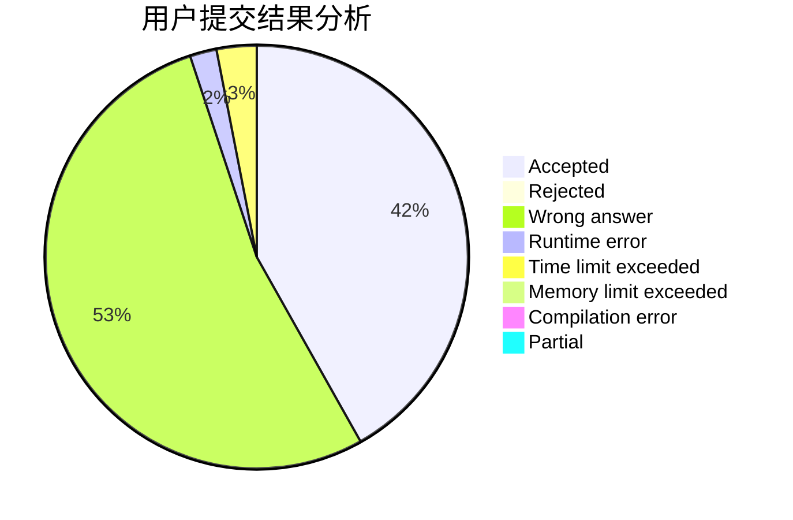
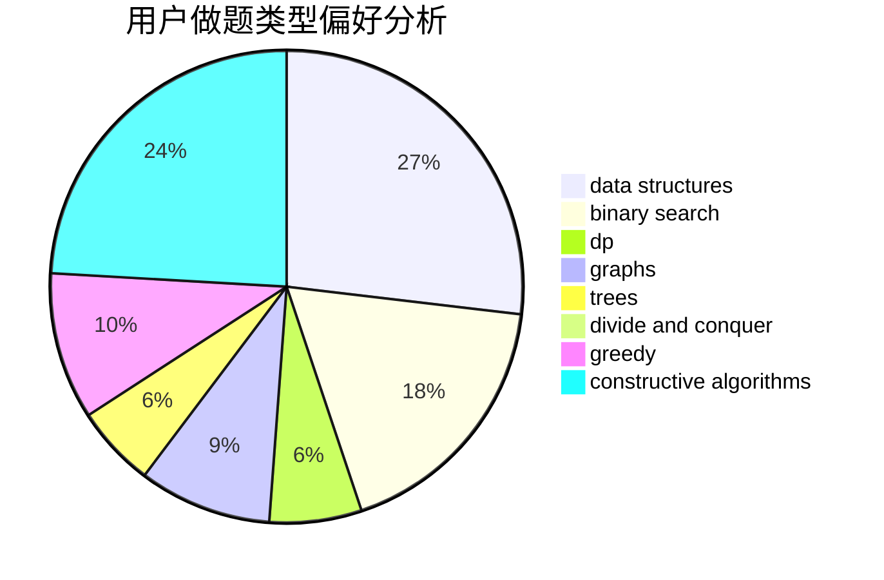
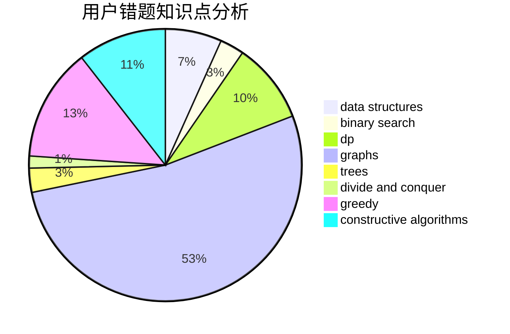

# ICANTAKIOI
<!-- tabs:start -->
#### **用户提交结果分析**

#### **用户做题类型偏好分析**

#### **用户错题知识点分析**

<!-- tabs:end -->
# 推荐题目
[Timofey and remoduling](https://codeforces.com/contest/764/problem/E)		brute force,
                        implementation,
                        math,
                        number theory		  
[Prefix Enlightenment](http://codeforces.com/problemset/problem/1290/C)		dfs and similar,
                        dsu,
                        graphs		  
[Gripping Story](http://codeforces.com/problemset/problem/198/E)		binary search,
                        data structures,
                        sortings		  
[Towers](http://codeforces.com/problemset/problem/229/D)		dp,
                        greedy,
                        two pointers		  
[Interesting Array](https://codeforces.com/contest/483/problem/D)		constructive algorithms,
                        data structures,
                        trees		  
[Prepare superposition of basis states with 0s](http://codeforces.com/problemset/problem/1357/C1)		nan		  
[Two strings](http://codeforces.com/problemset/problem/762/C)		binary search,
                        hashing,
                        strings,
                        two pointers		  
[Lazy Security Guard](http://codeforces.com/problemset/problem/859/B)		brute force,
                        geometry,
                        math		  
[Strictly Positive Matrix](http://codeforces.com/problemset/problem/402/E)		graphs,
                        math		  
[Declined Finalists](http://codeforces.com/problemset/problem/859/A)		greedy,
                        implementation		  
<!-- tabs:start -->
#### **data structures**
[Gripping Story](http://codeforces.com/problemset/problem/198/E)		binary search,
                        data structures,
                        sortings		  
[Interesting Array](https://codeforces.com/contest/483/problem/D)		constructive algorithms,
                        data structures,
                        trees		  
[Little Artem and Time Machine](https://codeforces.com/contest/668/problem/D)		data structures		  
[Queue in the Train](http://codeforces.com/problemset/problem/1239/C)		data structures,
                        greedy,
                        implementation		  
[Subtree Minimum Query](http://codeforces.com/problemset/problem/893/F)		data structures,
                        trees		  
[Optimal Subsequences (Easy Version)](https://codeforces.com/contest/1262/problem/D1)		data structures,
                        greedy		  
[Good Subarrays](http://codeforces.com/problemset/problem/1398/C)		data structures,
                        dp,
                        math		  
[Maximum width](http://codeforces.com/problemset/problem/1492/C)		binary search,
                        data structures,
                        dp,
                        greedy,
                        two pointers		  
[Old Floppy Drive](http://codeforces.com/problemset/problem/1490/G)		binary search,
                        data structures,
                        math		  
[Odd Mineral Resource](http://codeforces.com/problemset/problem/1479/D)		binary search,
                        bitmasks,
                        brute force,
                        data structures,
                        probabilities,
                        trees		  
#### **binary search**
[Gripping Story](http://codeforces.com/problemset/problem/198/E)		binary search,
                        data structures,
                        sortings		  
[Two strings](http://codeforces.com/problemset/problem/762/C)		binary search,
                        hashing,
                        strings,
                        two pointers		  
[Rotary Laser Lock](http://codeforces.com/problemset/problem/1428/H)		binary search,
                        interactive		  
[Thoroughly Bureaucratic Organization](http://codeforces.com/problemset/problem/201/E)		binary search,
                        combinatorics		  
[Sereja and Prefixes](http://codeforces.com/problemset/problem/380/A)		binary search,
                        brute force		  
[Two Arrays](http://codeforces.com/problemset/problem/1366/E)		binary search,
                        brute force,
                        combinatorics,
                        constructive algorithms,
                        dp,
                        two pointers		  
[Maximum width](http://codeforces.com/problemset/problem/1492/C)		binary search,
                        data structures,
                        dp,
                        greedy,
                        two pointers		  
[Pairs](http://codeforces.com/problemset/problem/1463/D)		binary search,
                        constructive algorithms,
                        greedy,
                        two pointers		  
[Old Floppy Drive](http://codeforces.com/problemset/problem/1490/G)		binary search,
                        data structures,
                        math		  
[Odd Mineral Resource](http://codeforces.com/problemset/problem/1479/D)		binary search,
                        bitmasks,
                        brute force,
                        data structures,
                        probabilities,
                        trees		  
#### **dp**
[Towers](http://codeforces.com/problemset/problem/229/D)		dp,
                        greedy,
                        two pointers		  
[INOI Final Contests](http://codeforces.com/problemset/problem/1439/D)		combinatorics,
                        dp,
                        fft		  
[Pie Rules](http://codeforces.com/problemset/problem/859/C)		dp,
                        games		  
[Boolean Function](http://codeforces.com/problemset/problem/582/E)		bitmasks,
                        dp,
                        expression parsing		  
[Dreamoon and WiFi](http://codeforces.com/problemset/problem/476/B)		bitmasks,
                        brute force,
                        combinatorics,
                        dp,
                        math,
                        probabilities		  
[Pokémon Army (easy version)](http://codeforces.com/problemset/problem/1420/C1)		constructive algorithms,
                        dp,
                        greedy		  
[PolandBall and Many Other Balls](http://codeforces.com/problemset/problem/755/G)		combinatorics,
                        divide and conquer,
                        dp,
                        fft,
                        math,
                        number theory		  
[Two Arrays](http://codeforces.com/problemset/problem/1366/E)		binary search,
                        brute force,
                        combinatorics,
                        constructive algorithms,
                        dp,
                        two pointers		  
[Painting Fence](http://codeforces.com/problemset/problem/448/C)		divide and conquer,
                        dp,
                        greedy		  
[Good Subarrays](http://codeforces.com/problemset/problem/1398/C)		data structures,
                        dp,
                        math		  
#### **graph**
[Prefix Enlightenment](http://codeforces.com/problemset/problem/1290/C)		dfs and similar,
                        dsu,
                        graphs		  
[Strictly Positive Matrix](http://codeforces.com/problemset/problem/402/E)		graphs,
                        math		  
[The Door Problem](http://codeforces.com/problemset/problem/776/D)		2-sat,
                        dfs and similar,
                        dsu,
                        graphs		  
[Wizard's Tour](http://codeforces.com/problemset/problem/858/F)		constructive algorithms,
                        dfs and similar,
                        graphs		  
[Deciphering](http://codeforces.com/problemset/problem/491/C)		flows,
                        graph matchings		  
[Ball in Berland](http://codeforces.com/problemset/problem/1475/C)		combinatorics,
                        graphs,
                        math		  
[Minimum Ties](http://codeforces.com/problemset/problem/1487/C)		brute force,
                        constructive algorithms,
                        dfs and similar,
                        graphs,
                        greedy,
                        implementation,
                        math		  
[Chef Monocarp](http://codeforces.com/problemset/problem/1437/C)		dp,
                        flows,
                        graph matchings,
                        greedy,
                        math,
                        sortings		  
[Strange Housing](http://codeforces.com/problemset/problem/1470/D)		constructive algorithms,
                        dfs and similar,
                        graph matchings,
                        graphs,
                        greedy		  
[Longest Simple Cycle](http://codeforces.com/problemset/problem/1476/C)		dp,
                        graphs,
                        greedy		  
#### **trees**
[Interesting Array](https://codeforces.com/contest/483/problem/D)		constructive algorithms,
                        data structures,
                        trees		  
[Subtree Minimum Query](http://codeforces.com/problemset/problem/893/F)		data structures,
                        trees		  
[Odd Mineral Resource](http://codeforces.com/problemset/problem/1479/D)		binary search,
                        bitmasks,
                        brute force,
                        data structures,
                        probabilities,
                        trees		  
[Yet Another Card Deck](http://codeforces.com/problemset/problem/1511/C)		brute force,
                        data structures,
                        implementation,
                        trees		  
[Diameter Cuts](http://codeforces.com/problemset/problem/1499/F)		combinatorics,
                        dfs and similar,
                        dp,
                        trees		  
[Fib-tree](http://codeforces.com/problemset/problem/1491/E)		brute force,
                        dfs and similar,
                        divide and conquer,
                        number theory,
                        trees		  
[13th Labour of Heracles](http://codeforces.com/problemset/problem/1466/D)		data structures,
                        greedy,
                        sortings,
                        trees		  
[BFS Trees](http://codeforces.com/problemset/problem/1495/D)		combinatorics,
                        dfs and similar,
                        graphs,
                        math,
                        shortest paths,
                        trees		  
[Sum of Prefix Sums](http://codeforces.com/problemset/problem/1303/G)		data structures,
                        divide and conquer,
                        geometry,
                        trees		  
[Number of Simple Paths](http://codeforces.com/problemset/problem/1454/E)		combinatorics,
                        dfs and similar,
                        graphs,
                        trees		  
#### **divide and conquer**
[PolandBall and Many Other Balls](http://codeforces.com/problemset/problem/755/G)		combinatorics,
                        divide and conquer,
                        dp,
                        fft,
                        math,
                        number theory		  
[Painting Fence](http://codeforces.com/problemset/problem/448/C)		divide and conquer,
                        dp,
                        greedy		  
[Divide and Summarize](http://codeforces.com/problemset/problem/1461/D)		binary search,
                        brute force,
                        data structures,
                        divide and conquer,
                        implementation,
                        sortings		  
[Song of the Sirens](http://codeforces.com/problemset/problem/1466/G)		combinatorics,
                        divide and conquer,
                        hashing,
                        math,
                        string suffix structures,
                        strings		  
[Permutation Transformation](http://codeforces.com/problemset/problem/1490/D)		dfs and similar,
                        divide and conquer,
                        implementation		  
[Skyline Photo](https://codeforces.com/contest/1483/problem/C)		data structures,
                        divide and conquer,
                        dp		  
[Fib-tree](http://codeforces.com/problemset/problem/1491/E)		brute force,
                        dfs and similar,
                        divide and conquer,
                        number theory,
                        trees		  
[Sum of Prefix Sums](http://codeforces.com/problemset/problem/1303/G)		data structures,
                        divide and conquer,
                        geometry,
                        trees		  
[Dogeforces](http://codeforces.com/problemset/problem/1494/D)		constructive algorithms,
                        data structures,
                        dfs and similar,
                        divide and conquer,
                        dsu,
                        greedy,
                        sortings,
                        trees		  
[Skyline Photo](http://codeforces.com/problemset/problem/1482/E)		data structures,
                        divide and conquer,
                        dp		  
#### **greedy**
[Towers](http://codeforces.com/problemset/problem/229/D)		dp,
                        greedy,
                        two pointers		  
[Declined Finalists](http://codeforces.com/problemset/problem/859/A)		greedy,
                        implementation		  
[Queue in the Train](http://codeforces.com/problemset/problem/1239/C)		data structures,
                        greedy,
                        implementation		  
[Pokémon Army (easy version)](http://codeforces.com/problemset/problem/1420/C1)		constructive algorithms,
                        dp,
                        greedy		  
[Find Divisible](http://codeforces.com/problemset/problem/1096/A)		greedy,
                        implementation,
                        math		  
[Common Prefixes](http://codeforces.com/problemset/problem/1384/A)		constructive algorithms,
                        greedy,
                        strings		  
[Optimal Subsequences (Easy Version)](https://codeforces.com/contest/1262/problem/D1)		data structures,
                        greedy		  
[Phoenix and Balance](http://codeforces.com/problemset/problem/1348/A)		greedy,
                        math		  
[Painting Fence](http://codeforces.com/problemset/problem/448/C)		divide and conquer,
                        dp,
                        greedy		  
[Maximum width](http://codeforces.com/problemset/problem/1492/C)		binary search,
                        data structures,
                        dp,
                        greedy,
                        two pointers		  
#### **constructive algorithms**
[Interesting Array](https://codeforces.com/contest/483/problem/D)		constructive algorithms,
                        data structures,
                        trees		  
[Wizard's Tour](http://codeforces.com/problemset/problem/858/F)		constructive algorithms,
                        dfs and similar,
                        graphs		  
[Mike and distribution](http://codeforces.com/problemset/problem/798/D)		constructive algorithms,
                        sortings		  
[Pokémon Army (easy version)](http://codeforces.com/problemset/problem/1420/C1)		constructive algorithms,
                        dp,
                        greedy		  
[Common Prefixes](http://codeforces.com/problemset/problem/1384/A)		constructive algorithms,
                        greedy,
                        strings		  
[Berserk Robot](http://codeforces.com/problemset/problem/538/G)		constructive algorithms,
                        math,
                        sortings		  
[Two Arrays](http://codeforces.com/problemset/problem/1366/E)		binary search,
                        brute force,
                        combinatorics,
                        constructive algorithms,
                        dp,
                        two pointers		  
[Anti-knapsack](http://codeforces.com/problemset/problem/1493/A)		constructive algorithms,
                        greedy		  
[Pairs](http://codeforces.com/problemset/problem/1463/D)		binary search,
                        constructive algorithms,
                        greedy,
                        two pointers		  
[XOR-gun](https://codeforces.com/contest/1456/problem/B)		bitmasks,
                        brute force,
                        constructive algorithms		  
#### **sortings**
[Gripping Story](http://codeforces.com/problemset/problem/198/E)		binary search,
                        data structures,
                        sortings		  
[Mike and distribution](http://codeforces.com/problemset/problem/798/D)		constructive algorithms,
                        sortings		  
[Berserk Robot](http://codeforces.com/problemset/problem/538/G)		constructive algorithms,
                        math,
                        sortings		  
[Diamond Miner](https://codeforces.com/contest/1496/problem/C)		geometry,
                        greedy,
                        math,
                        sortings		  
[Diamond Miner](http://codeforces.com/problemset/problem/1495/A)		geometry,
                        greedy,
                        math,
                        sortings		  
[Meximization](http://codeforces.com/problemset/problem/1497/A)		brute force,
                        data structures,
                        greedy,
                        sortings		  
[Avoiding Zero](http://codeforces.com/problemset/problem/1427/A)		math,
                        sortings		  
[Divide and Summarize](http://codeforces.com/problemset/problem/1461/D)		binary search,
                        brute force,
                        data structures,
                        divide and conquer,
                        implementation,
                        sortings		  
[Chef Monocarp](http://codeforces.com/problemset/problem/1437/C)		dp,
                        flows,
                        graph matchings,
                        greedy,
                        math,
                        sortings		  
[Replacing Elements](http://codeforces.com/problemset/problem/1473/A)		greedy,
                        implementation,
                        math,
                        sortings		  
<!-- tabs:end -->
