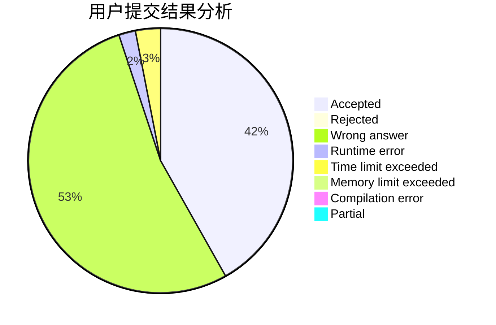
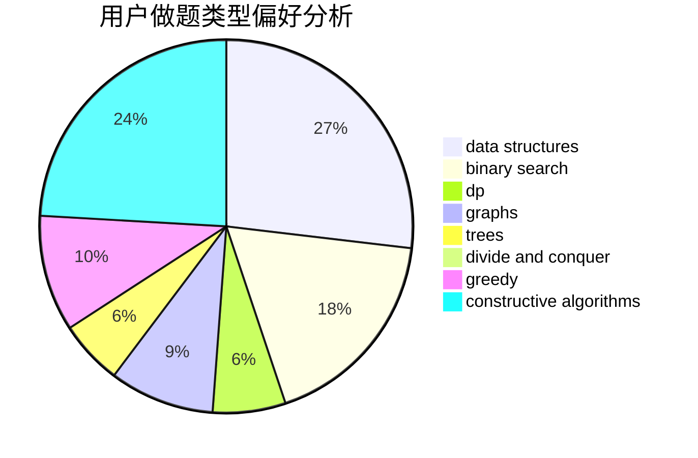
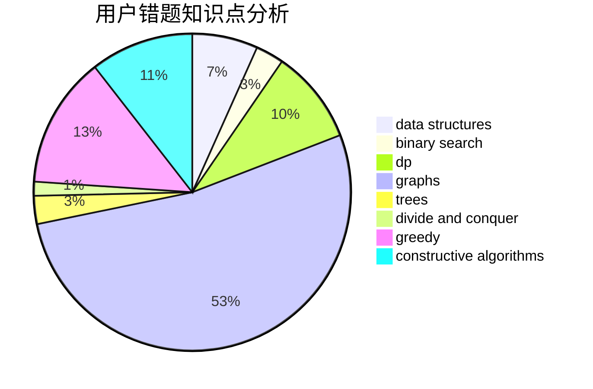

# ICANTAKIOI

<!-- tabs:start -->

#### **用户提交结果分析**

#### **用户做题类型偏好分析**

#### **用户错题知识点分析**

<!-- tabs:end -->
# 推荐题目
[1290C](https://codeforces.com/contest/1290/problem/C)		dfs and similar,
                        dsu,
                        graphs		  
[229D](https://codeforces.com/contest/229/problem/D)		dp,
                        greedy,
                        two pointers		  
[776D](https://codeforces.com/contest/776/problem/D)		2-sat,
                        dfs and similar,
                        dsu,
                        graphs		  
[491C](https://codeforces.com/contest/491/problem/C)		flows,
                        graph matchings		  
[859B](https://codeforces.com/contest/859/problem/B)		brute force,
                        geometry,
                        math		  
[859A](https://codeforces.com/contest/859/problem/A)		greedy,
                        implementation		  
[859C](https://codeforces.com/contest/859/problem/C)		dp,
                        games		  
[764E](https://codeforces.com/contest/764/problem/E)		dsu,graphs,sortings,trees		  
[198E](https://codeforces.com/contest/198/problem/E)		binary search,
                        data structures,
                        sortings		  
[1096A](https://codeforces.com/contest/1096/problem/A)		greedy,
                        implementation,
                        math		  
