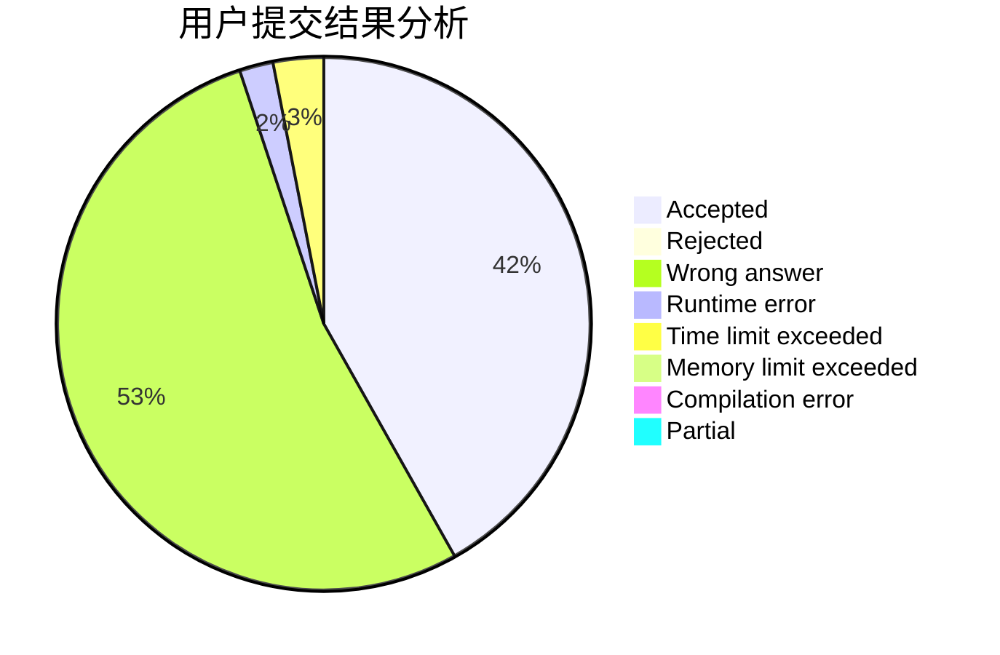
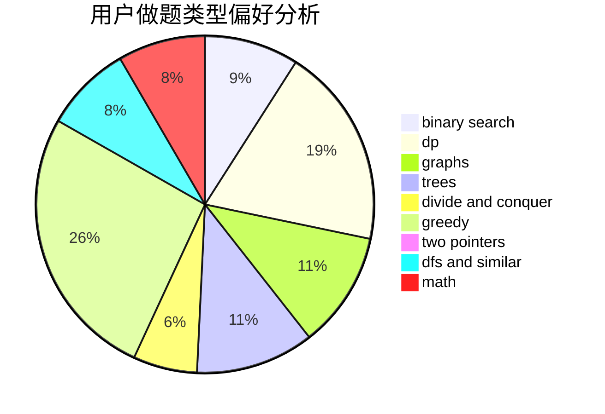

# ICANTAKIOI

<!-- tabs:start -->

#### **用户提交结果分析**

#### **用户做题类型偏好分析**

<!-- tabs:end -->
# 推荐题目
[1296F](https://codeforces.com/contest/1296/problem/F)
[249E](https://codeforces.com/contest/249/problem/E)
[794C](https://codeforces.com/contest/794/problem/C)
[512B](https://codeforces.com/contest/512/problem/B)
[876F](https://codeforces.com/contest/876/problem/F)
[876D](https://codeforces.com/contest/876/problem/D)
[877A](https://codeforces.com/contest/877/problem/A)
[784C](https://codeforces.com/contest/784/problem/C)
[21D](https://codeforces.com/contest/21/problem/D)
[1096D](https://codeforces.com/contest/1096/problem/D)
