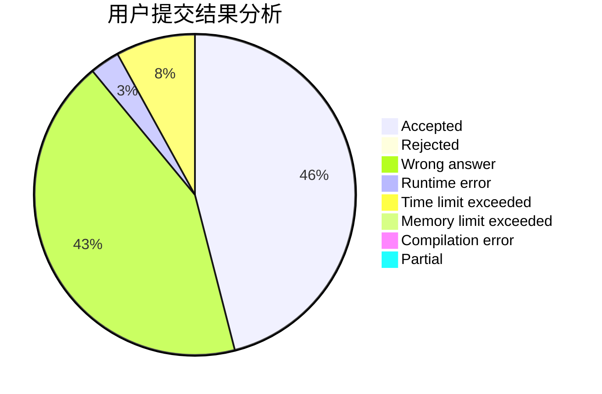
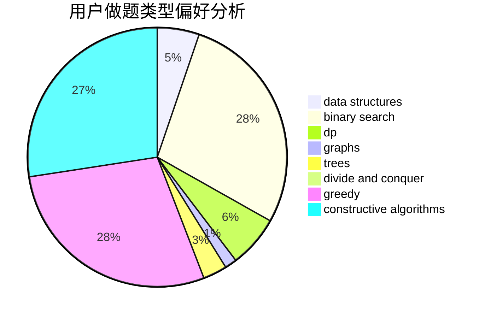

# 2997ms

<!-- tabs:start -->

#### **用户提交结果分析**

#### **用户做题类型偏好分析**

#### **用户错题知识点分析**

<!-- tabs:end -->
# 推荐题目
[1332E](https://codeforces.com/contest/1332/problem/E)		combinatorics,
                        constructive algorithms,
                        math,
                        matrices		  
[1331D](https://codeforces.com/contest/1331/problem/D)		implementation		  
[1331E](https://codeforces.com/contest/1331/problem/E)		dfs and similar,
                        geometry,
                        implementation		  
[1286B](https://codeforces.com/contest/1286/problem/B)		constructive algorithms,
                        data structures,
                        dfs and similar,
                        graphs,
                        greedy,
                        trees		  
[1216B](https://codeforces.com/contest/1216/problem/B)		greedy,
                        implementation,
                        sortings		  
[1330A](https://codeforces.com/contest/1330/problem/A)		implementation		  
[1034D](https://codeforces.com/contest/1034/problem/D)		binary search,
                        data structures,
                        two pointers		  
[1329B](https://codeforces.com/contest/1329/problem/B)		bitmasks,
                        combinatorics,
                        math		  
[1330B](https://codeforces.com/contest/1330/problem/B)		implementation,
                        math		  
[1136E](https://codeforces.com/contest/1136/problem/E)		binary search,
                        data structures		  
