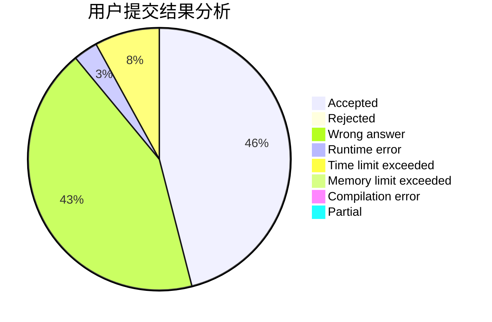
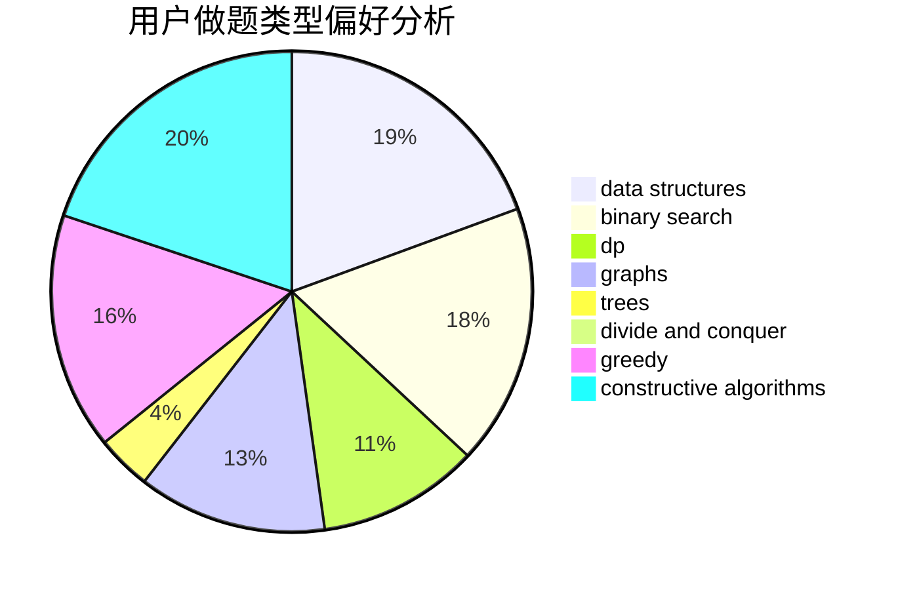

# 2997ms

<!-- tabs:start -->

#### **用户提交结果分析**

#### **用户做题类型偏好分析**

#### **用户错题知识点分析**

<!-- tabs:end -->
# 推荐题目
[1339B](https://codeforces.com/contest/1339/problem/B)		constructive algorithms,
                        sortings		  
[1337C](https://codeforces.com/contest/1337/problem/C)		dsu,graphs,sortings,trees		  
[1337D](https://codeforces.com/contest/1337/problem/D)		dsu,graphs,sortings,trees		  
[1293C](https://codeforces.com/contest/1293/problem/C)		dsu,graphs,sortings,trees		  
[1221F](https://codeforces.com/contest/1221/problem/F)		binary search,
                        data structures,
                        sortings		  
[1336A](https://codeforces.com/contest/1336/problem/A)		dfs and similar,
                        dp,
                        greedy,
                        sortings,
                        trees		  
[1036B](https://codeforces.com/contest/1036/problem/B)		math		  
[1335B](https://codeforces.com/contest/1335/problem/B)		constructive algorithms		  
[1336B](https://codeforces.com/contest/1336/problem/B)		binary search,
                        greedy,
                        math,
                        sortings,
                        two pointers		  
[1139A](https://codeforces.com/contest/1139/problem/A)		implementation,
                        strings		  
