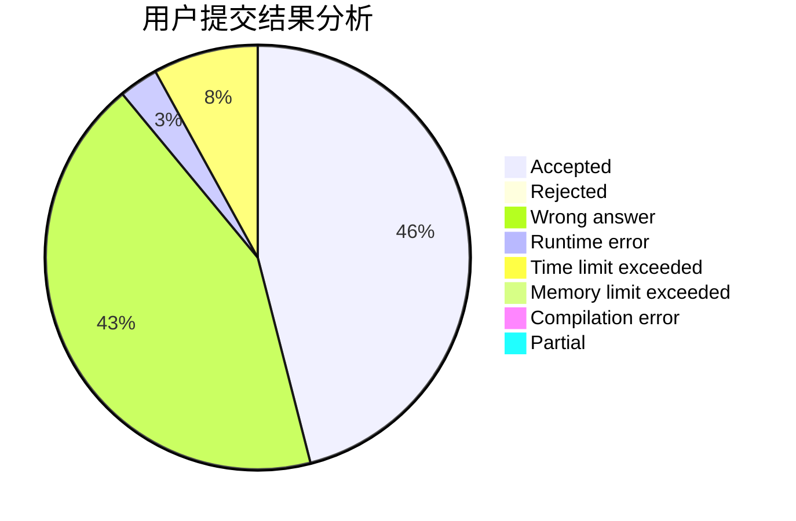
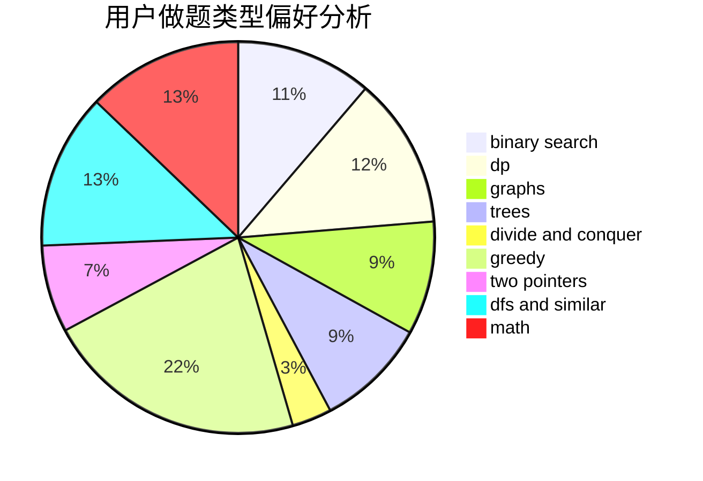

# 2997ms

<!-- tabs:start -->

#### **用户提交结果分析**

#### **用户做题类型偏好分析**

<!-- tabs:end -->
# 推荐题目
[1339B](https://codeforces.com/contest/1339/problem/B)
[1337C](https://codeforces.com/contest/1337/problem/C)
[1337D](https://codeforces.com/contest/1337/problem/D)
[1293C](https://codeforces.com/contest/1293/problem/C)
[1221F](https://codeforces.com/contest/1221/problem/F)
[1336A](https://codeforces.com/contest/1336/problem/A)
[1036B](https://codeforces.com/contest/1036/problem/B)
[1335B](https://codeforces.com/contest/1335/problem/B)
[1336B](https://codeforces.com/contest/1336/problem/B)
[1139A](https://codeforces.com/contest/1139/problem/A)
