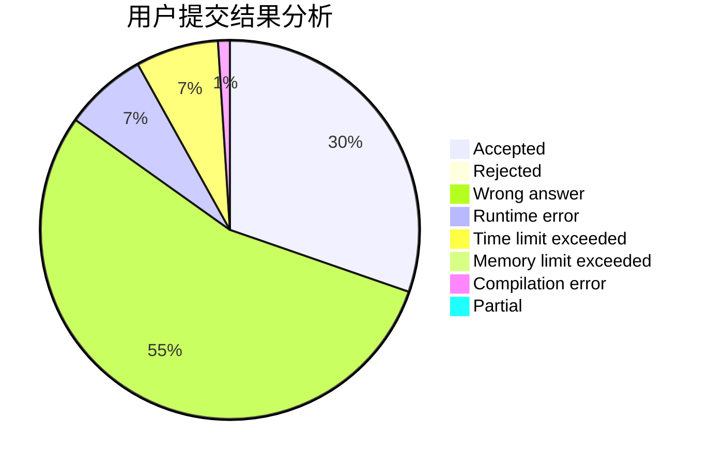
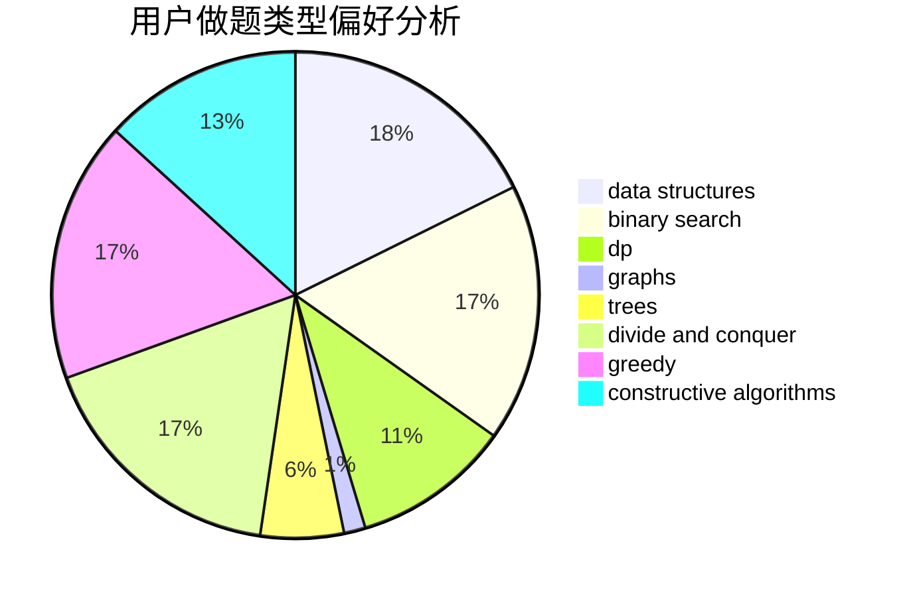
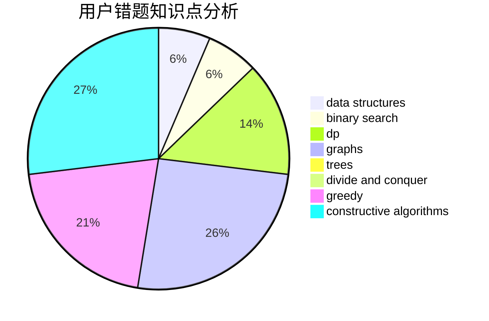

# IIIIndex
<!-- tabs:start -->
#### **用户提交结果分析**

#### **用户做题类型偏好分析**

#### **用户错题知识点分析**

<!-- tabs:end -->
# 推荐题目
[Cipher](http://codeforces.com/problemset/problem/156/C)		combinatorics,
                        dp		  
[Jumping on Walls](https://codeforces.com/contest/199/problem/D)		shortest paths		  
[Beautiful fountains rows](http://codeforces.com/problemset/problem/799/F)		data structures		  
[MP3](https://codeforces.com/contest/1199/problem/C)		sortings,
                        two pointers		  
[Cyclic Cipher](http://codeforces.com/problemset/problem/722/F)		chinese remainder theorem,
                        data structures,
                        implementation,
                        number theory,
                        two pointers		  
[Toy Army](http://codeforces.com/problemset/problem/84/A)		math,
                        number theory		  
[Keep talking and nobody explodes -- easy](http://codeforces.com/problemset/problem/1302/F)		bitmasks,
                        brute force,
                        expression parsing		  
[Tourist's Notes](http://codeforces.com/problemset/problem/538/C)		binary search,
                        brute force,
                        greedy,
                        implementation,
                        math		  
[Sorting Railway Cars](http://codeforces.com/problemset/problem/605/A)		constructive algorithms,
                        greedy		  
[Robot Breakout](http://codeforces.com/problemset/problem/1196/C)		implementation		  
<!-- tabs:start -->
#### **data structures**
[Cipher](http://codeforces.com/problemset/problem/799/F)		data structures		  
[Jumping on Walls](http://codeforces.com/problemset/problem/722/F)		chinese remainder theorem,
                        data structures,
                        implementation,
                        number theory,
                        two pointers		  
[Beautiful fountains rows](http://codeforces.com/problemset/problem/238/D)		data structures,
                        implementation		  
[MP3](http://codeforces.com/problemset/problem/620/F)		data structures,
                        strings,
                        trees		  
[Cyclic Cipher](http://codeforces.com/problemset/problem/1492/C)		binary search,
                        data structures,
                        dp,
                        greedy,
                        two pointers		  
[Toy Army](http://codeforces.com/problemset/problem/1490/G)		binary search,
                        data structures,
                        math		  
[Keep talking and nobody explodes -- easy](http://codeforces.com/problemset/problem/1479/D)		binary search,
                        bitmasks,
                        brute force,
                        data structures,
                        probabilities,
                        trees		  
[Tourist's Notes](http://codeforces.com/problemset/problem/1497/A)		brute force,
                        data structures,
                        greedy,
                        sortings		  
[Sorting Railway Cars](http://codeforces.com/problemset/problem/1491/C)		brute force,
                        data structures,
                        dp,
                        greedy,
                        implementation		  
[Robot Breakout](http://codeforces.com/problemset/problem/1492/B)		data structures,
                        greedy,
                        math		  
#### **binary search**
[Cipher](http://codeforces.com/problemset/problem/538/C)		binary search,
                        brute force,
                        greedy,
                        implementation,
                        math		  
[Jumping on Walls](http://codeforces.com/problemset/problem/1060/C)		binary search,
                        implementation,
                        two pointers		  
[Beautiful fountains rows](http://codeforces.com/problemset/problem/1492/C)		binary search,
                        data structures,
                        dp,
                        greedy,
                        two pointers		  
[MP3](http://codeforces.com/problemset/problem/1463/D)		binary search,
                        constructive algorithms,
                        greedy,
                        two pointers		  
[Cyclic Cipher](http://codeforces.com/problemset/problem/1490/G)		binary search,
                        data structures,
                        math		  
[Toy Army](http://codeforces.com/problemset/problem/1479/D)		binary search,
                        bitmasks,
                        brute force,
                        data structures,
                        probabilities,
                        trees		  
[Keep talking and nobody explodes -- easy](http://codeforces.com/problemset/problem/1436/E)		binary search,
                        data structures,
                        two pointers		  
[Tourist's Notes](http://codeforces.com/problemset/problem/1461/D)		binary search,
                        brute force,
                        data structures,
                        divide and conquer,
                        implementation,
                        sortings		  
[Sorting Railway Cars](http://codeforces.com/problemset/problem/1493/C)		binary search,
                        brute force,
                        constructive algorithms,
                        greedy,
                        strings		  
[Robot Breakout](http://codeforces.com/problemset/problem/1487/D)		binary search,
                        brute force,
                        math,
                        number theory		  
#### **dp**
[Cipher](http://codeforces.com/problemset/problem/156/C)		combinatorics,
                        dp		  
[Jumping on Walls](http://codeforces.com/problemset/problem/1472/B)		dp,
                        greedy,
                        math		  
[Beautiful fountains rows](http://codeforces.com/problemset/problem/234/C)		dp,
                        implementation		  
[MP3](http://codeforces.com/problemset/problem/478/D)		dp		  
[Cyclic Cipher](http://codeforces.com/problemset/problem/838/C)		dp,
                        games		  
[Toy Army](http://codeforces.com/problemset/problem/1272/D)		brute force,
                        dp		  
[Keep talking and nobody explodes -- easy](http://codeforces.com/problemset/problem/1158/F)		dp,
                        math		  
[Tourist's Notes](http://codeforces.com/problemset/problem/1492/C)		binary search,
                        data structures,
                        dp,
                        greedy,
                        two pointers		  
[Sorting Railway Cars](https://codeforces.com/contest/1457/problem/C)		brute force,
                        dp,
                        implementation		  
[Robot Breakout](http://codeforces.com/problemset/problem/1491/C)		brute force,
                        data structures,
                        dp,
                        greedy,
                        implementation		  
#### **graph**
[Cipher](http://codeforces.com/problemset/problem/1228/D)		brute force,
                        constructive algorithms,
                        graphs,
                        hashing,
                        implementation		  
[Jumping on Walls](http://codeforces.com/problemset/problem/1463/E)		constructive algorithms,
                        dfs and similar,
                        dsu,
                        graphs,
                        implementation,
                        sortings,
                        trees		  
[Beautiful fountains rows](http://codeforces.com/problemset/problem/1139/C)		dfs and similar,
                        dsu,
                        graphs,
                        math,
                        trees		  
[MP3](http://codeforces.com/problemset/problem/1487/C)		brute force,
                        constructive algorithms,
                        dfs and similar,
                        graphs,
                        greedy,
                        implementation,
                        math		  
[Cyclic Cipher](http://codeforces.com/problemset/problem/1437/C)		dp,
                        flows,
                        graph matchings,
                        greedy,
                        math,
                        sortings		  
[Toy Army](http://codeforces.com/problemset/problem/1470/D)		constructive algorithms,
                        dfs and similar,
                        graph matchings,
                        graphs,
                        greedy		  
[Keep talking and nobody explodes -- easy](http://codeforces.com/problemset/problem/1476/C)		dp,
                        graphs,
                        greedy		  
[Tourist's Notes](http://codeforces.com/problemset/problem/1304/D)		constructive algorithms,
                        graphs,
                        greedy,
                        two pointers		  
[Sorting Railway Cars](http://codeforces.com/problemset/problem/1475/C)		combinatorics,
                        graphs,
                        math		  
[Robot Breakout](http://codeforces.com/problemset/problem/553/E)		dp,
                        fft,
                        graphs,
                        math,
                        probabilities		  
#### **trees**
[Cipher](http://codeforces.com/problemset/problem/620/F)		data structures,
                        strings,
                        trees		  
[Jumping on Walls](http://codeforces.com/problemset/problem/1463/E)		constructive algorithms,
                        dfs and similar,
                        dsu,
                        graphs,
                        implementation,
                        sortings,
                        trees		  
[Beautiful fountains rows](http://codeforces.com/problemset/problem/1139/C)		dfs and similar,
                        dsu,
                        graphs,
                        math,
                        trees		  
[MP3](http://codeforces.com/problemset/problem/1479/D)		binary search,
                        bitmasks,
                        brute force,
                        data structures,
                        probabilities,
                        trees		  
[Cyclic Cipher](http://codeforces.com/problemset/problem/1511/C)		brute force,
                        data structures,
                        implementation,
                        trees		  
[Toy Army](http://codeforces.com/problemset/problem/1499/F)		combinatorics,
                        dfs and similar,
                        dp,
                        trees		  
[Keep talking and nobody explodes -- easy](http://codeforces.com/problemset/problem/1491/E)		brute force,
                        dfs and similar,
                        divide and conquer,
                        number theory,
                        trees		  
[Tourist's Notes](http://codeforces.com/problemset/problem/1466/D)		data structures,
                        greedy,
                        sortings,
                        trees		  
[Sorting Railway Cars](http://codeforces.com/problemset/problem/1495/D)		combinatorics,
                        dfs and similar,
                        graphs,
                        math,
                        shortest paths,
                        trees		  
[Robot Breakout](http://codeforces.com/problemset/problem/1303/G)		data structures,
                        divide and conquer,
                        geometry,
                        trees		  
#### **divide and conquer**
[Cipher](http://codeforces.com/problemset/problem/1250/M)		constructive algorithms,
                        divide and conquer		  
[Jumping on Walls](http://codeforces.com/problemset/problem/1461/D)		binary search,
                        brute force,
                        data structures,
                        divide and conquer,
                        implementation,
                        sortings		  
[Beautiful fountains rows](http://codeforces.com/problemset/problem/1466/G)		combinatorics,
                        divide and conquer,
                        hashing,
                        math,
                        string suffix structures,
                        strings		  
[MP3](http://codeforces.com/problemset/problem/1490/D)		dfs and similar,
                        divide and conquer,
                        implementation		  
[Cyclic Cipher](https://codeforces.com/contest/1483/problem/C)		data structures,
                        divide and conquer,
                        dp		  
[Toy Army](http://codeforces.com/problemset/problem/1491/E)		brute force,
                        dfs and similar,
                        divide and conquer,
                        number theory,
                        trees		  
[Keep talking and nobody explodes -- easy](http://codeforces.com/problemset/problem/1303/G)		data structures,
                        divide and conquer,
                        geometry,
                        trees		  
[Tourist's Notes](http://codeforces.com/problemset/problem/1494/D)		constructive algorithms,
                        data structures,
                        dfs and similar,
                        divide and conquer,
                        dsu,
                        greedy,
                        sortings,
                        trees		  
[Sorting Railway Cars](http://codeforces.com/problemset/problem/1482/E)		data structures,
                        divide and conquer,
                        dp		  
[Robot Breakout](http://codeforces.com/problemset/problem/566/C)		dfs and similar,
                        divide and conquer,
                        trees		  
#### **greedy**
[Cipher](http://codeforces.com/problemset/problem/538/C)		binary search,
                        brute force,
                        greedy,
                        implementation,
                        math		  
[Jumping on Walls](http://codeforces.com/problemset/problem/605/A)		constructive algorithms,
                        greedy		  
[Beautiful fountains rows](http://codeforces.com/problemset/problem/1472/B)		dp,
                        greedy,
                        math		  
[MP3](http://codeforces.com/problemset/problem/732/E)		greedy,
                        sortings		  
[Cyclic Cipher](http://codeforces.com/problemset/problem/1328/C)		greedy,
                        implementation		  
[Toy Army](http://codeforces.com/problemset/problem/1329/A)		constructive algorithms,
                        greedy,
                        implementation,
                        math		  
[Keep talking and nobody explodes -- easy](https://codeforces.com/contest/1255/problem/D)		constructive algorithms,
                        greedy,
                        implementation		  
[Tourist's Notes](http://codeforces.com/problemset/problem/1492/C)		binary search,
                        data structures,
                        dp,
                        greedy,
                        two pointers		  
[Sorting Railway Cars](https://codeforces.com/contest/1496/problem/C)		geometry,
                        greedy,
                        math,
                        sortings		  
[Robot Breakout](http://codeforces.com/problemset/problem/1493/A)		constructive algorithms,
                        greedy		  
#### **constructive algorithms**
[Cipher](http://codeforces.com/problemset/problem/605/A)		constructive algorithms,
                        greedy		  
[Jumping on Walls](http://codeforces.com/problemset/problem/1250/M)		constructive algorithms,
                        divide and conquer		  
[Beautiful fountains rows](http://codeforces.com/problemset/problem/398/C)		constructive algorithms		  
[MP3](http://codeforces.com/problemset/problem/1228/D)		brute force,
                        constructive algorithms,
                        graphs,
                        hashing,
                        implementation		  
[Cyclic Cipher](http://codeforces.com/problemset/problem/1463/E)		constructive algorithms,
                        dfs and similar,
                        dsu,
                        graphs,
                        implementation,
                        sortings,
                        trees		  
[Toy Army](http://codeforces.com/problemset/problem/1329/A)		constructive algorithms,
                        greedy,
                        implementation,
                        math		  
[Keep talking and nobody explodes -- easy](https://codeforces.com/contest/1255/problem/D)		constructive algorithms,
                        greedy,
                        implementation		  
[Tourist's Notes](http://codeforces.com/problemset/problem/1493/A)		constructive algorithms,
                        greedy		  
[Sorting Railway Cars](http://codeforces.com/problemset/problem/1463/D)		binary search,
                        constructive algorithms,
                        greedy,
                        two pointers		  
[Robot Breakout](https://codeforces.com/contest/1456/problem/B)		bitmasks,
                        brute force,
                        constructive algorithms		  
#### **sortings**
[Cipher](https://codeforces.com/contest/1199/problem/C)		sortings,
                        two pointers		  
[Jumping on Walls](http://codeforces.com/problemset/problem/1005/E1)		sortings		  
[Beautiful fountains rows](http://codeforces.com/problemset/problem/1463/E)		constructive algorithms,
                        dfs and similar,
                        dsu,
                        graphs,
                        implementation,
                        sortings,
                        trees		  
[MP3](http://codeforces.com/problemset/problem/732/E)		greedy,
                        sortings		  
[Cyclic Cipher](https://codeforces.com/contest/1496/problem/C)		geometry,
                        greedy,
                        math,
                        sortings		  
[Toy Army](http://codeforces.com/problemset/problem/1495/A)		geometry,
                        greedy,
                        math,
                        sortings		  
[Keep talking and nobody explodes -- easy](http://codeforces.com/problemset/problem/1497/A)		brute force,
                        data structures,
                        greedy,
                        sortings		  
[Tourist's Notes](http://codeforces.com/problemset/problem/1427/A)		math,
                        sortings		  
[Sorting Railway Cars](http://codeforces.com/problemset/problem/1461/D)		binary search,
                        brute force,
                        data structures,
                        divide and conquer,
                        implementation,
                        sortings		  
[Robot Breakout](http://codeforces.com/problemset/problem/1437/C)		dp,
                        flows,
                        graph matchings,
                        greedy,
                        math,
                        sortings		  
<!-- tabs:end -->
